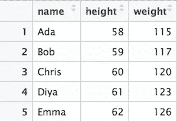

# 用于数据科学的 Python 库:DAY-2 →Matplotlib(事实和维度)

> 原文：<https://medium.com/analytics-vidhya/python-libraries-for-data-science-day-2-matplotlib-facts-and-dimensions-7c4d0801c870?source=collection_archive---------24----------------------->

**数据帧示例**

Matplotlib 的目的是提供多种功能，从存储在列表、数组等中的数据构建图形。

## **数据有两种类型，即:**

**事实**(亦作措施。)→它们包含数值和量化值。例如:销售额，总金额，马克…等等，我们也对它们应用计算和聚合。

1.  **维度**(它们是我们数据中的字段)→它们包含定性信息，如名称、日期、主题、位置信息等..我们可以用它来分类或分割，并揭示我们的数据细节。

简而言之，我们可以说事实(“数字”)和维度(“元数据”)…

一些例子:— ->

考虑自动柜员机的变量，然后指定哪些是事实或维度；

1.  取款金额→事实(数字)
2.  取款后账户余额→事实(数字)
3.  客户 ID →维度(元数据)
4.  交易费用→事实(数字)
5.  自动柜员机 ID →维度(元数据)
6.  支取日期→维度(元数据)

因此，当我们开始可视化数据时，我们将会知道这些事实和维度是多么重要。

在第三天的课程中，我们将学习 ***“散点图可视化”。***

拜拜