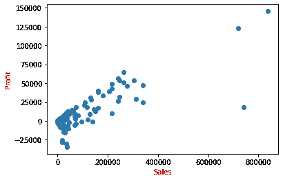
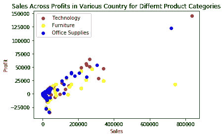
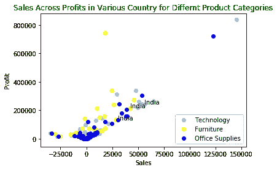

# 用于数据科学的 Python 库:第 3 天→Matplotlib(散点图)

> 原文：<https://medium.com/analytics-vidhya/python-libraries-for-data-science-day-3-matplotlib-scatter-plot-2138c0ec2003?source=collection_archive---------33----------------------->

**散点图**显示数据的散点图。它有助于检查两个定量变量之间的任何关系模式，并检测其中是否存在异常值。

```
**import numpy as np****import** **matplotlib.pyplot** **as** **plt**
*# Sales and Profit data for different product categories across different countries*
sales = np.array ([1013.14, 8298.48, 875.51, 22320.83, 9251.6, 4516.86, 585.16, 836154.03, 216748.48, 174.2, 27557.79, 563.25, 558.11, 37117.45, 357.36, 2206.96, 709.5, 35064.03, 7230.78, 235.33, 148.32, 3973.27, 11737.8, 7104.63, 83.67, 5569.83, 92.34, 107104.36, 1045.62, 9072.51, 42485.82, 5093.82, 14846.16, 943.92, 684.36, 15012.03, 38196.18, 2448.75, 28881.96, 13912.14, 4507.2, 4931.06, 12805.05, 67912.73, 4492.2, 1740.01, 458.04, 16904.32, 21744.53, 10417.26, 18665.33, 2808.42, 54195.57, 67332.5, 24390.95, 1790.43, 2234.19, 9917.5, 7408.14, 36051.99, 1352.22, 1907.7, 245722.14, 2154.66, 1078.21, 3391.65, 28262.73, 5177.04, 66.51, 2031.34, 1683.72, 1970.01, 6515.82, 1055.31, 1029.48, 5303.4, 1850.96, 1159.41, 39989.13, 1183.87, 96365.09, 8356.68, 7010.24, 23119.23, 46109.28, 146071.84, 242259.03, 9058.95, 1313.67, 31525.06, 2019.94, 703.04, 1868.79, 700.5, 55512.02, 243.5, 2113.18, 11781.81, 262189.49, 3487.29, 513.12, 312050.42, 5000.7, 121.02, 1302.78, 169.92, 124.29, 57366.05, 29445.93, 4614.3, 45009.98, 309.24, 3353.67, 41348.34, 2280.27, 61193.7, 1466.79, 12419.94, 445.12, 25188.65, 263514.92, 12351.23, 1152.3, 26298.81, 9900.78, 5355.57, 2325.66, 6282.81, 127707.92, 1283.1, 3560.15, 3723.84, 13715.01, 4887.9, 3396.89, 33348.42, 625.02, 1665.48, 32486.97, 340212.44, 20516.22, 8651.16, 13590.06, 2440.35, 6462.57, 1770.13, 7527.18, 1433.65, 423.3, 21601.72, 10035.72, 2378.49, 3062.38, 719469.32, 179366.79, 345.17, 30345.78, 300.71, 940.81, 36468.08, 1352.85, 1755.72, 2391.96, 19.98, 19792.8, 15633.88, 7.45, 521.67, 1118.24, 7231.68, 12399.32, 204.36, 23.64, 5916.48, 313.98, 108181.5, 9212.42, 27476.91, 1761.33, 289.5, 780.3, 15098.46, 813.27, 47.55, 8323.23, 22634.64, 1831.02, 28808.1, 10539.78, 588.99, 939.78, 7212.41, 15683.01, 41369.09, 5581.6, 403.36, 375.26, 12276.66, 15393.56, 76.65, 5884.38, 18005.49, 3094.71, 43642.78, 35554.83, 22977.11, 1026.33, 665.28, 9712.49, 6038.52, 30756.51, 3758.25, 4769.49, 2463.3, 160153.16, 967.11, 2311.74, 1414.83, 12764.91, 4191.24, 110.76, 637.34, 1195.12, 2271.63, 804.12, 196.17, 167.67, 131.77, 2842.05, 9969.12, 1784.35, 3098.49, 25005.54, 1300.1, 118697.39, 7920.54, 6471.78, 31707.57, 37636.47, 118777.77, 131170.76, 3980.88, 3339.39, 26563.9, 4038.73, 124.8, 196.65, 2797.77, 29832.76, 184.84, 79.08, 8047.83, 205313.25, 1726.98, 899.73, 224.06, 304763.54, 6101.31, 729.6, 896.07, 17.82, 26.22, 46429.78, 31167.27, 2455.94, 37714.3, 1506.93, 3812.78, 25223.34, 3795.96, 437.31, 41278.86, 2091.81, 6296.61, 468.82, 23629.64, 160435.53, 9725.46, 1317.03, 1225.26, 30034.08, 7893.45, 2036.07, 215.52, 3912.42, 82783.43, 253.14, 966.96, 3381.26, 164.07, 1984.23, 75.12, 25168.17, 3295.53, 991.12, 10772.1, 44.16, 1311.45, 35352.57, 245783.54, 20.49, 13471.06, 8171.16, 14075.67, 611.82, 3925.56, 981.84, 10209.84, 156.56, 243.06, 21287.52, 7300.51, 434.52, 6065.0, 741577.51, 132461.03, 224.75, 28953.6, 757.98, 528.15, 34922.41, 50.58, 2918.48, 1044.96, 22195.13, 3951.48, 6977.64, 219.12, 5908.38, 10987.46, 4852.26, 445.5, 71860.82, 14840.45, 24712.08, 1329.9, 1180.44, 85.02, 10341.63, 690.48, 1939.53, 20010.51, 914.31, 25223.82, 12804.66, 2124.24, 602.82, 2961.66, 15740.79, 74138.35, 7759.39, 447.0, 2094.84, 22358.95, 21734.53, 4223.73, 17679.53, 1019.85, 51848.72, 69133.3, 30146.9, 705.48, 14508.88, 7489.38, 20269.44, 246.12, 668.13, 768.93, 215677.35, 899.16, 2578.2, 4107.99, 20334.57, 366.84, 3249.27, 98.88, 3497.88, 3853.05, 786.75, 1573.68, 458.36, 1234.77, 1094.22, 2300.61, 970.14, 3068.25, 35792.85, 4277.82, 71080.28, 3016.86, 3157.49, 15888.0, 30000.36, 140037.89, 216056.25, 1214.22, 1493.94, 32036.69, 4979.66, 106.02, 46257.68, 1033.3, 937.32, 3442.62, 160633.45, 213.15, 338.88, 242117.13, 9602.34, 2280.99, 73759.08, 23526.12, 6272.74, 43416.3, 576.78, 1471.61, 20844.9, 3497.7, 56382.38, 902.58, 6235.26, 48.91, 32684.24, 276611.58, 13370.38, 10595.28, 4555.14, 10084.38, 267.72, 1012.95, 4630.5, 149433.51, 364.32, 349.2, 4647.56, 504.0, 10343.52, 5202.66, 2786.26, 34135.95, 2654.58, 24699.51, 339239.87, 136.26, 23524.51, 8731.68, 8425.86, 835.95, 11285.19])
profit = np.array([-1213.46, 1814.13, -1485.7, -2286.73, -2872.12, 946.8, 198.48, 145454.95, 49476.1, -245.56, 5980.77, -790.47, -895.72, -34572.08, 117.9, 561.96, 152.85, 1426.05, 1873.17, -251.03, 68.22, 635.11, 3722.4, -3168.63, 27.6, 952.11, 7.38, 20931.13, 186.36, -5395.38, 9738.45, 525.27, 3351.99, 120.78, 266.88, 3795.21, 8615.97, 609.54, 7710.57, 2930.43, 1047.96, -2733.32, 2873.73, -5957.89, -909.6, 163.41, -376.02, -6322.68, -10425.86, 2340.36, -28430.53, 756.12, 12633.33, 7382.54, -14327.69, 436.44, 683.85, -694.91, 1960.56, 10925.82, 334.08, 425.49, 53580.2, 1024.56, 110.93, 632.22, 8492.58, 1418.88, 19.26, -2567.57, 346.26, 601.86, 1318.68, 304.05, 428.37, 1416.24, -2878.18, 283.41, 12611.04, 261.95, -648.43, 1112.88, -2640.29, 6154.32, 11558.79, 15291.4, 56092.65, 1515.39, 342.03, -10865.66, -902.8, 351.52, 364.17, 87.72, 11565.66, 75.4, 289.33, 3129.63, 50795.72, 783.72, 215.46, 29196.89, 1147.26, 53.22, 286.56, 73.02, 42.24, 13914.85, 5754.54, 998.04, -1476.04, 86.58, -1636.35, 10511.91, 647.34, 13768.62, 338.67, 3095.67, 173.84, 5632.93, 64845.11, 3297.33, 338.61, 7246.62, 2255.52, 1326.36, 827.64, 1100.58, 9051.36, 412.23, 1063.91, 940.59, 3891.84, 1599.51, 1129.57, 8792.64, 6.24, 592.77, 8792.85, 47727.5, -4597.68, 2242.56, 3546.45, 321.87, 1536.72, -2463.29, 1906.08, -1916.99, 186.24, 3002.05, -3250.98, 554.7, 830.64, 122612.79, 33894.21, -559.03, 7528.05, -477.67, -1660.25, -33550.96, 481.68, 425.08, 450.3, 9.57, -3025.29, 2924.62, -11.84, 87.36, 26.51, 1727.19, -6131.18, 59.16, 3.06, 1693.47, 74.67, 24729.21, -4867.94, 6705.18, 410.79, 70.74, 101.7, 3264.3, 137.01, 6.18, 2100.21, 5295.24, 520.29, 7205.52, 2602.65, 116.67, 224.91, -5153.93, 3882.69, -6535.24, -1254.1, 84.56, -186.38, -3167.2, -7935.59, 37.02, 1908.06, -27087.84, 829.32, 8727.44, 2011.47, -11629.64, 234.96, 53.1, 1248.14, 1511.07, 7374.24, 1193.28, 1090.23, 553.86, 38483.86, 255.81, 528.54, 326.07, 3924.36, 1018.92, 36.48, 113.24, -1770.05, 527.64, 224.49, 79.53, 64.77, 38.08, 868.08, 2265.06, -2643.62, 833.73, 5100.03, 326.44, 18158.84, 1682.01, -3290.22, 8283.33, 7926.18, 1694.41, 30522.92, 1214.07, 900.6, -6860.8, -865.91, 26.16, 47.22, 863.52, 7061.26, 73.92, 33.12, 1801.23, 38815.44, 431.13, 216.81, 16.5, 53688.2, 1210.32, 236.94, 210.84, 3.18, 2.22, 10265.64, 7212.3, 343.56, 3898.28, 568.11, -1867.85, 5782.38, 697.29, -192.06, 10179.02, 616.32, 1090.47, 165.84, 6138.28, 39723.06, 2085.14, 90.0, 129.93, 7957.53, 2131.86, 562.44, 99.12, 1298.37, 7580.33, 113.73, 139.71, 456.0, 21.24, 292.68, 30.34, 5817.15, 1060.89, 252.9, 3060.61, 6.6, 219.09, 8735.82, 31481.09, 2.85, -3124.72, 2195.94, 3464.7, 141.12, 1125.69, -1752.03, 3281.52, -303.77, 114.18, -2412.63, -5099.61, 146.64, 660.22, 18329.28, 28529.84, -232.27, 7435.41, -1157.94, -746.73, -30324.2, 2.52, 1313.44, 213.72, -5708.95, 930.18, 1663.02, 31.59, 1787.88, -8219.56, 973.92, 4.32, 8729.78, -2529.52, 5361.06, 69.21, 519.3, 13.56, 2236.77, 213.96, 367.98, 5074.2, 206.61, 7620.36, 2093.19, 164.07, 230.01, -815.82, 4226.7, -3635.09, -3344.17, 167.26, 143.79, -8233.57, -4085.21, 919.35, -25232.35, 234.33, 12040.68, 7206.28, -15112.76, 206.04, -2662.49, 2346.81, 4461.36, 93.48, 82.11, 147.87, 10389.53, 395.58, 474.74, 1333.26, 3913.02, 117.36, 858.78, 6.9, -4628.49, 1170.6, 218.55, 539.58, -211.0, 438.87, 317.16, 310.8, -1578.09, 706.56, 6617.4, 803.84, 2475.26, 764.34, -1461.88, 3805.56, 7371.27, -1377.13, 42435.03, 472.47, 315.48, -11755.91, -2418.6, 6.36, 9317.76, 326.88, -287.31, 637.68, 17579.17, 70.83, 47.4, 26143.92, 1548.15, 612.78, 17842.76, 6735.39, 1206.5, -10035.74, 149.4, -777.85, 5566.29, 748.92, 14941.58, 348.93, 1944.06, -5.51, 7026.84, 46114.92, 2361.86, 2613.24, 1277.37, 2587.74, 103.08, 311.43, 1250.58, 13055.21, 18.21, 108.24, 709.44, 115.92, 1863.6, 1873.86, 817.32, 7577.64, 1019.19, 6813.03, 24698.84, 66.24, -10971.39, 2056.47, 2095.35, 246.33, 2797.89])

*# corresponding category and country value to the above arrays*
product_category = np.array(['Technology', 'Technology', 'Technology', 'Technology', 'Technology', 'Technology', 'Technology', 'Technology', 'Technology', 'Technology', 'Technology', 'Technology', 'Technology', 'Technology', 'Technology', 'Technology', 'Technology', 'Technology', 'Technology', 'Technology', 'Technology', 'Technology', 'Technology', 'Technology', 'Technology', 'Technology', 'Technology', 'Technology', 'Technology', 'Technology', 'Technology', 'Technology', 'Technology', 'Technology', 'Technology', 'Technology', 'Technology', 'Technology', 'Technology', 'Technology', 'Technology', 'Technology', 'Technology', 'Technology', 'Technology', 'Technology', 'Technology', 'Technology', 'Technology', 'Technology', 'Technology', 'Technology', 'Technology', 'Technology', 'Technology', 'Technology', 'Technology', 'Technology', 'Technology', 'Technology', 'Technology', 'Technology', 'Technology', 'Technology', 'Technology', 'Technology', 'Technology', 'Technology', 'Technology', 'Technology', 'Technology', 'Technology', 'Technology', 'Technology', 'Technology', 'Technology', 'Technology', 'Technology', 'Technology', 'Technology', 'Technology', 'Technology', 'Technology', 'Technology', 'Technology', 'Technology', 'Technology', 'Technology', 'Technology', 'Technology', 'Technology', 'Technology', 'Technology', 'Technology', 'Technology', 'Technology', 'Technology', 'Technology', 'Technology', 'Technology', 'Technology', 'Technology', 'Technology', 'Technology', 'Technology', 'Technology', 'Technology', 'Technology', 'Technology', 'Technology', 'Technology', 'Technology', 'Technology', 'Technology', 'Technology', 'Technology', 'Technology', 'Technology', 'Technology', 'Technology', 'Technology', 'Technology', 'Technology', 'Technology', 'Technology', 'Technology', 'Technology', 'Technology', 'Technology', 'Technology', 'Technology', 'Technology', 'Technology', 'Technology', 'Technology', 'Technology', 'Technology', 'Technology', 'Technology', 'Technology', 'Technology', 'Technology', 'Technology', 'Technology', 'Technology', 'Office Supplies', 'Office Supplies', 'Office Supplies', 'Office Supplies', 'Office Supplies', 'Office Supplies', 'Office Supplies', 'Office Supplies', 'Office Supplies', 'Office Supplies', 'Office Supplies', 'Office Supplies', 'Office Supplies', 'Office Supplies', 'Office Supplies', 'Office Supplies', 'Office Supplies', 'Office Supplies', 'Office Supplies', 'Office Supplies', 'Office Supplies', 'Office Supplies', 'Office Supplies', 'Office Supplies', 'Office Supplies', 'Office Supplies', 'Office Supplies', 'Office Supplies', 'Office Supplies', 'Office Supplies', 'Office Supplies', 'Office Supplies', 'Office Supplies', 'Office Supplies', 'Office Supplies', 'Office Supplies', 'Office Supplies', 'Office Supplies', 'Office Supplies', 'Office Supplies', 'Office Supplies', 'Office Supplies', 'Office Supplies', 'Office Supplies', 'Office Supplies', 'Office Supplies', 'Office Supplies', 'Office Supplies', 'Office Supplies', 'Office Supplies', 'Office Supplies', 'Office Supplies', 'Office Supplies', 'Office Supplies', 'Office Supplies', 'Office Supplies', 'Office Supplies', 'Office Supplies', 'Office Supplies', 'Office Supplies', 'Office Supplies', 'Office Supplies', 'Office Supplies', 'Office Supplies', 'Office Supplies', 'Office Supplies', 'Office Supplies', 'Office Supplies', 'Office Supplies', 'Office Supplies', 'Office Supplies', 'Office Supplies', 'Office Supplies', 'Office Supplies', 'Office Supplies', 'Office Supplies', 'Office Supplies', 'Office Supplies', 'Office Supplies', 'Office Supplies', 'Office Supplies', 'Office Supplies', 'Office Supplies', 'Office Supplies', 'Office Supplies', 'Office Supplies', 'Office Supplies', 'Office Supplies', 'Office Supplies', 'Office Supplies', 'Office Supplies', 'Office Supplies', 'Office Supplies', 'Office Supplies', 'Office Supplies', 'Office Supplies', 'Office Supplies', 'Office Supplies', 'Office Supplies', 'Office Supplies', 'Office Supplies', 'Office Supplies', 'Office Supplies', 'Office Supplies', 'Office Supplies', 'Office Supplies', 'Office Supplies', 'Office Supplies', 'Office Supplies', 'Office Supplies', 'Office Supplies', 'Office Supplies', 'Office Supplies', 'Office Supplies', 'Office Supplies', 'Office Supplies', 'Office Supplies', 'Office Supplies', 'Office Supplies', 'Office Supplies', 'Office Supplies', 'Office Supplies', 'Office Supplies', 'Office Supplies', 'Office Supplies', 'Office Supplies', 'Office Supplies', 'Office Supplies', 'Office Supplies', 'Office Supplies', 'Office Supplies', 'Office Supplies', 'Office Supplies', 'Office Supplies', 'Office Supplies', 'Office Supplies', 'Office Supplies', 'Office Supplies', 'Office Supplies', 'Office Supplies', 'Office Supplies', 'Office Supplies', 'Office Supplies', 'Office Supplies', 'Office Supplies', 'Office Supplies', 'Office Supplies', 'Office Supplies', 'Office Supplies', 'Office Supplies', 'Office Supplies', 'Office Supplies', 'Office Supplies', 'Office Supplies', 'Office Supplies', 'Office Supplies', 'Office Supplies', 'Office Supplies', 'Office Supplies', 'Office Supplies', 'Office Supplies', 'Furniture', 'Furniture', 'Furniture', 'Furniture', 'Furniture', 'Furniture', 'Furniture', 'Furniture', 'Furniture', 'Furniture', 'Furniture', 'Furniture', 'Furniture', 'Furniture', 'Furniture', 'Furniture', 'Furniture', 'Furniture', 'Furniture', 'Furniture', 'Furniture', 'Furniture', 'Furniture', 'Furniture', 'Furniture', 'Furniture', 'Furniture', 'Furniture', 'Furniture', 'Furniture', 'Furniture', 'Furniture', 'Furniture', 'Furniture', 'Furniture', 'Furniture', 'Furniture', 'Furniture', 'Furniture', 'Furniture', 'Furniture', 'Furniture', 'Furniture', 'Furniture', 'Furniture', 'Furniture', 'Furniture', 'Furniture', 'Furniture', 'Furniture', 'Furniture', 'Furniture', 'Furniture', 'Furniture', 'Furniture', 'Furniture', 'Furniture', 'Furniture', 'Furniture', 'Furniture', 'Furniture', 'Furniture', 'Furniture', 'Furniture', 'Furniture', 'Furniture', 'Furniture', 'Furniture', 'Furniture', 'Furniture', 'Furniture', 'Furniture', 'Furniture', 'Furniture', 'Furniture', 'Furniture', 'Furniture', 'Furniture', 'Furniture', 'Furniture', 'Furniture', 'Furniture', 'Furniture', 'Furniture', 'Furniture', 'Furniture', 'Furniture', 'Furniture', 'Furniture', 'Furniture', 'Furniture', 'Furniture', 'Furniture', 'Furniture', 'Furniture', 'Furniture', 'Furniture', 'Furniture', 'Furniture', 'Furniture', 'Furniture', 'Furniture', 'Furniture', 'Furniture', 'Furniture', 'Furniture', 'Furniture', 'Furniture', 'Furniture', 'Furniture', 'Furniture', 'Furniture', 'Furniture', 'Furniture', 'Furniture', 'Furniture', 'Furniture', 'Furniture', 'Furniture', 'Furniture', 'Furniture', 'Furniture', 'Furniture', 'Furniture', 'Furniture', 'Furniture', 'Furniture', 'Furniture', 'Furniture', 'Furniture', 'Furniture', 'Furniture', 'Furniture', 'Furniture', 'Furniture', 'Furniture', 'Furniture', 'Furniture', 'Furniture', 'Furniture', 'Furniture', 'Furniture', 'Furniture'])
country = np.array(['Zimbabwe', 'Zambia', 'Yemen', 'Vietnam', 'Venezuela', 'Uzbekistan', 'Uruguay', 'United States', 'United Kingdom', 'United Arab Emirates', 'Ukraine', 'Uganda', 'Turkmenistan', 'Turkey', 'Tunisia', 'Trinidad and Tobago', 'Togo', 'Thailand', 'Tanzania', 'Tajikistan', 'Taiwan', 'Syria', 'Switzerland', 'Sweden', 'Swaziland', 'Sudan', 'Sri Lanka', 'Spain', 'South Sudan', 'South Korea', 'South Africa', 'Somalia', 'Singapore', 'Sierra Leone', 'Serbia', 'Senegal', 'Saudi Arabia', 'Rwanda', 'Russia', 'Romania', 'Qatar', 'Portugal', 'Poland', 'Philippines', 'Peru', 'Paraguay', 'Papua New Guinea', 'Panama', 'Pakistan', 'Norway', 'Nigeria', 'Niger', 'Nicaragua', 'New Zealand', 'Netherlands', 'Nepal', 'Namibia', 'Myanmar (Burma)', 'Mozambique', 'Morocco', 'Mongolia', 'Moldova', 'Mexico', 'Mauritania', 'Martinique', 'Mali', 'Malaysia', 'Madagascar', 'Luxembourg', 'Lithuania', 'Libya', 'Liberia', 'Lesotho', 'Lebanon', 'Kyrgyzstan', 'Kenya', 'Kazakhstan', 'Jordan', 'Japan', 'Jamaica', 'Italy', 'Israel', 'Ireland', 'Iraq', 'Iran', 'Indonesia', 'India', 'Hungary', 'Hong Kong', 'Honduras', 'Haiti', 'Guyana', 'Guinea-Bissau', 'Guinea', 'Guatemala', 'Guadeloupe', 'Greece', 'Ghana', 'Germany', 'Georgia', 'Gabon', 'France', 'Finland', 'Ethiopia', 'Estonia', 'Eritrea', 'Equatorial Guinea', 'El Salvador', 'Egypt', 'Ecuador', 'Dominican Republic', 'Djibouti', 'Denmark', 'Democratic Republic of the Congo', 'Czech Republic', 'Cuba', 'Croatia', "Cote d'Ivoire", 'Costa Rica', 'Colombia', 'China', 'Chile', 'Central African Republic', 'Canada', 'Cameroon', 'Cambodia', 'Burkina Faso', 'Bulgaria', 'Brazil', 'Bosnia and Herzegovina', 'Bolivia', 'Benin', 'Belgium', 'Belarus', 'Barbados', 'Bangladesh', 'Bahrain', 'Azerbaijan', 'Austria', 'Australia', 'Argentina', 'Angola', 'Algeria', 'Albania', 'Afghanistan', 'Zimbabwe', 'Zambia', 'Yemen', 'Western Sahara', 'Vietnam', 'Venezuela', 'Uzbekistan', 'Uruguay', 'United States', 'United Kingdom', 'United Arab Emirates', 'Ukraine', 'Uganda', 'Turkmenistan', 'Turkey', 'Tunisia', 'Trinidad and Tobago', 'Togo', 'The Gambia', 'Thailand', 'Tanzania', 'Tajikistan', 'Taiwan', 'Syria', 'Switzerland', 'Sweden', 'Swaziland', 'Suriname', 'Sudan', 'Sri Lanka', 'Spain', 'South Korea', 'South Africa', 'Somalia', 'Slovenia', 'Slovakia', 'Singapore', 'Sierra Leone', 'Serbia', 'Senegal', 'Saudi Arabia', 'Rwanda', 'Russia', 'Romania', 'Republic of the Congo', 'Qatar', 'Portugal', 'Poland', 'Philippines', 'Peru', 'Paraguay', 'Papua New Guinea', 'Panama', 'Pakistan', 'Oman', 'Norway', 'Nigeria', 'Niger', 'Nicaragua', 'New Zealand', 'Netherlands', 'Nepal', 'Namibia', 'Myanmar (Burma)', 'Mozambique', 'Morocco', 'Montenegro', 'Mongolia', 'Moldova', 'Mexico', 'Mauritania', 'Martinique', 'Mali', 'Malaysia', 'Madagascar', 'Macedonia', 'Luxembourg', 'Lithuania', 'Libya', 'Liberia', 'Lesotho', 'Lebanon', 'Laos', 'Kyrgyzstan', 'Kenya', 'Kazakhstan', 'Jordan', 'Japan', 'Jamaica', 'Italy', 'Israel', 'Ireland', 'Iraq', 'Iran', 'Indonesia', 'India', 'Hungary', 'Hong Kong', 'Honduras', 'Haiti', 'Guyana', 'Guinea-Bissau', 'Guinea', 'Guatemala', 'Guadeloupe', 'Greece', 'Ghana', 'Germany', 'Georgia', 'Gabon', 'French Guiana', 'France', 'Finland', 'Ethiopia', 'Estonia', 'Eritrea', 'Equatorial Guinea', 'El Salvador', 'Egypt', 'Ecuador', 'Dominican Republic', 'Djibouti', 'Denmark', 'Democratic Republic of the Congo', 'Czech Republic', 'Cyprus', 'Cuba', 'Croatia', "Cote d'Ivoire", 'Costa Rica', 'Colombia', 'China', 'Chile', 'Chad', 'Central African Republic', 'Canada', 'Cameroon', 'Cambodia', 'Burkina Faso', 'Bulgaria', 'Brazil', 'Botswana', 'Bosnia and Herzegovina', 'Bolivia', 'Bhutan', 'Benin', 'Belize', 'Belgium', 'Belarus', 'Barbados', 'Bangladesh', 'Bahrain', 'Azerbaijan', 'Austria', 'Australia', 'Armenia', 'Argentina', 'Angola', 'Algeria', 'Albania', 'Afghanistan', 'Zimbabwe', 'Zambia', 'Yemen', 'Western Sahara', 'Vietnam', 'Venezuela', 'Uzbekistan', 'Uruguay', 'United States', 'United Kingdom', 'United Arab Emirates', 'Ukraine', 'Uganda', 'Turkmenistan', 'Turkey', 'Tunisia', 'Trinidad and Tobago', 'Togo', 'Thailand', 'Tanzania', 'Taiwan', 'Syria', 'Switzerland', 'Sweden', 'Sudan', 'Sri Lanka', 'Spain', 'South Korea', 'South Africa', 'Somalia', 'Slovenia', 'Slovakia', 'Singapore', 'Sierra Leone', 'Senegal', 'Saudi Arabia', 'Rwanda', 'Russia', 'Romania', 'Republic of the Congo', 'Qatar', 'Portugal', 'Poland', 'Philippines', 'Peru', 'Paraguay', 'Papua New Guinea', 'Panama', 'Pakistan', 'Norway', 'Nigeria', 'Niger', 'Nicaragua', 'New Zealand', 'Netherlands', 'Nepal', 'Myanmar (Burma)', 'Mozambique', 'Morocco', 'Montenegro', 'Mongolia', 'Moldova', 'Mexico', 'Mauritania', 'Martinique', 'Mali', 'Malaysia', 'Malawi', 'Madagascar', 'Macedonia', 'Lithuania', 'Libya', 'Liberia', 'Lebanon', 'Laos', 'Kyrgyzstan', 'Kuwait', 'Kenya', 'Kazakhstan', 'Jordan', 'Japan', 'Jamaica', 'Italy', 'Israel', 'Ireland', 'Iraq', 'Iran', 'Indonesia', 'India', 'Hungary', 'Hong Kong', 'Honduras', 'Haiti', 'Guyana', 'Guatemala', 'Guadeloupe', 'Greece', 'Ghana', 'Germany', 'Georgia', 'Gabon', 'France', 'Finland', 'Estonia', 'El Salvador', 'Egypt', 'Ecuador', 'Dominican Republic', 'Djibouti', 'Denmark', 'Democratic Republic of the Congo', 'Czech Republic', 'Cuba', 'Croatia', "Cote d'Ivoire", 'Costa Rica', 'Colombia', 'China', 'Chile', 'Canada', 'Cameroon', 'Cambodia', 'Burundi', 'Burkina Faso', 'Bulgaria', 'Brazil', 'Botswana', 'Bosnia and Herzegovina', 'Bolivia', 'Benin', 'Belgium', 'Belarus', 'Barbados', 'Bangladesh', 'Azerbaijan', 'Austria', 'Australia', 'Armenia', 'Argentina', 'Angola', 'Algeria', 'Albania', 'Afghanistan'])
```

让我们根据给定的数据绘制散点图…

```
plt.scatter(sales,profit)
plt.ylabel("Profit",fontdict={'color':"red"})
plt.xlabel("Sales",fontdict={'color':"red"})
plt.show()
```



散点图

## 这些泡泡想说什么？

## 我们为什么属性绘制比例利润图？

## 我们一定是通过某个维度来绘图的。因此，使用另外两个数组探索数据集，称为:-

## 1>.产品 _ 类别

## 2>.国家

## 那么，对于每个国家或每个产品类别，销售额和利润是多少呢？！！

**Matplotlib** 还提供了一个功能，允许结合**散点图上绘制的点之间的类别区别，**我们可以根据类别使用颜色编码这些点，并将它们彼此区分开来。现在，让我们为每个产品类别绘制散点图…

正如我们所看到的，只有三个产品类别…

```
products_cat=np.array(["Technology","Furniture","Office Supplies"])
*#Now give the different Color to each category*
colors=np.array(["brown","yellow","blue"])

**for** color,product_cat **in** zip(colors,products_cat):
    sales_cat=sales[product_category == product_cat]
    profit_cat=profit[product_category == product_cat]
    plt.scatter(profit_cat,sales_cat,color=color,label=product_cat)

plt.title("Sales Across Profits in Various Country for Differnt Product Categories",fontdict={'color':"green"})
plt.xlabel("Profit",fontdict={'color':"red"})
plt.ylabel("Sales",fontdict={'color':"red"})
plt.legend()
plt.show()
```



散点图(详细信息)

> 散点图的另一个特征是，可以使用标签进一步区分散点图和另一个维度变量。我们有另一个销售所在国家的数组。假设我们想突出显示图形中属于某个特定国家的点。

```
*# So here we wants to heighlight the India Sales*
**for** txt **in** zip(profit[country=="India"],sales[country=="India"]):
*#We can use the following command to add a note (annotate) with a point in the scatterplot:*
*#It will takes two parameter onw is for the label with txt and next is for the Values/Axis Where it should point out that* 
*#label*
        plt.annotate(s="India",xy=txt)

plt.title("Sales Across Profits in Various Country for Differnt Product Categories",fontdict={'color':"green"})
plt.ylabel("Profit",fontdict={'color':"red"})
plt.xlabel("Sales",fontdict={'color':"red"})
plt.legend()
plt.show()
```



散点图

在第四天的课程中，我们将学习 ***“通过线图可视化”…..***


拜拜拜拜