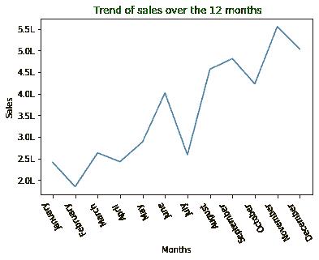
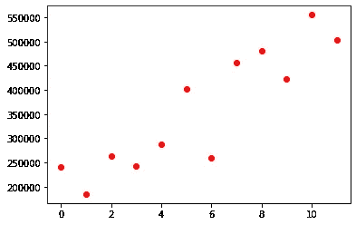

# 用于数据科学的 Python 库:第 4 天→Matplotlib(线形图)

> 原文：<https://medium.com/analytics-vidhya/python-libraries-for-data-science-day-4-matplotlib-line-plot-graph-a01a445468de?source=collection_archive---------26----------------------->

一个**线图**用于呈现连续的时间相关数据。

让我们借助一个例子来理解；

***折线图:过去 12 个月的销售趋势***

```
***# Sales data across months***
months = np.array(['January', 'February', 'March', 'April', 'May', 'June', 'July', 'August', 'September', 'October', 'November', 'December'])sales = np.array([241268.56, 184837.36, 263100.77, 242771.86, 288401.05, 401814.06, 258705.68, 456619.94, 481157.24, 422766.63, 555279.03, 503143.69])
```

**首次导入重要库:——**

```
**import** **numpy** **as** **np**
**import** **matplotlib.pyplot** **as** **plt**
```

创建数组；

```
months = np.array(['January', 'February', 'March', 'April', 'May', 'June', 'July', 'August', 'September', 'October', 'November', 'December'])
sales = np.array([241268.56, 184837.36, 263100.77, 242771.86, 288401.05, 401814.06, 258705.68, 456619.94, 481157.24, 422766.63, 555279.03, 503143.69])
```

绘制折线图；

```
plt.plot(months,sales)
*# adding title to the chart*
plt.title(" Trend of sales over the 12 months",color="green")
*# labeling the axes*
plt.xlabel("Months",color="red")
plt.ylabel("Sales",color="red")
*# rotating the tick values of x-axis(The names of the months are not be readable)*
plt.xticks(rotation=120)
```

一些小算法申请重命名 Y 轴上的数字；

```
tick_y=np.arange(200000,600000,50000)
tick_store=[]
**for** i **in** tick_y:
    num=i/100000
    txt=str(num)+"L"
    tick_store.append(txt)
plt.yticks(tick_y,tick_store)    

*# displating the created plot*
plt.show()
```



**线图**

一个小技巧，这样我们就可以借助 plot()函数/方法实现散点图；

#plt.plot(销售，' ro ')



散点图

在第五天的课程中，我们将学习“通过 H 图和图*的可视化”..*


拜拜