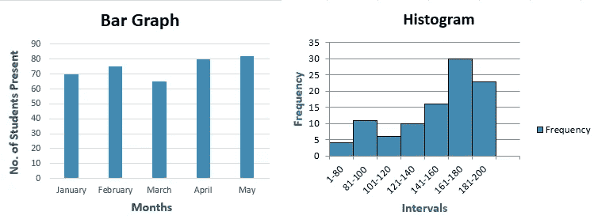
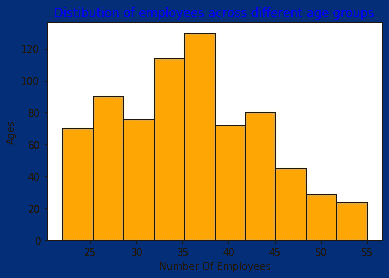
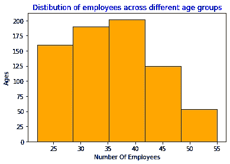

# 用于数据科学的 Python 库:第 5 天→Matplotlib (HistogramsGraph)

> 原文：<https://medium.com/analytics-vidhya/python-libraries-for-data-science-day-5-matplotlib-histogramsgraph-7953cb2f8855?source=collection_archive---------30----------------------->

**直方图→** 是指示每个条柱出现频率的条形面积。这意味着条形的高度不一定表示在每个单独的柱中出现了多少次得分。它是箱的高度乘以宽度的乘积，表示在该箱中出现的频率。

→直方图 和 ***条形图*** 有什么区别？



条形图 V/S 直方图

主要区别在于直方图仅用于绘制连续数据集中分数出现的频率，该连续数据已被划分为多个类别，称为箱。另一方面，条形图可以用于大量其他类型的变量，包括序数和名义数据集。

我们直接去做实际工作吧→

我们的例子…

直方图:不同年龄组的员工分布

1>.导入库

```
**import** **numpy** **as** **np**
**import** **matplotlib.pyplot** **as** **plt**
```

2>.初始化数组

对应于公司中雇员年龄的数据，

```
age = np.array([23, 22, 24, 24, 23, 23, 22, 23, 24, 24, 24, 22, 24, 23, 24, 23, 22, 24, 23, 23, 22, 23, 23, 24, 23, 24, 23, 22, 24, 22, 23, 24, 23, 24, 22, 22, 24, 23, 22, 24, 24, 24, 23, 24, 24, 22, 23, 23, 24, 22, 22, 24, 22, 23, 22, 23, 22, 23, 23, 23, 23, 22, 22, 23, 23, 23, 23, 23, 23, 22, 29, 29, 27, 28, 28, 29, 28, 27, 26, 27, 28, 29, 26, 28, 26, 28, 27, 27, 28, 28, 26, 29, 28, 28, 26, 27, 26, 28, 27, 29, 29, 27, 27, 27, 28, 29, 29, 29, 27, 28, 28, 26, 28, 27, 26, 26, 27, 26, 29, 28, 28, 28, 29, 26, 26, 26, 29, 26, 28, 26, 28, 28, 27, 27, 27, 29, 27, 28, 27, 26, 29, 29, 27, 29, 26, 29, 26, 29, 29, 27, 28, 28, 27, 29, 26, 28, 26, 28, 27, 29, 29, 29, 27, 27, 29, 29, 26, 26, 26, 27, 28, 27, 28, 28, 29, 27, 26, 27, 29, 28, 29, 27, 27, 26, 26, 26, 26, 29, 28, 28, 33, 34, 33, 33, 34, 33, 31, 32, 33, 33, 32, 34, 32, 31, 33, 34, 31, 33, 34, 33, 34, 33, 32, 33, 31, 33, 32, 32, 31, 34, 33, 31, 34, 32, 32, 31, 32, 31, 32, 34, 33, 33, 31, 32, 32, 31, 32, 33, 34, 32, 34, 31, 32, 31, 33, 32, 34, 31, 32, 34, 31, 31, 34, 34, 34, 32, 34, 33, 33, 32, 32, 33, 31, 33, 31, 32, 34, 32, 32, 31, 34, 32, 32, 31, 32, 34, 32, 33, 31, 34, 31, 31, 32, 31, 33, 34, 34, 34, 31, 33, 34, 33, 34, 31, 34, 34, 33, 31, 32, 33, 31, 31, 33, 32, 34, 32, 34, 31, 31, 34, 32, 32, 31, 31, 32, 31, 31, 32, 33, 32, 31, 32, 32, 31, 31, 34, 31, 34, 33, 32, 31, 34, 34, 31, 34, 31, 32, 34, 33, 33, 34, 32, 33, 31, 31, 33, 32, 31, 31, 31, 37, 38, 37, 37, 36, 37, 36, 39, 37, 39, 37, 39, 38, 36, 37, 36, 38, 38, 36, 39, 39, 37, 39, 36, 37, 36, 36, 37, 38, 36, 38, 39, 39, 36, 38, 37, 39, 38, 39, 39, 36, 38, 37, 38, 39, 36, 37, 36, 36, 38, 38, 38, 39, 36, 37, 37, 39, 37, 37, 36, 36, 39, 37, 36, 36, 36, 39, 37, 37, 37, 37, 39, 36, 39, 37, 38, 37, 36, 36, 39, 39, 36, 36, 39, 39, 39, 37, 38, 36, 36, 37, 38, 37, 38, 37, 39, 39, 37, 39, 36, 36, 39, 39, 39, 36, 38, 39, 39, 39, 39, 38, 36, 37, 37, 38, 38, 39, 36, 37, 37, 39, 36, 37, 37, 36, 36, 36, 38, 39, 38, 36, 38, 36, 39, 38, 36, 36, 37, 39, 39, 37, 37, 37, 36, 37, 36, 36, 38, 38, 39, 36, 39, 36, 37, 37, 39, 39, 36, 38, 39, 39, 39, 37, 37, 37, 37, 39, 36, 37, 39, 38, 39, 36, 37, 38, 39, 38, 36, 37, 38, 42, 43, 44, 43, 41, 42, 41, 41, 42, 41, 43, 44, 43, 44, 44, 42, 43, 44, 43, 41, 44, 42, 43, 42, 42, 44, 43, 42, 41, 42, 41, 41, 41, 44, 44, 44, 41, 43, 42, 42, 43, 43, 44, 44, 44, 44, 44, 41, 42, 44, 43, 42, 42, 43, 44, 44, 44, 44, 41, 42, 43, 43, 43, 41, 43, 41, 42, 41, 42, 42, 41, 42, 44, 41, 43, 42, 41, 43, 41, 44, 44, 43, 43, 43, 41, 41, 41, 42, 43, 42, 48, 48, 48, 49, 47, 45, 46, 49, 46, 49, 49, 46, 47, 45, 47, 45, 47, 49, 47, 46, 46, 47, 45, 49, 49, 49, 45, 46, 47, 46, 45, 46, 45, 48, 48, 45, 49, 46, 48, 49, 47, 48, 45, 48, 46, 45, 48, 45, 46, 46, 48, 47, 46, 45, 48, 46, 49, 47, 46, 49, 48, 46, 47, 47, 46, 48, 47, 46, 46, 49, 50, 54, 53, 55, 51, 50, 51, 54, 54, 53, 53, 51, 51, 50, 54, 51, 51, 55, 50, 51, 50, 50, 53, 52, 54, 53, 55, 52, 52, 50, 52, 55, 54, 50, 50, 55, 52, 54, 52, 54])
```

3>.让我们想象一下→

```
*# plotting a histogram*
*#by default it represents with 10 bins we also modify it*
plt.hist(age,edgecolor='black',color="orange")
plt.title("Distibution of employees across different age groups",color="blue")
plt.xlabel("Number Of Employees",color="green")
plt.ylabel("Ages",color="green")
plt.show()
```



直方图(默认条柱)

**4 >。我们还可以自定义图形的箱:——**

用固定数量的箱绘制直方图…

```
plt.hist(age,bins=5,edgecolor='black',color="orange")
plt.title("Distibution of employees across different age groups",color="blue")
plt.xlabel("Number Of Employees",color="green")
plt.ylabel("Ages",color="green")
plt.show()
```



直方图(有 5 个条块)

在第六天的课程中，我们将学习 ***“方框图可视化”…..***


拜拜