# Linux 上的 Python 库劫持(附例子)

> 原文：<https://medium.com/analytics-vidhya/python-library-hijacking-on-linux-with-examples-a31e6a9860c8?source=collection_archive---------2----------------------->


(戴维·克洛德在 [Unsplash](https://unsplash.com/s/photos/python?utm_source=unsplash&utm_medium=referral&utm_content=creditCopyText) 上的照片)

在本文中，我们将讨论在 Linux 环境中劫持 Python 库的三种有效方法。

## 为什么重要？

让我们看看……如果一个 Python 脚本以 ***sudo*** 权限运行，但是您在导入的模块上获得了 ***write*** 权限，会发生什么？

没错。您可以通过编辑导入的函数来升级您的权限，以调用系统命令，甚至生成一个 shell，它将拥有 ***root*** 权限。

## 滥用这个问题的方法

我将分享三个任何人都可以利用这个漏洞的场景(或者更好地称之为“安全错误配置”):

1.  ***对导入的 Python 模块的写权限***
2.  ***优先级更高的 Python 库路径拥有破碎权限***
3.  ***通过 PYTHONPATH 环境变量*** 重定向 Python 库搜索

## 共同要求

每个场景都有一个共同的特定需求。Python 脚本必须满足以下条件之一才能成功进行权限提升尝试:

*   脚本必须被编译成二进制格式，呈现更高特权用户的 **SUID** 权限(可执行文件将继承所有者的特权)。您可以通过以下命令在 Linux 系统中搜索 SUID 文件:

```
find / -perm /4000
```

*   脚本必须被编译成二进制格式，表示更高特权组的 **SGID** 权限(脚本将继承组所有者的特权)。您可以通过以下命令在 Linux 系统中搜索 SGID 文件:

```
find / -perm /4000
```

或者，您可以搜索同时拥有 SUID 和 SGID 权限的文件:

```
find / -perm /6000
```

*   脚本可以使用 **SUDO** 来启动，并且可以在 ***根目录*** 下运行。您可以通过终端输入以下命令来检查这是否可行:

```
sudo -l
```

## 场景 1:对导入的 Python 模块的写权限

假设我们有一个 Python 脚本，它导入了 ***base64*** 模块，并从该模块调用了 ***b64encode*** 函数，以便对特定的字符串进行编码。

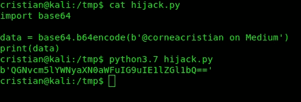

现在，让我们在 Linux 文件系统中定位 ***base64*** 模块路径。

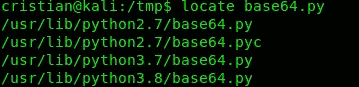

在许多路径下得到它(因为我安装了更多的 Python 版本)，但是我们的注意力应该落在 Python3.7 路径上:

```
/usr/lib/python3.7/base64.py
```

让我们检查一下 Python 模块的权限。

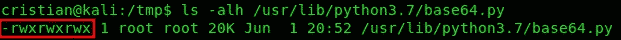

我们可以清楚地看到，它获得了 ***读*** ， ***写*** ， ***执行*** 的权限，为 ***所有人。***

接下来，必须编辑该文件中的 ***b64encode*** 函数，以执行系统命令，如 ***whoami*** 。

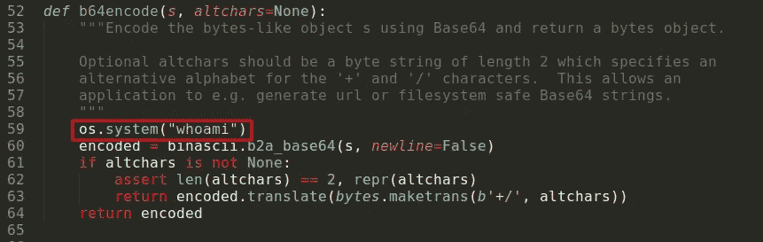

保存文件，返回终端并输入以下命令，检查我们可以使用 ***sudo*** 运行哪些文件:

```
sudo -l
```

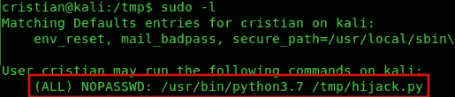

运行完脚本后，我们在这里:

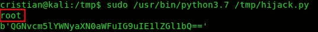

我们注意到 ***whoami*** 系统命令被执行并返回预期结果 ***。***

## 场景 2: ***优先级更高的 Python 库路径与破碎特权***

当在脚本中导入模块时，Python 将按照特定的优先级顺序在一些预定义的目录中搜索该模块文件，并选择第一个出现的位置。

例如，在 Ubuntu 上，默认的搜索优先级如下:

```
/usr/lib/pythonX
/usr/lib/pythonX/plat-x86_64-linux-gnu
/usr/lib/pythonX/lib-tk
/usr/lib/pythonX/lib-old
/usr/lib/pythonX/lib-dynload
/usr/local/lib/pythonX/dist-packages
/usr/lib/pythonX/dist-packagesX - Python Version (2.6, 2.7, 3.7, and so on)
```

您可以根据您的 Python 版本，使用以下命令查找您的订单:

```
pythonX -c 'import sys; print("\n".join(sys.path))'X - Python Version (2.6, 2.7, 3.7, and so on)
```

也许你已经知道了攻击是如何进行的，如果没有，我将在下面的段落中解释。

被搜索的模块将位于一个定义的路径中，但是如果 Python 在一个优先级更高的文件夹中找到一个与*同名的模块，它将导入那个模块而不是“合法的”模块。*

*这种方法的工作要求是能够在模块所在的文件夹之上的文件夹中创建文件。*

*我们将使用相同的 ***劫持. py*** 脚本，但是我将 ***base64.py*** 模块移动到了目录层次结构中优先级较低的文件夹，因此现在 */usr/lib/python3.7/* 文件夹不再包含该模块*。**

*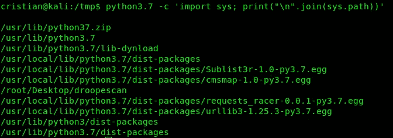*

*上面的截图提供了 Python 库搜索的实际文件夹优先级层次，在我的本地机器上。*

*接下来，我将检查 */usr/lib/python3.7\.* 的权限*

*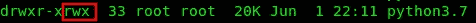*

*就是这样，文件夹里有 ***读*** ， ***写*** ，*执行* 的权限，所以我们可以在里面创建我们自定义的 ***base64.py*** 模块。*

*恶意模块必须包含一个通过 Python 脚本调用的函数定义(在我们的例子中为 ***b64encode*** )，并具有确切的参数数量(在我们的例子中，只有一个字符串被解析为参数，因此我们将使用一个参数来定义函数，称为“ *a* ”)。*

*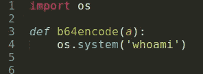*

*现在，保存模块，运行脚本，注意有效负载已经成功执行。*

*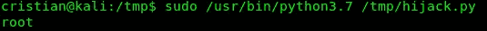*

## *场景 3: ***通过 PYTHONPATH 环境变量*** 重定向 Python 库搜索*

****PYTHONPATH*** 环境变量表示一个(或多个)目录，Python 可以在其中搜索要导入的模块。*

*如果用户获得了设置或修改该变量的权限，通常是通过一个可以使用 ***sudo*** 权限运行的脚本，并获得了设置到 ***/etc/sudoers*** 文件中的 ***SETENV*** 标记，则该漏洞可能会被滥用。*

*在我们的例子中，我将 Python 模块移动到了 ***/tmp/*** 文件夹中。*

**

*让我们通过“ *sudo -l* ”命令来检查 ***SETENV*** 标签是否被设置:*

*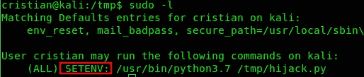*

*现在，我们可以这样运行脚本:*

*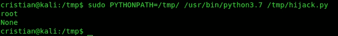*

*在那里！*

## *预防提示*

*不要在 Python 模块所在的文件夹上为用户设置写权限。*

*通过虚拟环境限制对特定模块的访问，而不是让 Python 搜索文件夹。*

*我真的希望这篇文章是有用的，并祝大家有一个美好的一天！*