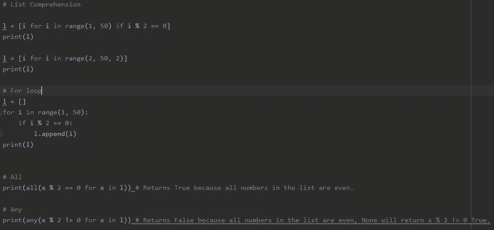

# Python:列表理解，所有和任何方法

> 原文：<https://medium.com/analytics-vidhya/python-list-comprehension-all-and-any-methods-35355128b88f?source=collection_archive---------15----------------------->



列出所有和任何(一个)人的理解

# Python 中的列表理解是什么？

这是一种无需编写代码就能创建 Python 列表或字典的方法，让你的脚本看起来更整洁、可读性更好。

想象一下，你想创建一个 1 到 50 之间的偶数整数列表。

```
# For loop
l = []
for i in range(1, 50):
    if i % 2 == 0:
        l.append(i ** 0.5)
```

但是有了列表理解，这就是你所需要的。

```
# List Comprehension
l = [i ** 0.5 for i in range(1, 50) if i % 2 == 0]
```

现在让我解释/描述这是如何工作的。

列表理解非常直观，不是火箭科学。

在列表理解中，一般需要定义**变量**、**输出表达式**和一个可选的**条件语句**或**输入序列**。

```
# List Comprehension
l = [i ** 0.5 for i in range(1, 50) if i % 2 == 0]i -> Variable
i  ** 0.5 -> Input Sequence (Optional)
range(1, 50) -> Output Expression
if i % 2 == 0 -> Conditional Statement (Optional)
```

通常，我会在脑海中重复这些台词:

> 对于(输出表达式)中的所有(变量)，我要把变量(输入序列)的平方根追加到列表中，前提是变量是偶数整数(条件语句)。

我发现在通过列表理解创建列表时，在脑海中背诵这些句子是有效的。它类似于读出一个 For 循环代码来创建一个列表，但是把它压缩成一行代码。

```
# For loop
l = []
for i in range(1, 50):
    if i % 2 == 0:
        l.append(i ** 0.5)
```

> 对于 range(1，50)(输出表达式)中的所有 I(变量)，只有当 i % 2 == 0 的计算结果为 True(条件语句)时，我才希望将 i ** 0.5(输入序列)追加到列表中。

# Python 中的 Any and All 方法是什么？

**Any** 和 **All** 方法用于检查列表中的每个元素是否满足条件。

现在，使用我们在文章的第一部分中通过列表理解创建的列表( *l* ),我们想要通过使用 All 方法来验证 *l* 中的每个元素是否都是**偶数**。

```
# All
all(x % 2 == 0 for x in l)l -> List
x -> Variable
x % 2 == 0 -> Conditions
```

> 我想检查列表中的所有元素是否都是偶数。

该语句将评估为真，因为 *l* 中的每个元素都是**偶数**。但是，如果至少有一个奇数出现，则该语句的计算结果为假。

类似地，我们可以通过使用 Any 方法来检查 *l* 中的任何元素是否为奇数**。**

```
# Any
print(any(x % 2 != 0 for x in l))l -> List
x -> Variable
x % 2 != 0 -> Conditions
```

> **我想检查列表中的元素是否是奇数。**

**该语句将评估为假，因为 *l* 中的元素都不是奇数**。但是，如果至少有一个奇数**出现，该语句将被评估为真。******

# ****结论****

****通过足够的练习，这些技术将会使你的编码体验不那么痛苦和省时。熟能生巧！****