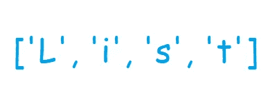

# Python 列表 I

> 原文：<https://medium.com/analytics-vidhya/python-lists-i-8d630cb07dcc?source=collection_archive---------33----------------------->



Python 的突出特性之一是它强大的内置数据结构集合，可以分为可变和不可变两种。列表、集合和字典是可变的，这意味着它们的内容在创建后可以改变。元组和字符串是不可变的，即在创建期间赋予它们的初始值不能改变。在今天的帖子中，让我们深入了解 Python 列表的世界。

> 我们如何在 Python 中创建一个空列表？

首先，我们需要将一个名字与我们希望创建的列表相关联。该名称应该是合法的标识符(只允许字母、下划线和数字；可以以字母或下划线开头；不能包含空白；不能是关键字)。接下来，我们使用 **list** 关键字，后跟一对圆括号，如下所示:

```
my_list = list()
```

或者，我们可以使用一对空方括号，如下所示:

```
my_list = []
```

在这两个场景中，我们得到一个由 **my_list** 标识的空列表

> 我们如何创建一个带有值的列表？

请注意，列表是异构的。它们可以包含不同类型的值或元素，但都是相同的类型，如下所示:

```
my_list_1 = [1, 2, 3, 4]
my_list_2 = [3.14, 2.73, 1729, 28]
my_list_3 = [3.14, 2.73, "pi", 22, 7, "exponent"]
```

**my_list_1** 是整数列表， **my_list_2** 是浮点数和整数列表， **my_list_3** 是整数、浮点数和字符串列表

> 列表可以被索引吗？

索引是指通过项目的位置值来访问有序序列中的项目。这里，sequence 可以是 Python 中可用的任何数据结构，比如列表和元组。但是，并不是所有的都是订购的。列表是一个有序的序列，这意味着元素被创建的顺序被保留，从而使得索引成为可能。Python 支持正索引和负索引:

```
my_list = [1.6, 2, "hello", 7]
print(my_list[0])  # OUTPUT : 1.6
print(my_list[3])  # OUTPUT : 7
print(my_list[-1]) # OUTPUT : 7
print(my_list[-2]) # OUTPUT : hello
print(my_list[2])  # OUTPUT : hello
print(my_list[10]) # OUTPUT : IndexError
```

索引从零开始，一直到列表长度减一。试图索引列表中没有元素的位置会导致如上所示的 **IndexError** 。这里，my_list 包含 4 个元素。因此，位置值的范围是从 **0 到(4 - 1)** 或 **0 到 3** 。对于反向索引，我们可以使用负值。如上所示，最后一个元素 7 可以使用两个位置值来访问:3 和-1。

```
print(my_list[len(my_list)-1])  # OUTPUT : 7
print(my_list[-1])              # OUTPUT : 7
```

函数的作用是:报告列表中元素的总数。在上面的场景中，它返回 4。从列表长度中减去 1 得到 3，这是 **my_list** 中最后一项的索引。然而，事实证明它是冗长的。当我们处理一个非常大的列表并且想要优雅地访问最后一项时，负索引被证明是有用的。

> Python 中的列表可以切片吗？

提取有序序列的一部分被称为**切片**。Python 中的列表是有序的，是切片操作的候选对象。切片的语法是:

```
name_of_list[start_index : stop_index : step_size]
start_index : starting point of slicing (inclusive)
stop_index : ending point of slicing (exclusive)
step_size : increment value 
```

切片的**包括起始位置**，但切片的**不包括结束位置**。这三个值都是可选的:

```
my_list = [1, 2, 3, 4, 5]  # list of 5 integersprint(my_list[0:3:1])  # OUTPUT: [1, 2, 3]print(my_list[:3:1])   # Default start_index = 0; OUTPUT: [1, 2, 3]print(my_list[0::1])   # Default stop_index = length of list
                       # OUTPUT: [1, 2, 3, 4, 5]print(my_list[0:4:])   # Default step_size = 1; OUTPUT: [1, 2, 3, 4]print(my_list[::])     # Same as my_list[0:len(my_list):1]
                       # OUTPUT: [1, 2, 3, 4, 5]
```

stop_index 可以是列表中没有元素的位置。它不会导致任何**索引错误**。相反，它将考虑列表末尾之前的元素:

```
print(my_list[0:10:1]) # OUTPUT: [1, 2, 3, 4, 5]
```

对于切片，我们也可以使用负索引。一个优雅的反转列表的方法是一个很好的例子:

```
print(my_list[::-1])   # OUTPUT: [5, 4, 3, 2, 1]
```

我希望这篇文章对你有所帮助。请随时留下您的评论、反馈、批评、想法和其他一切。回头见！