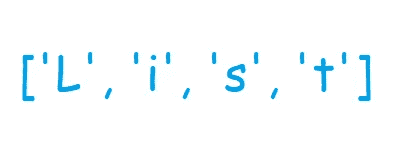

# Python 列表 II

> 原文：<https://medium.com/analytics-vidhya/python-lists-ii-a6681421b60e?source=collection_archive---------35----------------------->

在之前的[帖子](/@soumyajitpal776/python-lists-i-8d630cb07dcc)中，我们已经经历了列表**创建**、**索引**和**切片**。让我们进一步探索列表的力量。

> 我们可以添加到列表中吗？

在可变序列末尾添加元素的操作被称为**追加**。因为列表可以被**修改(也就是可变的)**，所以对 list 类型的对象应用这个操作是完全合法的。为此，我们有内置的 **append()** 函数。我们可以将整数添加到列表中:

将 99 附加到我的列表

不仅像整数、浮点、布尔和字符串这样的单值常量，列表对象还可以附加另一个列表:

将列表追加到我的列表中

一个问题立刻出现了，*“我们如何索引一个列表，就像上面显示的，它包含另一个列表？”*

我们将新添加的列表视为一个项目，并按位置对其进行索引，在上面的场景中，位置恰好是 **6** :

通过位置值索引获取整个列表

*“如果我们想要内部列表的一个特定元素呢？”*

我们更进一步，通过位置值进行索引。第一对[ ]表示整个内部列表，下一对[ ]表示内部列表中的特定元素。由于有两个元素，**你好**和 **449** ，合法的位置值只有 **0** 和 **1** :

使用两级索引

> 我们能从列表中删除元素吗？

清空一个列表可以用一个命令完成: **clear( )**
该操作在**就地**执行(清空方法调用的列表对象的内容)，是**不可逆的**并且**不返回任何值**。 **clear( )** 函数**不接受任何参数**:

完全清除我的列表

可能会出现这样的情况，我们希望从列表中删除一个元素，而不是清空它。实现这一点的一种方法是使用 **remove( )** —删除作为函数参数提供的列表项的第一次出现:

在两次出现 12 的情况中，索引为 0 的情况会被丢弃

与 clear()一样，remove( ) **不返回任何值**，是**不可逆**并就地执行**。如果我们传递一个不在列表中的参数，remove()会产生一个 **ValueError** :**

****

**因为 99 不在我的列表中，我们得到一个错误值**

**另一种去除列表项的方法是使用 **pop( )** —通过位置(索引)值移除元素。它**返回被删除的元素**，是**不可逆**，**取 0 或 1 自变量**并应用**在位**。我们可以传递要移除的项目的索引值(传递 1 个参数):**

****

**传递索引值 15 (= 3)以将其从列表中移除**

**如果我们不向 pop()传递任何参数，它**返回并删除**列表中调用 pop()方法的最后一项:**

****

**从我的列表中删除“hello”(最后一个索引= 6)**

**最后，如果我们传递一个在列表中没有元素的位置值，我们得到一个 **IndexError** :**

****

**my_list 的范围是从 0 到 6，因此 10 是 pop()的无效参数**

> **我们可以按升序或降序排列列表元素吗？**

**可以使用内置函数 **sort( )** 对列表进行排序。然而，有一个例外。由于 list 是一个**异构序列**(可以包含混合类型)，所以只有当它包含相同类型的值时才能排序。默认情况下，它按升序对元素进行排序:**

****

**按字母顺序对字符串进行升序排序**

****sort( )** 函数被就地**应用**并且**不返回任何值**。为了按照**降序**排列元素，我们将**参数 reverse 设置为 True** (默认为 False 用于按升序对元素进行排序):**

****

**按降序对 my_list_3 排序**

**如果我们试图对包含不同类型值的列表进行排序，我们会得到一个 **TypeError** :**

****

**my_list 包含字符串和整数，因此无法排序**

**我希望这篇文章对你有所帮助。请随时留下您的评论、反馈、批评、想法和其他一切。回头见！**