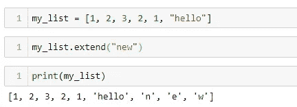

# Python 列表 III

> 原文：<https://medium.com/analytics-vidhya/python-lists-iii-524f035acf5a?source=collection_archive---------20----------------------->

在之前的 [post](/analytics-vidhya/python-lists-ii-a6681421b60e) 中，我们已经经历了**追加**、**删除**、**排序**等列表操作。让我们进一步探索列表的力量。

> 清单项目可以算吗？

使用 **count( )** 方法，我们可以找到一个条目在列表中出现的次数。它只接受**一个参数**——列出我们想要查找其计数的**项——并返回该项在列表**中出现的次数**:**

1729 在 my_list 中出现两次，因此返回 2

如果我们传递一个列表中没有的值，那么 count()将被调用，我们将返回 0 作为返回值:

“鲁尼”不在我的列表中，因此返回 0

> 列表可以反转吗？

可以使用内置函数 **reverse( )** 反转列表。不管列表项是否属于同一类型，它都可以工作。操作**就地**(原列表反过来)**不返回值****不接受任何参数**:

在 my_list 上调用 reverse()后，列表项以相反的顺序出现

另一种方法是使用切片，步长为-1:

重新分配 my_list 后，列表项以相反的顺序出现

> 列表可以扩展吗？

有一个叫做 **extend( )** 的方法允许我们这样做。它接受一个 iterable，比如另一个列表、一个元组、一个集合、一个字符串甚至一个字典作为参数，并扩展调用 extend()的列表。操作**到位**且**不返回值**:

通过列表项目扩展我的列表

通过元组项扩展 my_list

通过集合元素扩展 my_list。但是，元素的顺序不会保留

通过字符串扩展我的列表。字符串中的每个字符都被视为一个单独的列表项

通过字典扩展我的列表。键作为列表项添加，但值被忽略

> 我们能找到列表项的位置值吗？

**index( )** 方法使我们能够找到列表元素的**索引值(也称为位置值)**。它期望一个**列表项作为参数**并且**返回该项在列表**中的 **位置。调用 index()方法的列表保持不变:**

25 是第二个元素(即位置 1)

如果我们传递一个在列表中多次出现的值，我们只得到第一次出现的位置:

12 存在于位置 3、5 和 6。index(12)返回这些位置中的第一个，即 3

如果我们传递一个不在列表中的值，我们得到 **ValueError** :

因为 100 在我的 _list 中不存在，所以我们得到一个 ValueError

**index( )** 方法带**两个可选参数** — **搜索的起始位置**和**搜索的结束位置**。如果我们**传递两个参数**，第一个**表示元素**，第二个**表示搜索**的开始位置。因为未指定结束位置，所以搜索会一直进行到列表的末尾:

10 是搜索项，2 是搜索的开始位置。因此，第一次出现的 10(位置 0)将被忽略

如果我们指定**三个参数**来索引( )，第一个**表示元素**，第二个**表示搜索**的开始位置，**第三个表示结束位置**:

搜索项目 12 出现在位置 3、5 和 6。由于搜索限制在位置 4 到 7，index()返回指定范围内第一次出现的 12，即 5

> 我们可以在列表中的指定位置插入吗？

**insert( )** 方法回答了这个问题。在位置**执行操作**不返回值**:**

在我的列表的位置 0，列表[“维耶拉”、“克鲁伊维特”]已被成功插入

当我们插入一个新值时，现有的列表项会相应地移动:

现有元素已被移动，以便为 my_list 位置 4 处的字符串“hello”让路

如果**指定的索引不包含任何元素**，默认情况下，该值插入到最后一个位置:

我的 _list 范围从 0 到 7。试图在索引 50 处插入 10000 将导致在最后一个位置插入

我希望这篇文章对你有所帮助。请随时留下您的评论、反馈、批评、想法和其他一切。回头见！