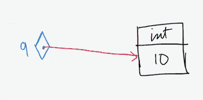
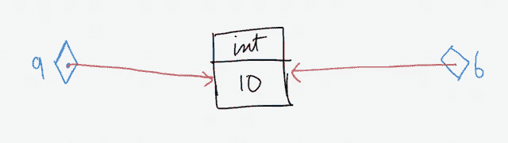
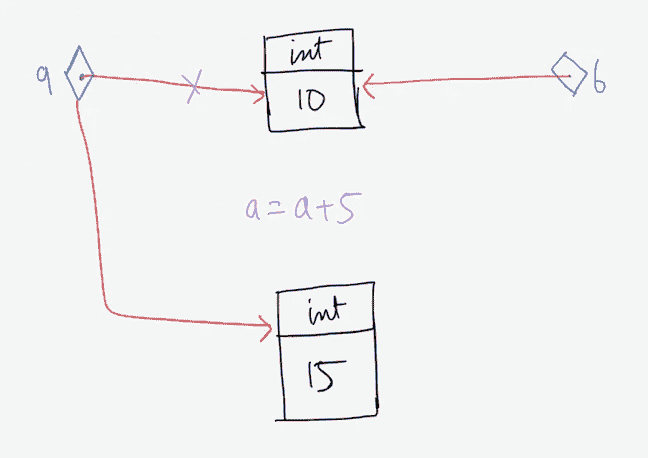
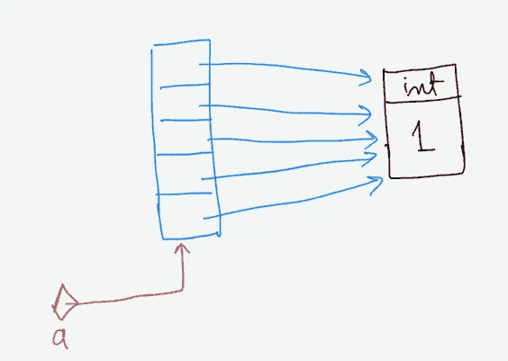
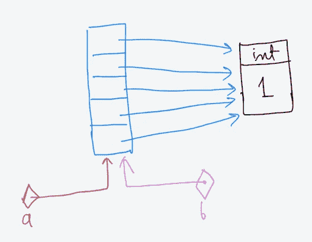
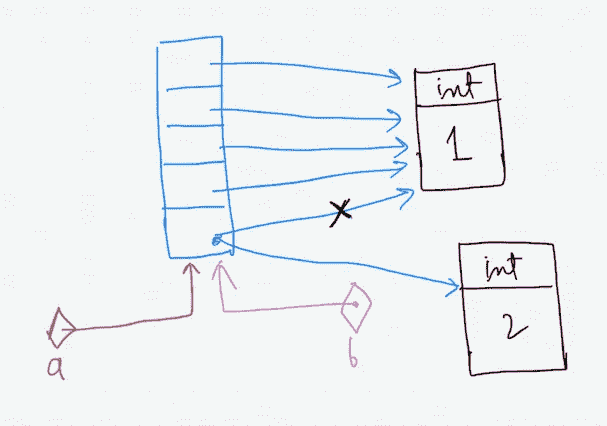
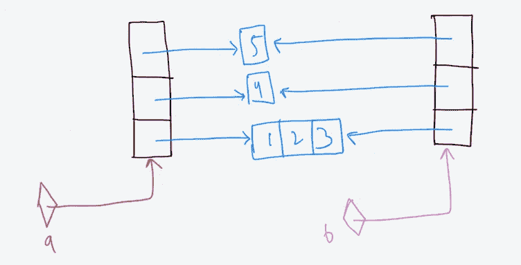
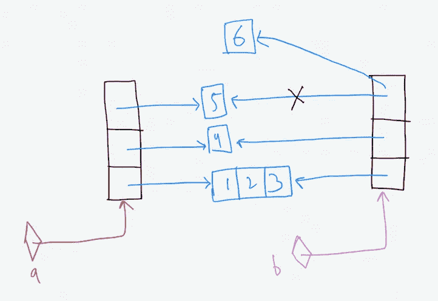
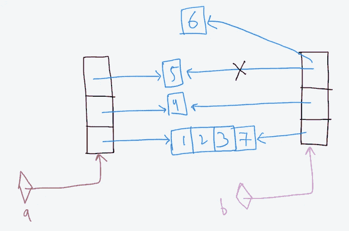

# Python 列出了浅拷贝和深拷贝。

> 原文：<https://medium.com/analytics-vidhya/python-lists-shallow-and-deep-copy-fdcddb0c4555?source=collection_archive---------0----------------------->


所有东西，如 int、float、str、lists 等。是 Python 中的对象。当我们声明一个变量的时候-

a=10

它创建一个对值为 10 的 **int** 对象的引用。在图中，它可以表示为



所以如果我们写下这个片段-

```
a=10
print(a)
print(id(a))
```

它给了我们输出-

```
10
4446123712
```

这里的 **id()** 给出了一个对象的唯一标识符值，该值在其生命周期内保持不变。这意味着当两个对象具有相同的 id 时，它们是完全相同的。但是，可以有对该对象的多个引用。因此，任何被赋值为 **10** 的整数变量都指向由变量 **a** 指向的同一个对象。

```
a=10
b=10
print(id(a))
print(id(b))
print(id(10))
```

这段代码给了我们输出-

```
4446123712
4446123712
4446123712
```

这意味着 **a** 和 **b** 指向同一个对象 **10。**注意，整数对象 10 本身具有相同的 id 值。



由于 **a** 和 **b** 指向同一个对象，那么当我们改变 **a** 的值时 **b** 的值是否也会改变？

```
a=a+5
```

现在如果我们打印出 **a** 和 **b** 的值以及它们指向的对象的 id 会怎么样？

```
a=a+5
print(a)
print(b)
print(id(a))
print(id(b))
```

输出是-

```
15
10
4446123872
4446123712
```

这里发生的事情是创建了一个值为 **15** 的新对象，现在 **a** 指向该对象。



# 复制列表。

让我们看看当我们声明一个只有整数对象的列表时会发生什么。

```
a=[1]*5
print(a)
```

它给了我们输出-

```
[1, 1, 1, 1, 1]
```



变量 a 指向底层的列表对象。现在我们将变量 **a** 赋值给 **b.**

```
b=a
print(b)
```

这给了我们输出

```
[1, 1, 1, 1, 1]
```

不出所料。a 指向的列表的每个元素并不是一个一个复制到 b 指向的列表中。相反，只有引用被复制到 b。变量 a 和 b 现在指向同一个列表对象。



我们现在可以通过引用 a 或 b 来修改列表。

```
b[0]=2
print(b)
print(a)
```

给了我们输出

```
[2, 1, 1, 1, 1]
[2, 1, 1, 1, 1]
```



通过打印 a 和 b 的 id，我们可以验证它们是否指向同一个列表对象。

```
print(id(a))
print(id(b))
```

给了我们输出-

```
4500229128
4500229128
```

# 浅抄深抄。

浅层副本只是最外层容器的副本。看看下面的代码。

```
a=[[1,2,3],4,5]
b=a
print(a)
print(b)
```

这给了我们输出-

```
[[1, 2, 3], 4, 5]
[[1, 2, 3], 4, 5]
```

这是意料之中的，因为 a 和 b 指向同一个底层列表对象。我们可以使用 a 或 b 来修改列表。

如果我们只想创建最外层容器的副本，我们可以这样做-

```
a=[[1,2,3],4,5]
b = list(a)
print(a)
print(b)
```



list()方法将 a 指向的列表元素复制到 b 指向的列表中，通过打印它们的 id，我们可以看到它们指向不同的列表。

```
a=[[1,2,3],4,5]
b = list(a)
print(a)
print(b)
print(id(a))
print(id(b))
```

上面的代码给出了输出-

```
[[1, 2, 3], 4, 5]
[[1, 2, 3], 4, 5]
4500623176
4501514312
```

我们可以看到 list()方法只通过打印内部元素的 id 执行了一次浅层复制。

```
for i in a:
    print(id(i))
print()
for j in b:
    print(id(j))
```

输出-

```
4500014408
4446123520
44461235524500014408
4446123520
4446123552
```

如果我们现在修改 b-指向的列表

```
b[2] = 6
print(a)
print(b)
```

给了我们输出-

```
[[1, 2, 3], 4, 5]
[[1, 2, 3], 4, 6]
```



因为 b[2]指向的对象是不可变的，所以它创建了一个值为 6 和的新对象，并将 b[2]赋给它。a[2]没有改变，它仍然指向同一个 int 对象 5。

但是现在如果我们写代码-

```
a[0].append(7)
print(a)
print(b)
```

我们得到-

```
[[1, 2, 3, 7], 4, 5]
[[1, 2, 3, 7], 4, 6]
```

我们看到，我们在 a[0]指向的列表中所做的更改也反映在 b[0]中。这是因为列表是一个可变对象。



要获得完全相同的副本，我们必须进行深层复制。深层副本是每个内部对象的递归副本。这两个副本彼此独立，任何级别上一个副本中的更改都不会反映在另一个副本中。

```
import copy
a=[[1,2,3],4,5]
b=copy.deepcopy(a)
b[0].append(6)
print(a)
print(b)
```

给了我们输出-

```
[[1, 2, 3], 4, 5]
[[1, 2, 3, 6], 4, 5]
```

我们可以看到，当我们修改 b 时，对 a 没有影响。

这就是这篇文章的内容。如果你喜欢，请分享。