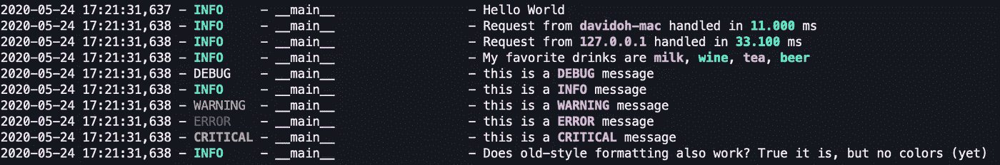
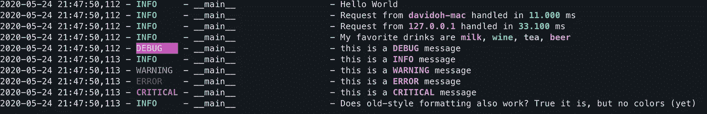

# Python 日志记录:为您的参数着色！

> 原文：<https://medium.com/analytics-vidhya/python-logging-colorize-your-arguments-41567a754ac?source=collection_archive---------4----------------------->

为消息参数记录交替的颜色

本文的最新完整代码和示例可以在我的 [GitHub Repo](https://github.com/davidohana/colargulog) 获得 Apache-2.0 许可。

是的，我们喜欢用颜色记录。
是的，有许多 Python 库和示例代码向您展示了如何根据日志级别来给 stdout 日志消息着色。

但是我将向您展示一些更好的东西——除了通过日志级别进行**着色之外，对于格式字符串中的每个参数，日志消息还具有**交替颜色**。还有一个好处——参数格式是使用 Python 3.2 中引入的新的“**大括号样式**”格式制作的，例如:**

实施非常简单，并且没有引入第三方依赖性。要应用颜色，您需要做的就是将 StreamHandler 的格式化程序设置为 **ColorizedArgsFormatter:** 的实例

拔靴带

## 它是如何工作的？

*   检查每个日志记录以确定是否使用了大括号样式的格式。我决定使用大括号样式的格式，因为这样更容易识别格式参数的开始和结束:{param}
*   当前交替颜色的 ANSI 转义码添加在每个格式化参数之前，重置颜色转义码添加在它之后
*   更新日志记录，以便使用 str.format()格式化**消息**字段，并将**参数**字段设置为空。
*   特定级别的 ANSI 转义码添加在 **levelname** 和 **levelno** 格式占位符之前，重置颜色转义码添加在占位符之后。

## 兼容性挑战

*   **我们仍然需要支持传统风格的字符串格式**，例如:
    *logger.info("我的名字是%s，我的年龄是%d "，"戴夫"，12)* 因为我们代码的许多第三方依赖项可能会以旧格式登录。我的解决方案是使用一些简单的试探法来确定是否应该使用大括号格式:字符串中没有“%”字符+花括号对的数量与日志记录参数的数量相匹配。否则，我们会退回到传统格式，但是没有参数着色可用。
*   当记录到其他媒介时，我们必须支持括号格式，比如文件。否则，记录器将无法理解格式字符串，并显示“TypeError:并非所有参数都在字符串格式化期间被转换”。解决方案是使用另一个简单的格式化程序，名为**BraceFormatStyleFormatter**，用于文件记录处理程序和其他不支持颜色的介质。这个格式化程序与**的 ColorizedArgsFormatter** 非常相似，但是它只使用格式化后的消息重写日志记录，而不添加 ANSI 颜色转义码。

## 其他提示

*   默认情况下，有两种交替的颜色。您可以通过更改 *arg_colors* 列表来更改颜色或添加更多可选颜色。
*   通过改变 *level_to_color* 字典，可以改变日志级别到颜色的映射。
*   目前，日志记录中不支持带有 kwargs 映射的花括号消息格式，例如:*我的名字是{name}”。格式(name="David")*

定制—更多交替颜色和不同颜色或调试信息

## 完整代码

## 引导和日志记录—完整示例应用程序:

最新的完整代码和示例可以在我的 [GitHub Repo](https://github.com/davidohana/colargulog) 获得 Apache-2.0 许可。

度过多彩的一天，
大卫