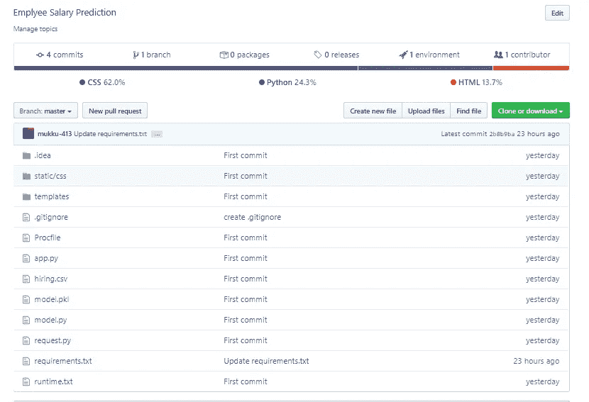

# Python 机器学习 Web 应用部署

> 原文：<https://medium.com/analytics-vidhya/python-machine-learning-web-application-deployment-d313511b9000?source=collection_archive---------38----------------------->


前往印度北阿坎德邦 Dayara trek 途中的某处(2018 年 3 月)

这篇文章的目标是— (1)用 python 构建一个用于员工工资预测的样本机器学习模型(2)使用 python flask 构建 web 应用程序(3)使用 Heroku 部署应用程序。随着每一步的进展，我们将查看目录结构。

*机器学习模型开发—*

在这一部分中，我们将使用 python 开发一个简单的机器学习模型，并保存该模型以在下一步中使用。使用下面的代码，我们将读入一个训练数据文件“hiring.csv”，处理空值并将文本值替换为数值，以便将它们输入到模型中。

```
import pandas as pd
import pickle

dataset = pd.read_csv("hiring.csv")
dataset['experience'].fillna(0, inplace=True)
dataset['test_score'].fillna(dataset['test_score'].mean(), inplace=True)

X = dataset.iloc[:, :3]

# converting words into integer values
def convert_to_int(word):
    word_dict = {'one': 1, 'two': 2, 'three': 3, 'four': 4, 'five': 5,
                 'six': 6, 'seven': 7, 'eight': 8, 'nine': 9, 'ten': 10,
                 'eleven': 11, 'twelve': 12, 'zero': 0, 0: 0}
    return word_dict[word]

X['experience'] = X['experience'].apply(lambda x: convert_to_int(x))
y = dataset.iloc[:, -1]
```

此外，我们将从 sklearn 加载 LinearRegression 模块，并在整个训练数据上拟合模型，因为我们只有少量记录。(因为我们只是为了说明的目的而构建模型，所以我们不关心模型的性能)然后我们将模型保存在“model.pkl”中，以便在下一步中加载它进行预测。

```
# training the model on entire data as we have very small number of training examples
from sklearn.linear_model import LinearRegression
model = LinearRegression()
model.fit(X, y)
# saving the trained model
pickle.dump(model, open('model.pkl', 'wb'))

# loading the model to make predictions
model = pickle.load(open('model.pkl', 'rb'))
```

*使用 Flask web 框架开发 Web 应用—*

我们将使用 flask 创建 web 应用程序，并尝试首先在本地系统上运行它。下面附上 app 开发代码。我们将导入必要的包和我们在上一部分中训练的机器学习模型。然后，我们将创建一个简单的应用程序对象，并将它与 index.html 页面链接起来。这个 HTML 页面将有一个 HTML 表单，并接受数字输入。我们将这些输入存储在 int_features 变量中，并将这些值作为特征值传递到模型中。该模型将预测这些输入值的雇员薪金，并输出消息“prediction_text= '雇员薪金应为$ {}”

```
import numpy as np
from flask import Flask, request, jsonify, render_template
import pickle#'app' is the name of the app app = Flask(__name__)
model = pickle.load(open('model.pkl', 'rb')) #this is the render the home page of the application when we launch the app
@app.route('/')
def home():
    return render_template('index.html')@app.route('/predict', methods=['POST'])
def predict():
    *"""for rendering results to HTML GUI"""* int_features = [int(x) for x in request.form.values()]
    final_features = [np.array(int_features)]
    prediction = model.predict(final_features)
    output = round(prediction[0], 2)
    return render_template('index.html', prediction_text='Employee salary should be $ {}'.format(output))

if __name__ == '__main__':
    app.run(debug=True)
```

*Web 应用部署—*

有各种平台来部署 web 应用程序，但我们将使用一个免费使用的平台 Heroku 来部署我们的应用程序。Heroku 是 *Salesforce 旗下的云平台即服务公司。*我们*正在*使用它进行部署，因为有两个原因——(a)它是免费使用的，(b)易于应用程序部署。

首先，我们必须在 heroku 上创建一个免费帐户来登录 heroku 系统。有 3 种不同的应用程序部署方法，但我们将采用无需安装 heroku CLI 的方法。git 的安装依赖于我们。如果我们在 GitHub 上已经有了应用程序文件，那么就不需要安装 git，但是如果我们在 Github 上没有，那么我们要么使用 git 上传文件和文件夹的工具来上传它们，要么我们可以安装 git，然后将项目文件推送到 git 中。下面是项目目录结构。要求项目目录中包含 ***Procfile*** 和**requests . txt**文件。heroku 需要 Procfile 来将应用程序检测为 python 应用程序。requirements.txt 应该有运行应用程序的所有包列表。只需在 python shell 中执行“pip freeze requirements.txt ”,就可以获得已安装的软件包列表。我们还需要包含 runtime.txt。该文件应该有一行提到 python 版本为“python 3.7.2”。下面是目录结构—



项目结构

现在，我们准备好部署这个应用程序了。我们将按照以下步骤部署应用程序—

(一)使用注册凭证登录 Heroku 在线平台

(ii)单击右上角的“新建”按钮，在下一个屏幕上选择一个应用程序名称(这也将包含在我们的应用程序网址中)，然后单击“创建应用程序”继续。

(iii)在应用程序部署方法中，选择 GitHub 并连接上面创建的 git 项目存储库

(iv)转到设置选项卡并添加 Python buildpack

(v)最后，单击“deploy application ”,这样首先会检测到应用程序类型(python ),然后它会自动安装 requirements.txt 文件中包含的包。瞧，我们已经成功部署了我们的第一个 web 应用程序。

我们可以去 <app-name>.herokuapp.com 试着运行一下应用。[https://salary-prediction-413.herokuapp.com/](https://salary-prediction-413.herokuapp.com/)是我已经部署的应用，继续访问吧。感谢您的阅读，如果您在以下步骤中遇到任何问题，请留下您的评论。</app-name>