# Python 均值、中值、众数函数无需导入任何内容

> 原文：<https://medium.com/analytics-vidhya/python-mean-median-mode-functions-without-importing-anything-b2be91870280?source=collection_archive---------4----------------------->

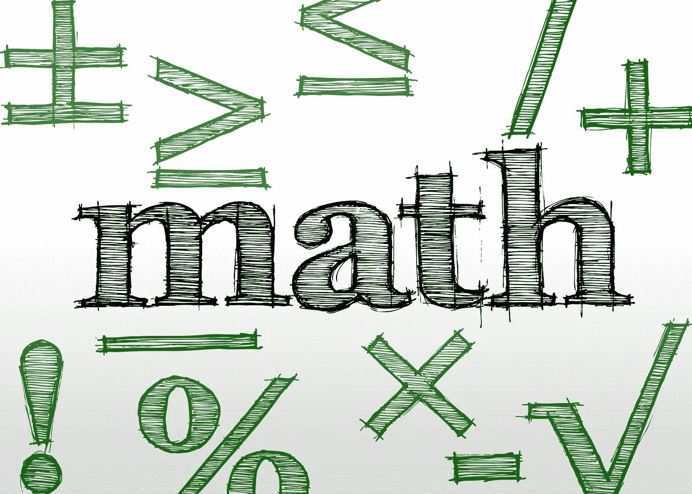

均值、中值、众数是数学中最常用的三种平均类型。意思是人们通常认为的“平均”一词。

# 平均:

当谈到一组数字的“平均值”时，人们最常提到的是一组数字的平均值。它是通过将所有数字的总和除以数字的个数(列表的长度)而得到的。在下面的示例中，我们将编写一个名为“mean”的函数，它将使用 Python 内置的 *sum()* 函数将列表中的所有数字相加，并使用 Python 内置的 *len()* 函数来获得列表的长度(数字的数量)。

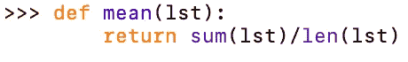

我们现在可以使用一个类似于[1，2，3，4，5]的随机列表来测试我们的函数，因为(1+2+3+4+5)=15，并且因为我们有 5 个数字，我们除以 5: 15/5=3，所以我们的预期输出将是 3。

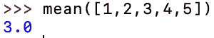

该功能适用于任何长度的输入

# 中位数:

一系列数字的中间值将是中间的数字。如果列表中有偶数个元素，那么我们将取中间两个数字的平均值(将它们相加，然后除以 2)。

我们将首先对列表进行排序，并检查列表长度是否为奇数。我们将通过检查列表模数 2 的长度是否为 1:*len(lst)% 2 = 1*(如果您不知道模数是什么，则取百分号左边的一个数字(在这种情况下为列表长度)并将其除以右边的数字(在这种情况下为 2)尽可能多次，然后查看余数是多少)。如果长度是奇数，那么我们要返回中间的数字，它将是长度除以 2，向下舍入到最接近的整数: *len(lst)//2* (两个斜线表示下限除法，这意味着我们要向下舍入到最接近的整数)

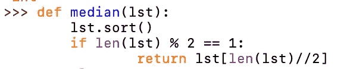

只要 lst 有奇数个元素，我们到目前为止编写的函数就能工作。我们现在想添加一个 *else* 语句，如果列表长度是偶数，它将运行，并返回两个中间数的和除以 2。中间的两个数字将以数组长度除以 2 减 1 和数组长度除以 2 的方式进行索引。这是因为 python 中的列表从索引零开始，我们的列表的第一个元素可以用 *lst[0]访问。*

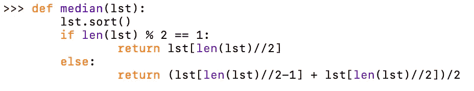

注意:我们仍然在 *else* 语句中使用 floor division，尽管我们将总是使用整数，因为常规除法返回一个浮点类型的数字，如 *1.0，2.0，3.0* ，但是我们需要整数类型的数字(整数)作为数组的索引，所以我喜欢使用 floor division，或者您可以编写 *int(len(lst))* ，但是在我看来这看起来更复杂。

我们现在可以对其进行测试，请确保测试偶数和奇数数量，以确保函数正常工作:

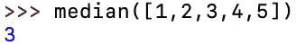

因为 3 是中间的数字，我们知道它工作正常

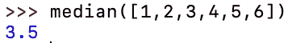

因为我们有偶数个数字，所以我们想把中间的两个数字加在一起(3，4)，然后除以 2(3+4)/2 = 3.5，因为这与我们的函数显示的结果相同，我们知道它工作正常。

# 模式:

列表的模式是列表中出现频率最高的数字。我们将通过查找列表中出现的每个数字的频率来计算它，然后选择频率最高的一个。

我们希望从创建一个字典开始，我们称之为“频率”，它将存储数字及其频率，数据的形式为*frequency[number]= # occurrences*。然后，我们将循环遍历我们的列表，并将所有的数字输入到我们的频率字典中。

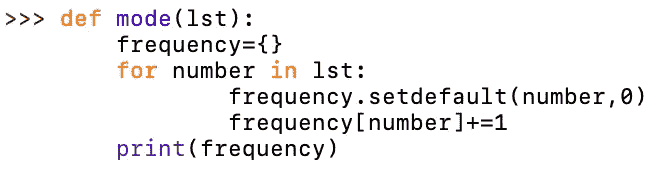

注意:如果你不知道 set defualt 是做什么的，它所做的只是检查这个数字是否在我们的字典中，如果不在我们的字典中，那么它将把它添加到我们的字典中，并设置它等于零。我添加了一个 print 语句，这样我就可以直观地展示代码到目前为止所做的事情。

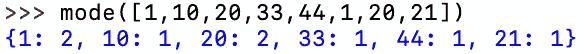

我们现在想要找到字典中的最高值，这可以通过使用*内置的 pythons 将我们所有的值转换成一个列表来实现。values()* 函数在我们的字典上创建一个列表。然后，我们可以使用内置于 *max()* 函数中的 Pythons 来查找列表中的最高值。

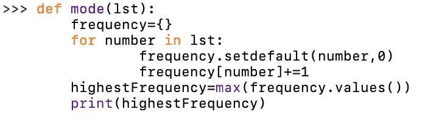

注意:添加 print 语句是为了显示正在发生的事情，变量名是我自己编的，可以是任何东西。

如果我们像以前一样插入相同的数据集:

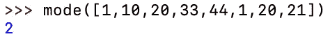

我们可以看到最高频率的数字在我们的列表中出现了两次。我们现在想要创建一个新的列表，方法是遍历字典并向其中添加任何具有 highestFrequency 值(在本例中为 2)的键。然后我们想返回这个列表。

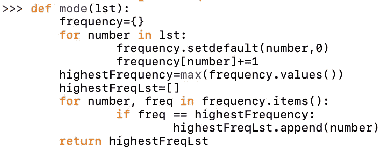

注:*。items()* 是一个内置的 python 函数，它将一个字典转换成表示键值对的元组列表。

我们现在可以试试之前的例子:

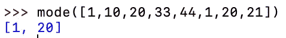

我们也可以尝试一个例子，每个数字只出现一次

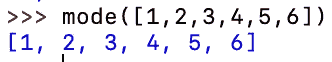

> 因为列表中的每个数字都有相同的频率，所以每个数字都是众数。