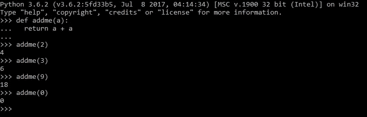
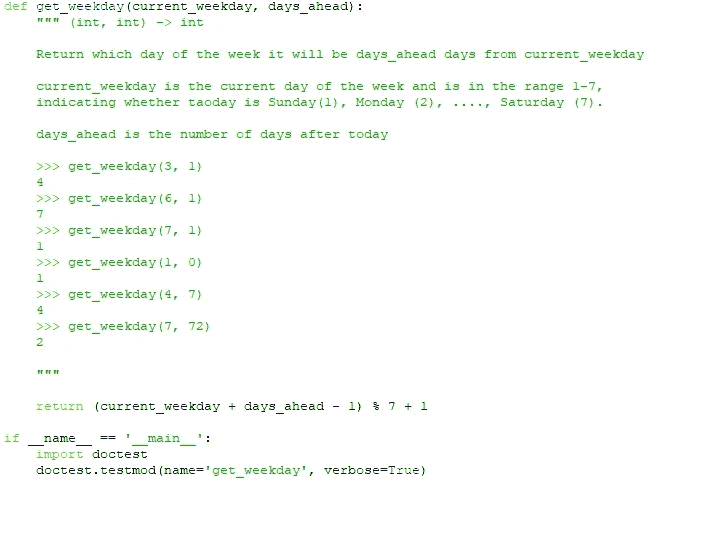
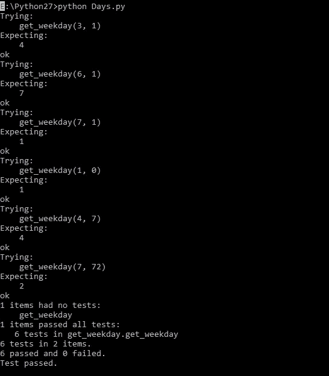
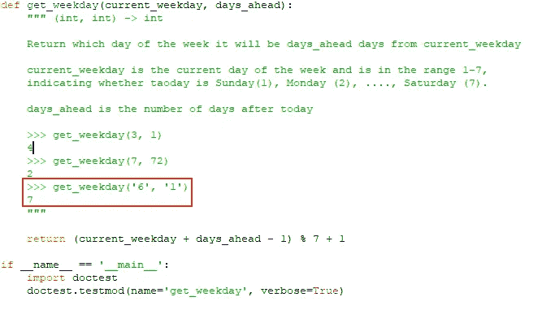
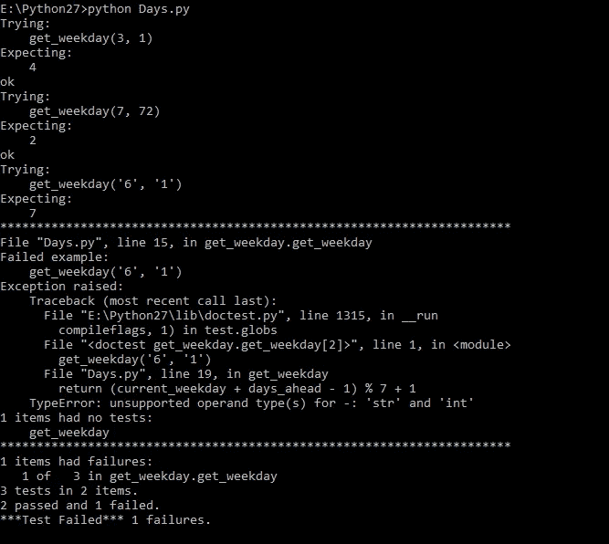

# Python 新手- Doctest

> 原文：<https://medium.com/analytics-vidhya/python-newbie-doctest-efe4692f79a7?source=collection_archive---------8----------------------->

Python 编程

*任何一个* [*软件开发的*](https://en.wikipedia.org/wiki/Software_development_process) *过程都由五个阶段组成:*

1.  需求分析
2.  设计
3.  发展
4.  测试
5.  维护

虽然上面提到的每一个过程在 [**SDLC 生命周期**](https://en.wikipedia.org/wiki/Systems_development_life_cycle) 中都很重要，但这篇文章将主要关注测试的重要性，以及我们如何使用 python 中的 [**doctest**](https://docs.python.org/3/library/doctest.html) 模块来执行测试。

**测试的重要性**

我们都会犯错误，如果不加以检查，其中一些错误会导致失败或错误，恢复起来会非常昂贵。测试我们的代码有助于发现这些错误，或者从一开始就避免将它们投入生产。“因此，测试在软件开发中非常重要”。有效地使用，测试有助于识别错误，确保产品的质量，并验证软件做了它应该做的事情。

**Python 模块- doctest**

Doctest 通过运行文档中嵌入的示例并验证它们是否产生预期的结果来帮助您测试代码。它的工作方式是解析帮助文本以找到示例，运行它们，然后将输出文本与预期值进行比较。

为了使事情变得简单，让我们用一个简单的例子来理解上面的实现

Python 内联函数

所以，在上面的代码片段中，我写了一个基本的内联函数，它把一个数加到自己身上。对于这个函数，我手动运行了几个测试用例来进行一些基本的验证(对我的函数进行健全性检查)。现在考虑一个场景，其中 python 能够读取上述输出，并在运行时为我们执行健全性检查，这就是 doctest 背后的思想。

到目前为止，我们已经了解了 doctest 背后的主要内容，现在我们将深入研究如何实现它。

因此，为了理解 doctest 的实现，我们举一个非常简单的例子来计算一周中的哪一天比当前工作日早。

我们为我们的函数写了一个 docstring，帮助我们理解我们的函数做什么，输入做什么，等等。在这个 docstring 中，我添加了几个测试用例，它们将在运行时由 doctest 模块读取，并进行测试

doctest 的实现

当我们从命令中运行上述脚本时，将会得到以下输出

Doctest 输出

从上面的截图中我们可以看到，docstring 中提到的所有测试用例都成功通过，因为结果与预期结果相匹配。

但是，如果任何测试失败，或者脚本不按预期运行，会发生什么呢？为了测试这一点，我们添加了一个错误的测试用例，因为我们知道我们的脚本只能接受整数作为输入，所以如果我们给一个字符串作为输入，会发生什么呢？

以字符串作为输入的测试用例

我使用了相同的脚本，但是在测试用例中做了一点小小的改变，我将字符串作为输入传递，那么上面的测试用例的结果是什么呢？

失败的测试用例输出

**瞧**，我们可以看到 doctest 已经清楚地标识了失败的测试用例，并且列出了上述测试用例失败的原因。

# **结论**

这就是开始使用 **doctest** 所需的全部内容。从这篇文章中，我们看到了 doctest 的强大之处，以及它是如何让大部分脚本的自动化测试变得更加容易的。尽管如此，许多开发人员发现 [doctest](https://pymotw.com/2/doctest/#module-doctest) 比 [unittest](https://pymotw.com/2/unittest/index.html#module-unittest) 更容易，因为在其最简单的形式中，在使用它之前不需要学习 API。然而，随着示例变得更加复杂，缺乏夹具管理会使得编写 [doctest](https://pymotw.com/2/doctest/#module-doctest) 测试比使用 [unittest](https://pymotw.com/2/unittest/index.html#module-unittest) 更加麻烦。但是仍然 doctest 由于这个模块的简易性，值得把它添加到我们的代码中。

在未来的博客中，我们将讨论更多关于方便的 python 模块，这些模块简化了我们的任务，我们还将深入一些其他概念，如机器学习、深度学习。