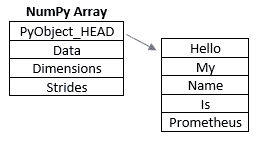
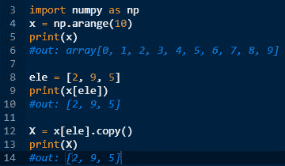

# Python Numpy 基础知识

> 原文：<https://medium.com/analytics-vidhya/python-numpy-basics-4a1e851898c0?source=collection_archive---------12----------------------->

即使你是数据分析、数据科学或机器学习领域的新手，你也可能听说过 Numpy。它是 Python 语言中一个常用且功能强大的包，有助于为任何类型的程序操作和清理数据，而不仅仅是机器学习。如果你在一个领域或者准备进入一个以数学为游戏名称的领域，那么 python 和这个包将是你最好的朋友。

先说一个显而易见的问题:**Numpy 是什么？**

更深入地说，除了称它为强大的库之外，Numpy 是 Numerical Python 的缩写，是许多数据科学工具生态系统的核心。这是一个 c 扩展库，使它成为数组计算的主要工具。这个包可以创建，找到最小值和最大值，对整个数组求和，并毫不费力地操作大型数据集。这部分是由于 Numpy 的固定类型数组。

一个普通的 Python 列表能够在其结构中包含许多不同的类型，例如整数、字符串、浮点等等，这使得更多关于列表的信息被存储在计算机中。另一方面，Numpy 数组只能包含一种类型，这使得计算机只能指向一个信息存储，而不是在 python 的列表中指向一个内存位置列表，然后花费额外的时间来检索信息。

这就像必须接你的朋友来你家，汽油是每加仑 3.00 美元，你更愿意让每个人在一个地方见面，让你去接他们，而不是去他们每个人的房子，他们可能相距数英里，忍受交通，占用你宝贵的汽油，更不用说你的车额外的英里数。让数组的元素在内存中靠近在一起，而不是分散开来，可以节省宝贵的时间和 cpu/gpu 的能力。

另一个让 Numpy 在数组中高效的元素是它的通用函数，或 ufuncs。Ufuncs 允许执行向量化操作。哇，**什么是矢量化运算？**

很棒的问题！它是一个与 Numpy 底层的某个函数相关联的包装器，允许产生指定数量的输入和固定数量的输出。如果你需要进一步的解释，我在这里放了一个文档[的链接。](https://docs.scipy.org/doc/numpy/reference/ufuncs.html)

ufuncs 的强大之处在于，它让我们能够遍历一个数组，并在一行中快速对每个元素执行操作，而不必遍历整个数组。

目前有 60 多种不同的函数，涵盖了从加法和指数等基本数学运算到三角函数、比较函数和聚合函数。如果您需要在 python 中创建一个数组循环，请查看是否有适合您的 ufunc。

ufuncs 的伟大之处在于，它可以在多维数组(或者不是线性的数组)上运行，也可以通过广播在不同大小和形状的数组上运行。我知道，**什么是广播？**它是 Numpy 使用的一组规则，将 ufuncs 应用于不同形状和大小的数组。如果这些规则中的任何一个为真，则阵列是“可广播的”。规则是:

1.  这些阵列都有完全相同的形状。

[2 3 4]= [8 1 6] [2 3] != [8 1 6]

1.  这些数组都有相同的维数，每个维的长度要么是相同的长度，要么是 1。

*   列数相等，每列的行数不为 0。

1.  数组的维数太少，可以将长度为 1 的维数放在前面(左侧),以满足规则 2。

*   如果列不匹配，则列数较少的数组在其左侧添加列，其中有一行。

[1 2 3] = [8 1 6]

Ufuncs 是如此的多样化，我强烈建议你查阅这些文档，并对它们进行一些研究。开始将这些应用到您的 python 程序中，(我敢说)您可能会看到性能的提高。

Numpy 允许我们快速管理数组并使用 ufuncs 操作它们，这很好，但是**我们如何访问数组的不同元素，甚至可能将它拆分呢？**这就是索引和切片发挥作用的地方。就编码方式而言，Numpy 的索引和切片类似于 Python 的标准索引和切片。切片有一个很大的区别，那就是返回的数组不是副本，而是检查。除非用变量调用它或使用 copy()方法，否则不会保存它。

因为 Numpy 是为大数据编写的，所以一次访问多个数组元素的需求是必不可少的，这样就产生了奇特的索引。花哨的索引就像类固醇上的常规索引。我们可以传入多个索引并创建数组的子集来操作，而不是传入单个元素的位置。花式索引允许调用行实际改变被调用数组的形状。被抓取的元素将被整形到调用数组中。花式索引的另一个有用的特性是，您可以使用另一个包含您想要更改的索引的数组来更改数组的值。盗梦空间！不完全是，但它确实很方便，这样你就不必循环或单独调用一个列表或数组。如果你有兴趣的话，这里有一个[链接](https://docs.scipy.org/doc/numpy-1.15.1/reference/generated/numpy.sort.html)到文档。

我知道我已经检查了这么多信息，但是在 Numpy 的坏被揭露之前，只有两个点需要被击中。

还记得当你第一次学习数组和列表，一切是多么简单，然后一个叫做排序的扳手扔了进来。恩，Numpy 是来帮忙的。它包含快速排序、堆排序和合并排序的功能，默认为快速排序。您还可以在一行代码中对列或行进行排序。如果您也只对查找低于或高于某一点的所有元素感兴趣，可以使用一种称为分区的部分排序。这种排序采用数组，所有低于阈值的元素放在分区的左侧，所有较高的元素放在右侧。请记住，对于这种排序，顺序是任意的，没有关系。唯一重要的部分是最后一个较低的元素和第一个较高的元素之间的分区。

本文的最后一点是 Numpy 的结构化数组。还记得我之前提到过在一个数组中只能存储一种变量类型吗？结构良好的数组有助于解决这个问题。这非常类似于 java 中的字典，其中有一个键和值。您可以调用键本身并获取值，也可以使用索引调用。结构化数组允许对相互依赖的数据进行简单的维护，从而使代码更有意义。Numpy 的结构化数组可以有一个键值，但不是必需的。这些键将默认为 f0、f1、f2 等。

我们已经讨论了好的方面，现在是讨论它的缺点的时候了。Numpy 的主要缺点是，它是为通常涉及大数据的密集科学计算而开发的。这些大数据可能长达数千到数百万行，使用 Python 列表会占用宝贵的时间。Numpy 就是为了满足这种需求而开发的，如果您还不属于大数据的范畴，那么 Numpy 目前可能不适合您。如果你将在一个数据驱动的部门工作，知道如何使用它是必不可少的，但如果你不是，只是一个小数据爱好者；使用 python 可能是你创建程序最简单快捷的方式，直到你获得大数据，并以可预见的未来的格式构建它。

希望你喜欢这个，并希望它能帮助你的技术之旅！

在我们重新学习之前，

ReginaOfTech

*本文最早出现在科技博客 Regina 的*[*【www.reginaoftech.com】*](https://reginaoftech.com)