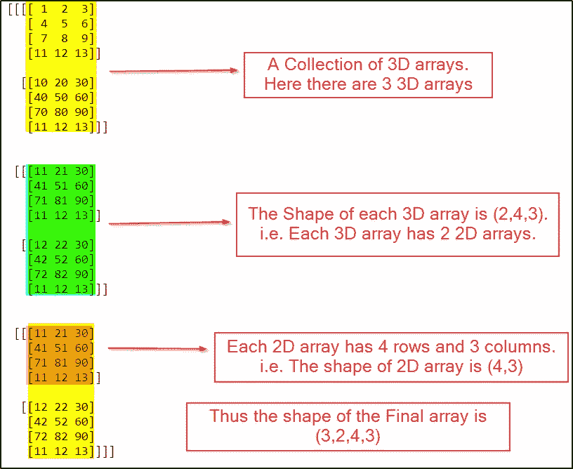
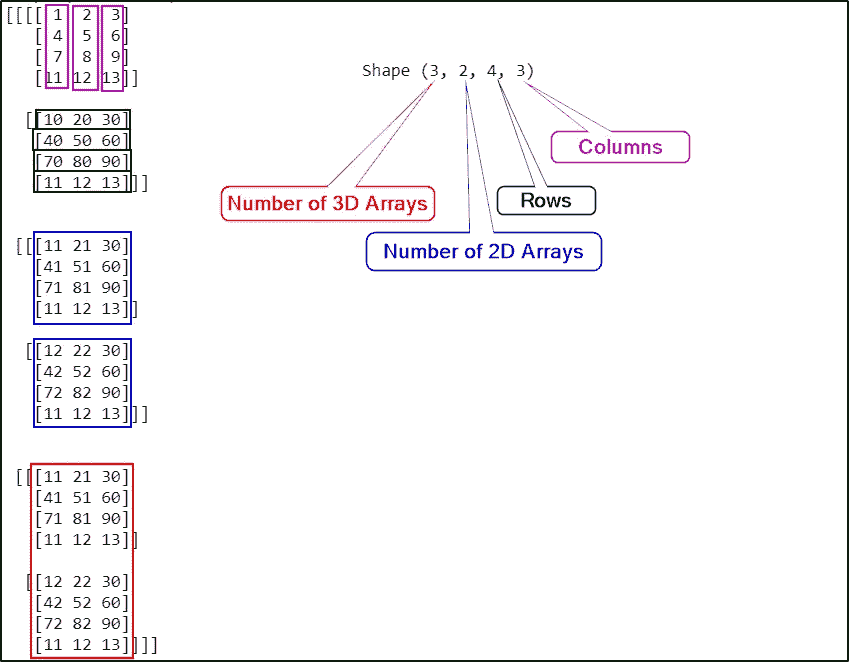

# python-Numpy-了解数组和维度

> 原文：<https://medium.com/analytics-vidhya/python-numpy-understanding-arrays-dimensions-63e8e33b0f81?source=collection_archive---------9----------------------->

# Numpy 是一个用于计算科学/数学数据的 python 库。


来源:照片由 [Faris Mohammed](https://unsplash.com/@pkmfaris?utm_source=unsplash&utm_medium=referral&utm_content=creditCopyText) 在 [Unsplash](https://unsplash.com/s/photos/arrays?utm_source=unsplash&utm_medium=referral&utm_content=creditCopyText) 上拍摄

# Numpy 用法位于:

*   数值分析
*   线性代数
*   矩阵计算
*   包括上面的概念，Numpy 提供了一个叫做数组的重要特性
*   尽管它类似于 python 列表，但数组比列表有优势。

# 阵列的优势在于:

*   内存高效
*   更快的
*   方便的

下面是创建新 Numpy 数组的代码。

array()方法接受进入数组的项目列表。

```
**import** numpy **as** nparr1d **=** np.array([1,2,3,4])
```

上面的数组是一个包含 4 个元素的一维数组。

只有当维度大于 1 时，行和列的概念才适用于 Numpy 数组。

对于一维数组更像是一个列表，没有行和列的概念，所以形状只是显示列表中的项目数。

```
print("Shape",arr1d.shape)Shape (4,)arr2d **=** np.array([[1,2,3,3],[4,5,6,2],[7,8,9,4]])print("Shape",arr2d.shape)print(arr2d)
```

输出:

```
Shape (3, 4)
[[1 2 3 3]
 [4 5 6 2]
 [7 8 9 4]]
```

在上面的输出中，您可以看到形状是 3 行 4 列。

此外，您可以注意到数组以 2 个方括号开始[[并以 2 个方括号结束]]。

这将使我们很容易理解这是一个 2D 阵列。

2D 数组只是 1D 数组的集合。

类似地，3D 阵列是 2D 阵列的集合。

现在让我们来看一个 3D 数组。

```
arr3d **=** np.array([[[1,2,3],[4,5,6],[7,8,9],[11,12,13]],[[10,20,30],[40,50,60],[70,80,90],[11,12,13]]])print("Shape",arr3d.shape)print(arr3d)
```

输出:

```
Shape (2, 4, 3)
[[[ 1  2  3]
  [ 4  5  6]
  [ 7  8  9]
  [11 12 13]] [[10 20 30]
  [40 50 60]
  [70 80 90]
  [11 12 13]]]
```

## 在上面的结果中，形状定义为:

*   这里有两个 3D 数组，它们成为第一个数字，
*   第二个数字是行数
*   第三个数字是列

让我们再看一个例子，以便更好地理解。

```
arr3d **=** np.array([[[1,2,3],[4,5,6],[7,8,9],[11,12,13]],[[10,20,30],[40,50,60],[70,80,90],[11,12,13]],[[11,21,30],[41,51,60],[71,81,90],[11,12,13]],[[12,22,30],[42,52,60],[72,82,90],[11,12,13]]])print("Shape",arr3d.shape)print(arr3d)
```

输出:

```
Shape (4, 4, 3)
[[[ 1  2  3]
  [ 4  5  6]
  [ 7  8  9]
  [11 12 13]] [[10 20 30]
  [40 50 60]
  [70 80 90]
  [11 12 13]] [[11 21 30]
  [41 51 60]
  [71 81 90]
  [11 12 13]] [[12 22 30]
  [42 52 60]
  [72 82 90]
  [11 12 13]]]
```

现在让我们看一个 4D 阵列的例子。

```
arr4d **=** np.array([[[[1,2,3],[4,5,6],[7,8,9],[11,12,13]],[[10,20,30],[40,50,60],[70,80,90],[11,12,13]]],[[[11,21,30],[41,51,60],[71,81,90],[11,12,13]],[[12,22,30],[42,52,60],[72,82,90],[11,12,13]]],[[[11,21,30],[41,51,60],[71,81,90],[11,12,13]],[[12,22,30],[42,52,60],[72,82,90],[11,12,13]]]])print("Shape",arr4d.shape)print(arr4d)
```

输出:

```
Shape (3, 2, 4, 3)
[[[[ 1  2  3]
   [ 4  5  6]
   [ 7  8  9]
   [11 12 13]] [[10 20 30]
   [40 50 60]
   [70 80 90]
   [11 12 13]]] [[[11 21 30]
   [41 51 60]
   [71 81 90]
   [11 12 13]] [[12 22 30]
   [42 52 60]
   [72 82 90]
   [11 12 13]]] [[[11 21 30]
   [41 51 60]
   [71 81 90]
   [11 12 13]] [[12 22 30]
   [42 52 60]
   [72 82 90]
   [11 12 13]]]]
```



作者图片

要了解形状中每个数字的更多信息，请参见下图。



作者图片

上面阵列的形状是:4D，它是三个 3D 阵列的集合

*   第一个数字是 3d 阵列的数量，
*   第二个数字是 2d 阵列的数量，
*   第三个数字是行数，
*   第四个数字是列。

**附言:**我会尽我所能给你最好的 Jupyter 笔记本电池。希望它能在我的下一篇文章中有所表现。

## 结论:

在本文中，我们已经讨论了数组的各个维度及其形状。

在我即将发表的文章中，我们将回顾在使用 Numpy 数组和改变数组形状进行矩阵操作时，使用 Numpy 数组是多么容易。