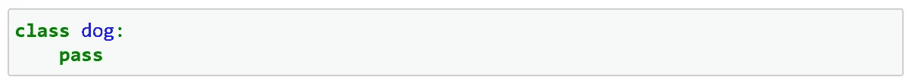
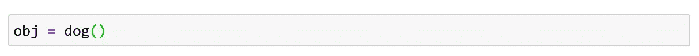
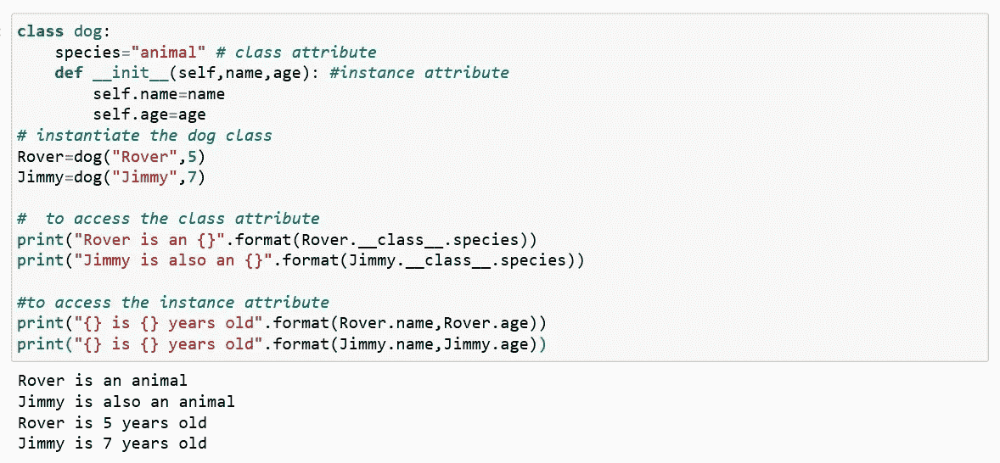

# Python 对象和类

> 原文：<https://medium.com/analytics-vidhya/python-object-and-class-58a217e4c439?source=collection_archive---------32----------------------->

众所周知，python 是一种多语言编程语言(这意味着它支持不同的编程方法)。在这篇文章中，我们将看到什么是对象和类，以及它们是如何被创建的。

公认的解决编程困难的方法之一是创建对象。这就是所谓的面向对象编程(OOP)。

**对象特征:**

属性

行为

**举例:**

一只狗可以是一个物体，为此；

属性:姓名、年龄、颜色

行为:吠叫，追逐，抓取

在 python 中，oops 专注于创建可重用的代码。这就是所谓的干(不要重复自己)。

## 类别:

类是对象的蓝图。

一个类是一个应该如何定义的概念。

一个类被用来创建新的用户定义的数据结构，该数据结构包含关于某事物的任意信息。

这里我们使用 *class* 关键字定义了一个空类。而 dog 就是那个类的实例(对象)。

## **对象**:

实例是从特定类创建的特定对象。

对象是类的实例化。当定义一个类时，只定义一个对象的描述，这意味着不分配内存或存储。

这里 obj 是 dog 类的一个对象

现在让我们看看如何创建一个类和一个对象；

就这样，我们来到了这篇文章的结尾。

快乐编码…..😊😊😊