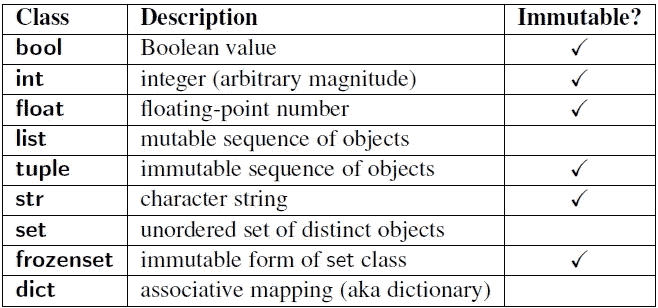
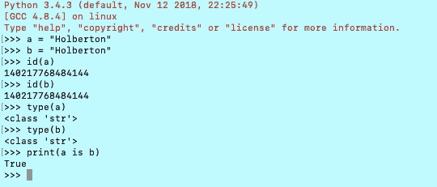

# Python:无处不在的对象

> 原文：<https://medium.com/analytics-vidhya/python-objects-everywhere-a415b3226273?source=collection_archive---------20----------------------->


Python 语言是一种强大的编程语言，简单易学，优雅的语法和动态类型。它本可以在面向对象编程中使用得更多，是由吉多·范·罗苏姆创建的，Tim Peters 在那里创建了 Python 的 [Zen 来描述一些规则，以了解 Python 如何工作以及幕后的魔力。](https://www.python.org/dev/peps/pep-0020/)

所以你需要理解的第一件事是 Python 中的一切都是一个对象，这意味着每个变量持有一个对象实例，这意味着当你初始化一个对象时，它被赋予一个唯一的对象 id，它的类型在运行时被定义，一旦设置就永远不能改变，但是这些对象可以是 ***【可变】*** 或 ***不可变*** ，这取决于它们的状态。

现在让我们看看什么是内置类型的对象，如果它们是可变的或不可变的，这个表可以帮助我们理解类型，如果它是可变的或不可变的。



内置类型的对象

但是，我们如何知道我们的变量是可变的还是不可变的呢？答案很简单，你应该理解 ***id()*** 和 ***type()*** 函数。

## ***id()*** 和 ***type()*** 功能

id()函数以整数的形式返回对象的标识，这个整数通常对应于对象在内存中的位置。

type()函数返回一个对象的类型。

让我们来看一个例子，这个例子可以帮助我们理解它是如何工作的



正如你在上一部分看到的，我们使用的 ***是*** 运算符，这两个对象的身份是相同的。让我们看另一个使用 type()的例子


现在我们知道了如何比较两个简单的字符串变量来找到类型和 id。使用这两个函数，我们可以检查不同类型的对象与变量相关联，以及如何改变对象。如果你不知道一个对象是可变的还是不可变的，最好的方法是看它的标识(id()函数)。

## 可变和不可变对象

正如我们前面讨论的，可变对象可以改变它的状态或内容，而不可变对象不能。

> **:**
> 
> **列表、字典、集合、字节数组**
> 
> ****不可变对象:****
> 
> **int，float，complex，string，tuple，冻结集【注:不可变版本集】，bytes**

*一个发现对象类型可变性的实例*

```
*x = 10
x = y*
```

*我们正在创建一个 int 类型的对象。标识符 x 和 y 指向同一个对象。*

```
*id(x) == id(y)
id(y) == id(10)*
```

*如果我们做一个简单的手术*

```
*x = x + 1*
```

*现在*

```
*id(x) != id(y)
id(x) != id(10)*
```

*标记 x 的对象被更改。对象 10 从未被修改。**不可变对象创建后不允许修改***

*在**可变对象**的情况下*

```
*m = list([1, 2, 3])
n = m*
```

*我们正在创建一个 list 类型的对象。标识符 m 和 m 被标记到同一个列表对象，这是 3 个不可变 int 对象的集合。*

```
*id(m) == id(n)*
```

*现在从列表对象中弹出一个项目确实会改变对象，*

```
*m.pop()*
```

*对象 id 将不会更改*

```
*id(m) == id(n)*
```

*修改后，m 和 n 将指向同一个列表对象。列表对象现在将包含[1，2]。*

*那么从上面的例子中我们看到了什么？*

*   *Python 以不同的方式处理可变和不可变对象。*
*   *不可变对象比可变对象访问起来更快。*
*   *当你需要改变对象、例子列表、字典等的大小时，可变对象非常有用..当你需要确保你制作的对象总是保持不变时，就使用不变。*
*   *不可变对象从根本上说“改变”是昂贵的，因为这样做涉及到创建一个副本。改变可变对象的成本很低。*

# *不变性中的例外。*

*如前所述，Python 容器像元组一样是不可变的。这意味着`tuple`的值在创建后不能更改。但是元组的“值”实际上是一个名称序列，具有不可改变的对象绑定。需要注意的关键是*绑定*是不可更改的，而不是它们绑定到的对象。*

*让我们考虑一个元组 **t =('霍尔伯顿'，[1，2，3])***

*上面的 tuple **t** 包含不同数据类型的元素，第一个是不可变字符串，第二个是可变列表。元组本身是不可变的。即它没有任何改变其内容的方法。同样，字符串是不可变的，因为字符串没有任何可变的方法。但是 list 对象确实有变异方法，所以它可以被改变。这是一个微妙的点，但仍然很重要:不可变对象*的“值”不能*改变，但它的组成对象*可以*改变。*

# *对象如何传递给函数*

*了解可变类型和不可变类型之间的区别，以及它们在传递给函数时是如何被处理的，这对我们来说很重要。当使用适当的对象时，内存效率会受到很大影响。*

*例如，如果一个可变对象在函数中被引用调用，它可以改变原始变量本身。因此，为了避免这种情况，需要将原始变量复制到另一个变量中。不可变对象可以通过引用调用，因为它的值无论如何都不能改变。*

```
*def updateList(list1):
    list1 += [10]n = [5, 6]
print(id(n))                  # 140312184155336updateList(n)
print(n)                      # [5, 6, 10]
print(id(n))                  # 140312184155336*
```

*从上面的例子中我们可以看到，我们通过引用调用**调用了列表，所以对原始列表本身进行了修改。***

*让我们看另一个例子:*

```
*def updateNumber(n):
    print(id(n))
    n += 10b = 5
print(id(b))                   # 10055680
updateNumber(b)                # 10055680
print(b)                       # 5*
```

*在上面的例子中，同一个对象被传递给函数，但是变量的值没有改变，即使对象是相同的。这就叫**传** **传值**。这里到底发生了什么？当函数调用该值时，只传递变量的值，而不是对象本身。所以引用对象的变量没有改变，但是对象本身被改变了，但是只是在函数范围内。因此，这种变化没有反映出来。*

## *NSMALLPOSINTS 和 NSMALLNEGINTS*

*最后一个要知道和理解的主题是 Python 中为最常用的整数定义的两个宏。这个宏实际上是一个由 262 个整数组成的数组，以尽可能最快地访问，它们在你初始化 **NSMALLPOSINTS** 和 **NSMALLNEGINTS** 时被分配，范围从-5(含)到 257(不含)。*