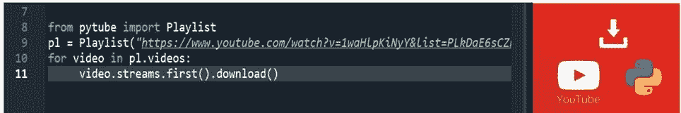

# Spyder 上的 python:“ModuleNotFoundError”——一个诡计

> 原文：<https://medium.com/analytics-vidhya/python-on-spyder-modulenotfounderror-a-trick-51c058129e17?source=collection_archive---------0----------------------->

# 或者如何在编辑器上强制导入带有 pip 的模块并与错误相处

诺贝托·乔菲

— -

几天前我在 Python 上写了一个基本脚本，从 Youtube[【1】](http://file///C:/Users/norbe/OneDrive/Desktop/trick%20spyder.docx#_edn1)下载一些播放列表。

我使用 Spyder 作为开发环境。

但是当启动脚本时，我收到了错误:*“ModuleNotFoundError”*

这似乎是很多人的共同问题，当通过 *"pip install module_xxx"* 导入本地机器上缺失的 Python 模块时，默认情况下它们没有与 Spyder 链接。关于如何以正式的方式构建和组织工作的一些参考资料可以在这里找到[【2】](http://file///C:/Users/norbe/OneDrive/Desktop/trick%20spyder.docx#_edn2)。

但是今天我提出一个快速的技巧来解决这个问题。(知道怎么做总是很容易的吧:)？)这里有些参考[【3】](http://file///C:/Users/norbe/OneDrive/Desktop/trick%20spyder.docx#_edn3)。

事实上，在 Spyder 上的*“Tool/python path manager”*上设置本地机器通过 pip 下载并存储已安装模块的路径，保存、关闭并重新启动 Spyder 就足够了。

简单，不是吗？:)以下是一些指导截图:

希望这能帮助那些和我一样在几天前的下午陷入困境的人，当时外面是一个阳光明媚的日子，也是一个绕着湖(我居住的城市)散步的绝佳机会。

再见:)

— — — — — — — — — — — — — — — — — — — — — — — — — — — — — — — — — — — — — — — — — — — — — — — — — — — — — — —

[【1】](http://file///C:/Users/norbe/OneDrive/Desktop/trick%20spyder.docx#_ednref1)关于代码的一些参考可以在这里找到[https://pypi.org/project/pytube/](https://pypi.org/project/pytube/)和这里[https://dev . to/spectrumcetb/download-a-whole-YouTube-playlist-at-one-go-3331](https://dev.to/spectrumcetb/download-a-whole-youtube-playlist-at-one-go-3331)

[【2】](http://file///C:/Users/norbe/OneDrive/Desktop/trick%20spyder.docx#_ednref2)这里有一个维基教程链接:[https://github . com/Spyder-ide/Spyder/wiki/Working-with-packages-and-environments-in-Spyder # installing-packages-into-the-same-environment-as-Spyder](https://github.com/spyder-ide/spyder/wiki/Working-with-packages-and-environments-in-Spyder#installing-packages-into-the-same-environment-as-spyder)

[【3】](http://file///C:/Users/norbe/OneDrive/Desktop/trick%20spyder.docx#_ednref3)阅读所有 Stackoverflow 页面，评论包括:[https://stack overflow . com/questions/10729116/adding-a-module-specific-py morph-to-spyder-python-ide](https://stackoverflow.com/questions/10729116/adding-a-module-specifically-pymorph-to-spyder-python-ide)