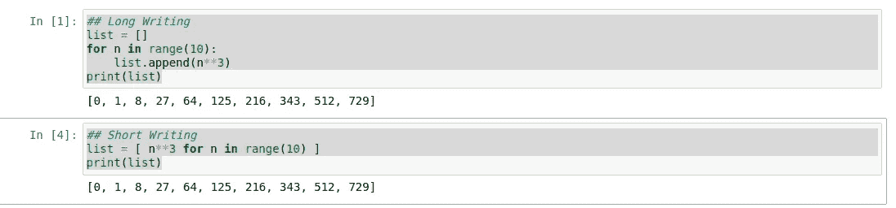
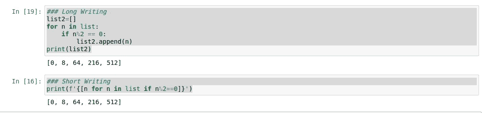
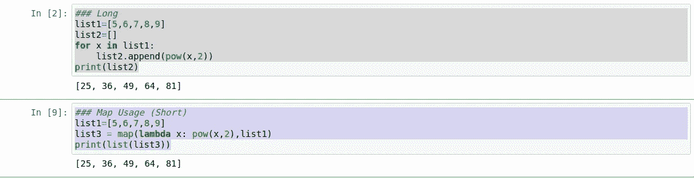
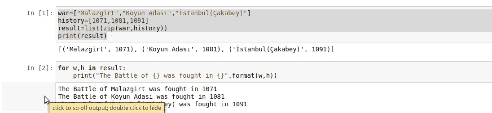
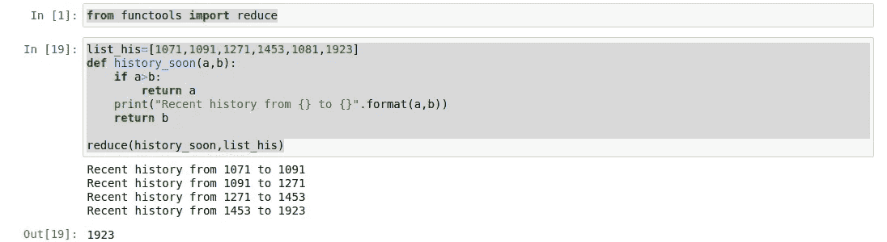
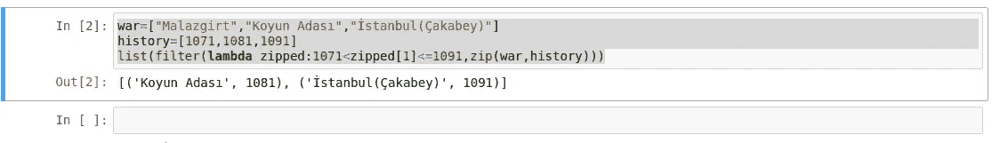

# Python 单线函数(地图、压缩、简化和过滤函数)

> 原文：<https://medium.com/analytics-vidhya/python-one-line-function-map-zip-reduce-and-filter-functions-97f60fea498?source=collection_archive---------18----------------------->

你可以在你的 Python 脚本中一直使用的函数，它们将获得有用性和速度。当您开始编写 Python 脚本时，尤其是在学习了 for 循环和列表之后，我们一直在采用类似的方法。

让我们从几个例子开始

第一个例子中从 0 到 10 的 n ** 3 计算



结果-1

现在让我们在我们创建的列表中找到能被 2 除的数字。



结果-2

**Map 函数**
它以 map (func，iter1)的形式使用。换句话说，它将您拥有的数据元素按顺序发送给一个函数，并将结果作为单个对象返回。



结果-3

我们已经创建了一个新的列表，其中包含了我们创建的列表中元素的平方结果。

**Zip 函数**
将两个列表合并到彼此的索引上。这样做时，它基于具有最短元素的列表的长度。

我们已经在一个列表中列出了战斗及其日期。



结果-4

**Reduce 函数**
需要导入到项目中才能使用。

```
from functools import reduce
```

Reduce 函数是一种结构，可以在任何可以循环的数据类型中循环，减少数据类型中的所有元素并允许比较。



结果-5

**过滤功能**就是过滤功能。

用作过滤器(func，push)，将 push 元素用作返回 true 或 false 的过滤函数。返回一个新列表，其中包含 func (x)函数为真的所有 x 项。

在我们的示例中，我们看到了前面学习的 zip 函数的用法。我们正在做一个过滤过程，从我们拥有的 zip 列表中查找战争的日期和名称，包括 1071 年和 1091 年。



结果-6

我希望这是一篇有用的文章…