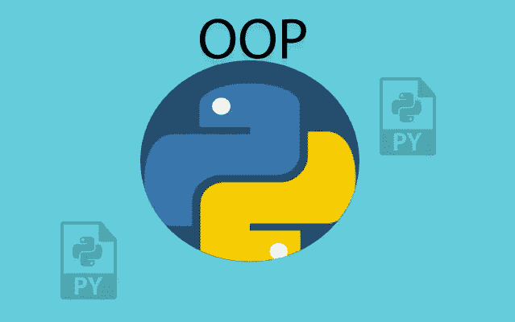

# Python OOP —继承

> 原文：<https://medium.com/analytics-vidhya/python-oop-inheritance-20f973fe9096?source=collection_archive---------4----------------------->



继承是面向对象编程中的一个关键概念。它使我们能够从现有的类创建一个新的类。新类是现有类的专用版本，它继承了现有类的所有非私有变量和方法。

什么时候应该使用继承？答案是，每当我们碰到一个 ***就是一个*** 的关系对象。

*   Python ***是一种*** 编程语言
*   特斯拉 ***是一辆*** 汽车
*   谷歌 ***是一家*** 公司

从上面的例子中，我们可以通过扩展现有的类(编程语言、汽车、公司)来构建新的类

# 语法和术语

当我们基于现有类创建新类时，我们使用以下术语:

*   父类(超级类)
*   子类(子类):这个类继承了超类

```
Class ParentClass:Class ChildClass (ParentClass):
```

**示例**

```
class Vehicle:
    def __init__(self, make, color, model):
        self.make = make
        self.color = color
        self.model = model
    def printDetails(self):
        print ("Manufacturer: ", self.make)
        print ("Color: ", self.color)
        print ("Model: ", self.model)class Car(Vehicle):
    def __init__(self, make, color, model, doors):
        Vehicle.__init__(self, make, color, model)
        self.doors = doors
    def printCarDetails(self):
        self.printDetails()
        print ("Doors: ", self.doors)
```

在这个例子中，Vehicle 是一个父类，我们实现了一个从这个 Vehicle 类扩展而来的 Car 类。

# Super()函数

当我们实现继承时，它用在子类中，并且它引用父类而不显式命名它。

它主要用于三种情况

## **1。访问父类属性**

如果我们在车辆类中定义了一个名为 fuelCap 的字段来跟踪车辆的燃料容量。如果我们实现了一个从 Vehicle 类扩展而来的 Car 类，并且我们在 Car 类中声明了一个具有相同名称 fuelCap 但不同值的类属性，我们可以在子类中引用父类的 fuelCap，然后我们将使用 super()函数。

```
class Vehicle:
    fuelCap = 100class Car(Vehicle):
    fuelCap = 50

    def display(self):
        print ("Fuel Cap from Vehicle: ", super().fuelCap) print ("Fuel Cap from Car: ", self.fuelCap)
```

## 2.**调用父类方法**

super()也可以与方法一起使用。当父类和直接子类有同名的方法时，我们使用 super()来访问子类中父类的方法。

```
class Vehicle:
    def display(self):
        print ("This is from Vehicle.")class Car(Vehicle):
    def display(self):
        super().display()
        print ("This is from Car.")
```

## **3。与初始值一起使用**

super()的另一个重要用途是从子类的初始化器内部调用父类的初始化器。

```
# Parent class
class ParentClass():
    def __init__(self, a, b):
        self.a = a
        self.b = b# Child class
class ChildClass(ParentClass):
    def __init__(self, a, b, c):
        super().__init__(a,b)
        self.c = c
```

让我们用 super()来改变我们前面的例子

```
class Vehicle:
    def __init__(self, make, color, model):
        self.make = make
        self.color = color
        self.model = model
    def printDetails(self):
        print ("Manufacturer: ", self.make)
        print ("Color: ", self.color)
        print ("Model: ", self.model)class Car(Vehicle):
    def __init__(self, make, color, model, doors):
        #Vehicle.__init__(self, make, color, model)
        super().__init__(make, color, model)  
        self.doors = doors
    def printCarDetails(self):
        self.printDetails()
        print ("Doors: ", self.doors)
```

# 继承的类型

有五种类型的继承:

1.  单一的
2.  多层次
3.  等级体系的
4.  多重
5.  混合物

## 单一遗传

在这种情况下，只有一个类是从另一个类扩展而来的。

汽车— — — →车辆

(孩子)— — →(父母)

```
class Vehicle:
    def __init__(self, make, color, model):
        self.make = make
        self.color = color
        self.model = model
    def printDetails(self):
        print ("Manufacturer: ", self.make)
        print ("Color: ", self.color)
        print ("Model: ", self.model)class Car(Vehicle):
    def printCarDetails(self):
        print ("This is a car.")
```

## 多层次继承

当一个类是从一个类派生出来的，而这个类本身又是从另一个类派生出来的，这就叫做多级继承。

SUV— →轿车—→汽车

*   SUV **是一辆**汽车
*   汽车**是**车辆

```
class Vehicle:
    def setSpeed(self, speed):
        self.speed = speed
        print ("Current speed is set to: ", self.topSpeed)class Car(Vehicle):
    def openDoor(self):
        print ("Door is now open.")class SUV(Car):
    def openTruck(self):
        print (Trunk of SUV is now open.")
```

## 分层继承

当一个以上的类从同一个类继承时，它被称为层次继承。

*   一个`Car` **是一个** `Vehicle`
*   一个`Truck`是一个**是一个`Vehicle`**

```
class Vehicle:
    def setSpeed(self, speed):
        self.speed = speed
        print ("Current speed is set to: ", self.topSpeed)class Car(Vehicle):
    passclass Truck(Vehicle):
    pass
```

## 多重遗传

当一个类是从一个以上的基类派生出来的时候，就叫做多重继承。

*   `HybridEngine` **是一个** `ElectricEngine`。
*   `HybridEngine` **是一个** `CombustionEngine`也是。

```
class CombustionEngine():
    def setTankCapacity(self, tankCapacity):
        self.tankCapacity = tankCapacityclass ElectricEngine():
    def setChargeCapacity(self, chargeCapacity):
        self.chargeCapacity = chargeCapacityclass HybridEngine(CombustionEngine, EletricEngine):
    def printDetails(self):
        print ("Tank capacity: ", self.tankCapacity)
        print ("Charge capacity: ", self.chargeCapacity)
```

混合遗传

它是多重和多层次传承的结合。

*   `CombustionEngine`T23 是一个 T9。
*   `ElectricEngine`T25 是一个 T11。
*   `HybridEngine`T27 是一个 T13 和一个`CombustionEngine`。

```
# Parent class
class Engine:
    def setPower(self, power):
        self.power = power# Child class inherited from Engine
class CombustionEngine(Engine):
    def setTankCapacity(self, tankCapacity):
        self.tankCapacity = tankCapacityclass ElectricEngine(Engine):
    def setChargeCapacity(self, chargeCapacity):
        self.chargeCapacity = chargeCapacity# Child class inherited from CombustionEngine and EletricEngine
class HybridEngine(CombustionEngine, EletricEngine):
    def printDetails(self):
        print ("Tank capacity: ", self.tankCapacity)
        print ("Charge capacity: ", self.chargeCapacity)
        print ("Power: ", self.power)
```