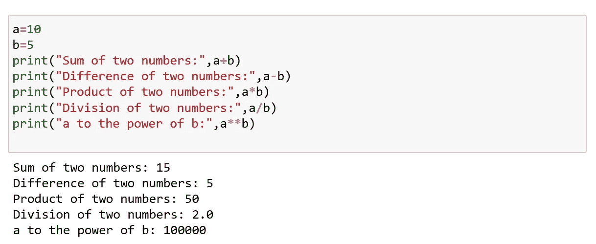
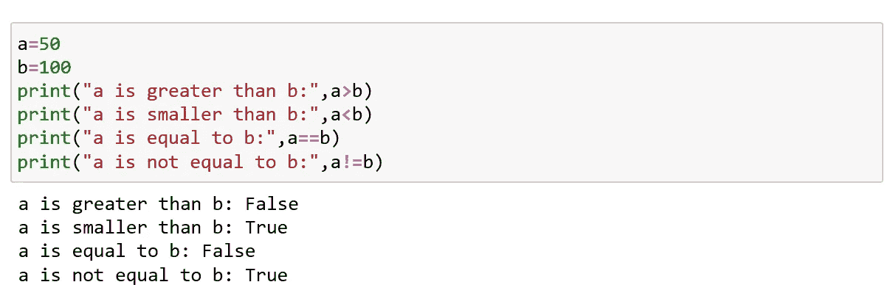
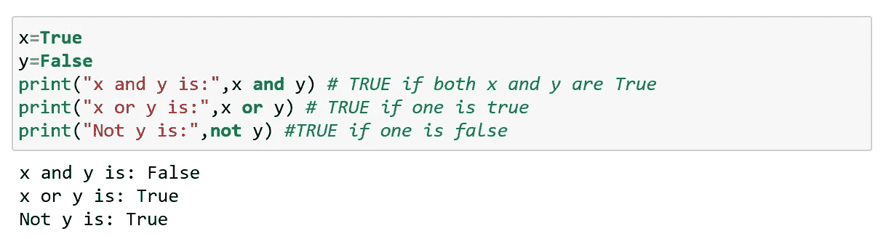
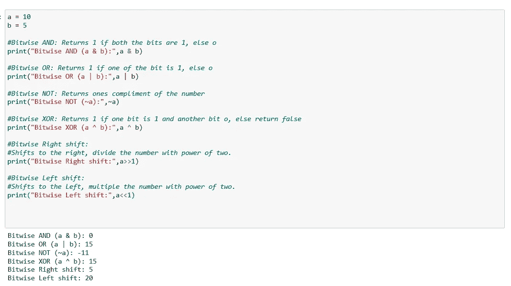
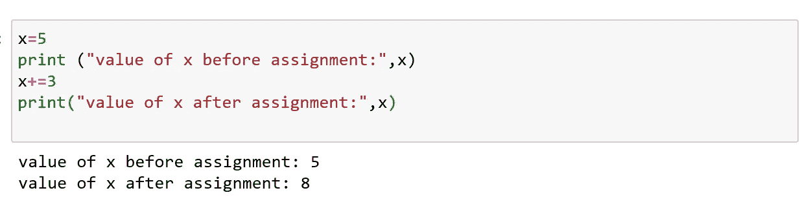
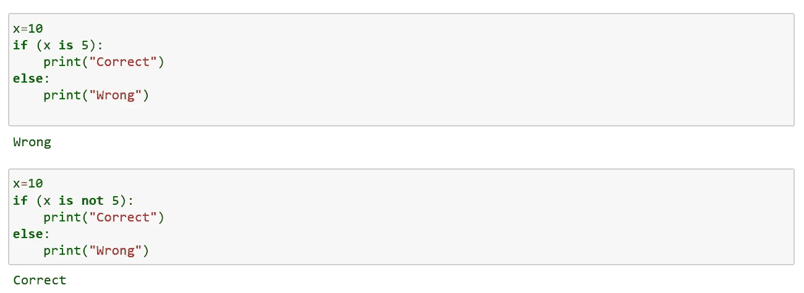
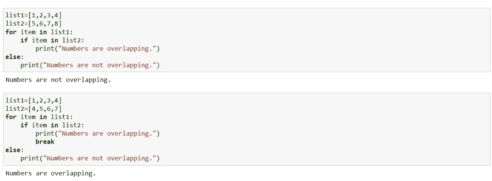
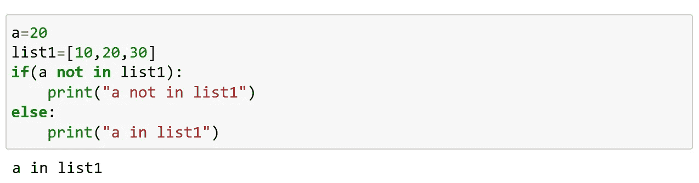

# Python 运算符

> 原文：<https://medium.com/analytics-vidhya/python-operators-21f0bb7cb664?source=collection_archive---------23----------------------->

运算符是 python 中执行算术和逻辑运算的特殊符号。

一些操作符如下:

1.算术运算符

2.比较运算符

3.逻辑运算符

4.按位运算符

5.赋值运算符

6.特殊运算符:a)身份运算符 b)成员运算符

## 算术运算符:

它们用于执行算术运算，如加、减、乘、除等。

算术运算符

## 比较运算符:

比较两个值并返回 True 或 False

比较运算符

## 逻辑运算符:

逻辑运算符是 AND、OR、NOT 运算符。

逻辑运算符

## 按位运算符:

这些运算符将操作数视为二进制数字。他们一点一点地运作。

按位运算符

## 赋值运算符:

这些运算符用于给变量赋值。最常用的赋值运算符是“=”。

*举例:*

对于一个变量 A，如果你想把它的值赋为 50，你只需要把代码写成 A=50，这个值就被赋给这个变量了。

有各种复合运算符，如 A+=5，它添加到变量中，然后再对变量赋值(类似地，也可以使用所有其他算术运算)。

赋值运算符

## 特殊操作员:

**a)身份操作员**

Is 和 is not 是 python 中的标识运算符。这些用于检查值或变量是否存在。

标识运算符(是/不是)

**b)会员操作符:**

In 和 Not in 是 python 的成员运算符，它们用于检查值或变量是否在序列(字符串、列表、元组、集和字典)中找到。

成员运算符(输入)

成员资格运算符(不在中)

Python 中的标识操作符和成员操作符都可以反过来使用，使程序更加高效。

至此，我们结束了这篇“Python 操作符”的文章。

快乐编码…😊😊😊