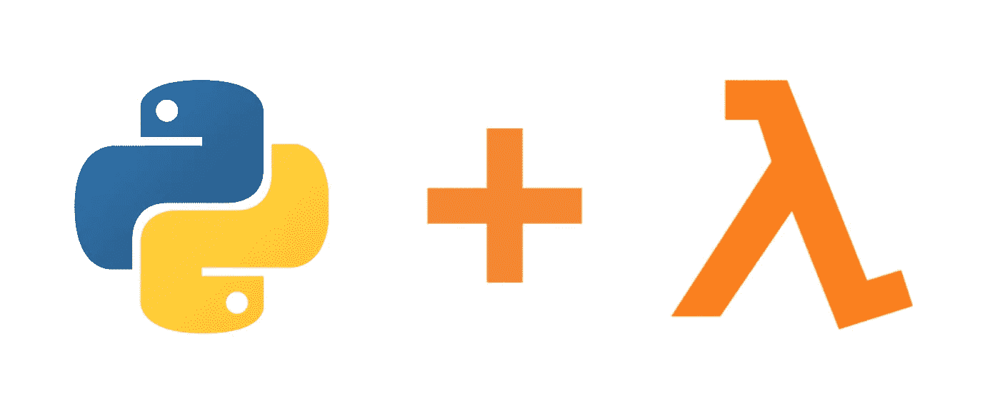

# 带有 AWS 层的 Python 包——正确的方式

> 原文：<https://medium.com/analytics-vidhya/python-packages-with-aws-layers-the-right-way-1cff618e0772?source=collection_archive---------12----------------------->

在本文中，我们将讨论如何在需要部署到云提供商时管理所有 python 包，在这种情况下，使用无服务器框架将部署到 AWS Lambda 函数中。为了管理 python 包，我们将使用 AWS Lambda 层

这将帮助我们:

*   在以下情况下，避免依赖性问题