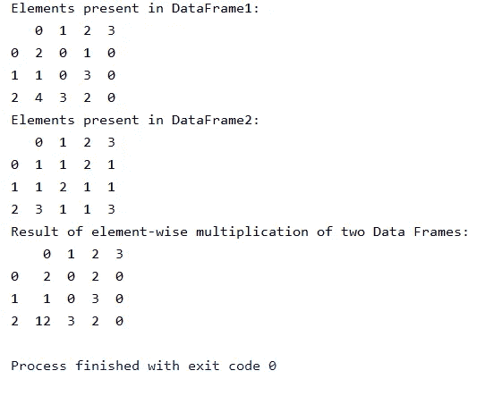

# 蟒蛇熊猫-数据框架

> 原文：<https://medium.com/analytics-vidhya/python-pandas-dataframe-d7e7ffbd19bb?source=collection_archive---------18----------------------->


# 熊猫简介:

在了解 pandas 中的数据帧之前，我们先简单讨论一下:

**熊猫是什么？？**


Pandas 是一个**开源**，BSD 许可的 Python 库，为 Python 编程语言提供**高性能、**易于使用的数据结构和数据分析工具。Python 和熊猫被广泛应用于学术和商业领域，包括金融、经济、统计、分析等。

> 【pandas】来源于术语“panel data”，这是一个计量经济学术语，指的是包含同一个人在多个时间段的观察结果的数据集。—维基百科

pandas*包是当今从事 Python 工作的数据科学家和分析师所拥有的最重要的工具。*

**现在，让我们来看看什么是数据框以及如何在 Pandas 中创建数据框。**

# **数据帧:**

> **数据帧**是一种二维数据结构，即数据以表格形式排列成行和列。

# 数据帧的特征

*   列可能有不同的类型
*   大小—可变
*   带标签的轴(行和列)
*   可以对行和列执行算术运算

# 如何创建熊猫数据框？？

构建数据框有许多因素。在现实世界中，将通过从现有存储中加载数据集来创建 Pandas 数据框，存储可以是 SQL 数据库、CSV 文件和 Excel 文件。Pandas 数据框可以从列表、字典和字典列表等中创建。

可以使用以下构造函数创建 pandas 数据框

```
pandas.DataFrame( data, index, columns, dtype, copy)
```

> 然而，为了帮助你更好地理解它，我将在这里使用 Python 数据结构(字典和列表)。

**让我们看看如何使用 List 创建数据框:**


使用列表创建数据框

**使用字典创建数据框:**


使用字典创建数据框

**创建一个包含字典、行索引和列索引列表的数据框:**


**从文件创建熊猫数据框:**

您可以使用将求职者数据框保存为 [CSV](https://realpython.com/python-csv/) 文件。to_csv():

```
>>> df.to_csv('data.csv')
```

上面的语句将在您的工作目录中生成一个名为`data.csv`的 CSV 文件:

```
,name,city,age,py-score
101,Xavier,Mexico City,41,88.0
102,Ann,Toronto,28,79.0
103,Jana,Prague,33,81.0
104,Yi,Shanghai,34,80.0
105,Robin,Manchester,38,68.0
106,Amal,Cairo,31,61.0
107,Nori,Osaka,37,84.0
```

现在您已经有了一个包含数据的 CSV 文件，您可以用。read_csv():

```
>>> pd.read_csv('data.csv', index_col=0)
       name         city  age  py-score
101  Xavier  Mexico City   41      88.0
102     Ann      Toronto   28      79.0
103    Jana       Prague   33      81.0
104      Yi     Shanghai   34      80.0
105   Robin   Manchester   38      68.0
106    Amal        Cairo   31      61.0
107    Nori        Osaka   37      84.0
```

# 查看数据帧的数据:

在任何时间点，***Pandas data frame***将包含数百(如果不是数千)行数据。我们只能在任何时间点选择性地查看它们。

**为了有选择地查看行，我们可以使用 head(…)和 tail(…)函数，默认情况下给出前五行或后五行(如果没有输入)，否则从顶部或底部显示具体的行数。**

> df.head( ) #显示前五行
> 
> df.tail( ) #显示最后五行

# 数据帧上的数学运算:

> 是的，可以对数据帧执行各种数学运算，如乘法、加法、减法等。


将两个数据帧相乘



输出

**因此我们用这种方式处理熊猫的数据帧。**

> 谢谢大家！！