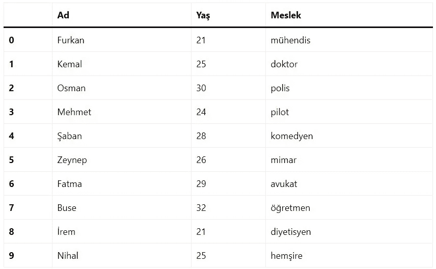
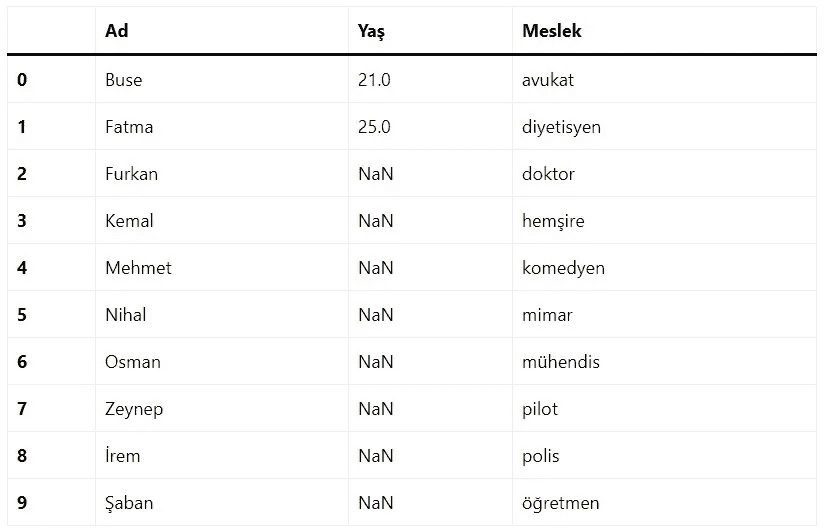
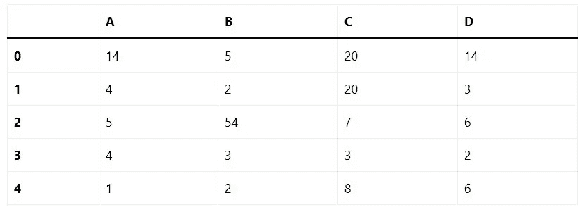
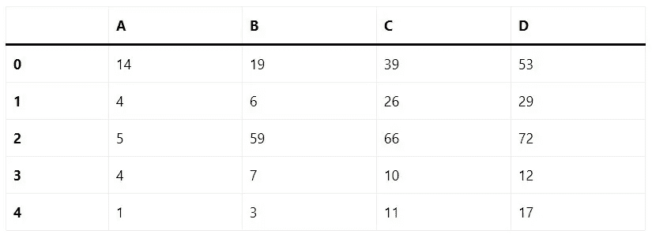
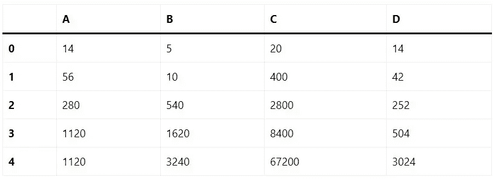
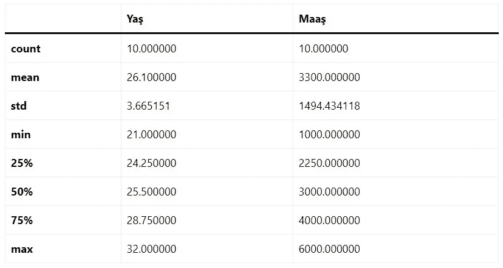
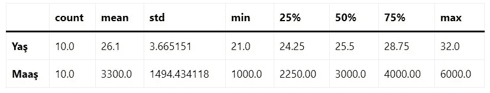
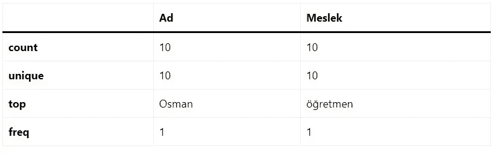
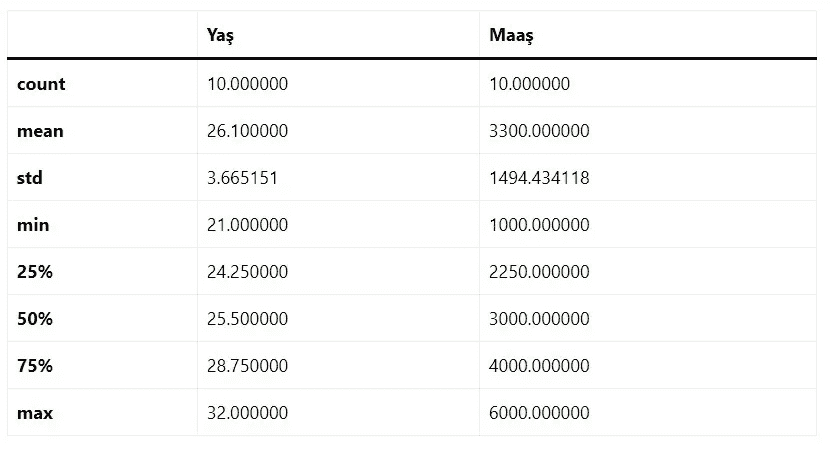

# PYTHON 熊猫描述性统计

> 原文：<https://medium.com/analytics-vidhya/python-pandas-descriptive-statistics-7346b42f9774?source=collection_archive---------14----------------------->


许多方法共同计算数据框架中的描述性统计和其他相关过程。这些是像 sum()、mean()这样的聚合，但有些会产生相同大小的对象，如 sumsum()。一般来说，这些方法采用类似 ndarray，{sum，std，... }的轴参数，但也可以由轴名或整数指定。

让我们创建一个数据帧，并在本节的所有操作中使用该对象。



# 总和()

返回所需坐标轴的值的总和。默认情况下，它是轴索引(轴= 0)。

```
Ad        FurkanKemalOsmanMehmetŞabanZeynepFatmaBuseİrem...
Yaş                                                     261
Meslek    mühendisdoktorpolispilotkomedyenmimaravukatöğr...
dtype: object
```

每一列都是单独添加的(字符串是添加的)。

**轴=1**

```
0    21
1    25
2    30
3    24
4    28
5    26
6    29
7    32
8    21
9    25
dtype: int64
```

# 平均值()

返回平均值。

```
Yaş    26.1
dtype: float64
```

# 标准()

返回数值列的标准偏差。

```
Yaş    3.665151
dtype: float64
```

# 功能和描述

我们来了解一下 Python 熊猫中描述性统计下的函数。下表列出了重要的功能及其解释:

*   **count():** 非空观测值的个数。
*   **sum():** 数值的总和。
*   **mean():** 数值的平均值。
*   **median():** 数值的中值。
*   **mode():** 值的模式。
*   **std():** 值的标准偏差
*   **max():** 最大的值。
*   **min():** 最小值。
*   **abs():** 数值的绝对值。
*   **prod():** 值的乘积。
*   **cumsum():** 值的累积和。
*   **cumprod():** 值的累积乘积。

**注意:**由于数据帧是一种异构数据结构，一般操作并不适用于所有函数。

**例 1【计数】** 非空观测值的个数。

```
Ad        10
Yaş       10
Meslek    10
dtype: int64
```

**例 2【平均值】** 数值的平均值。

```
Yaş    26.1
dtype: float64
```

**例 3** 中值的中值。

```
Yaş    25.5
dtype: float64
```

**例 4【模式】** 模式的值。



这里模式功能部分不起作用。这样做的原因是数据中有字符串。如果所有值都是数字，则该函数工作正常。

**例 5【最大值】** 的最大值。

```
Ad           Şaban
Yaş             32
Meslek    öğretmen
dtype: object
```

由于这里没有另一个 int 类型的值，它根据 age 列计算最大值，age 列是唯一的 int 类型。

```
A    14
B    54
C    20
D    14
dtype: int64
```

**例 6【最小】** 的最小值。

```
Ad          Buse
Yaş           21
Meslek    avukat
dtype: object
```

**例 7【ABS】** 数值的绝对值。

上面的结构就不行了。原因是数据帧中有 str 类型的值。



**例 8【prod】** 值的乘积。

```
Yaş    134069644800000
dtype: int64
```

因为它是这里唯一的 int 值，相应地计算。

```
A     1120
B     3240
C    67200
D     3024
dtype: int64
```

**例 9** (cumsum)值的累计总和。



**例 10【cum prod】** 值的累计乘积。



## 与熊猫一起总结数据

Describe()函数计算 dataframe 列的统计信息摘要。



我们可以使用 T 方法来更好地阅读此表。当列数增加时，使用下面的结构而不是我上面给出的结构。



该函数返回平均值、标准差和 IQR 值。此外，该函数还提供了有关字符列和数字列的信息。“Include”是用于传达关于哪些列应被视为汇总的必要信息的参数。

*   **汇总对象:**对象列
*   **数字:**汇总数字列

