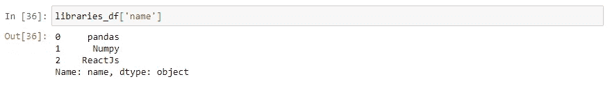

# 蟒蛇熊猫:-第 1 部分

> 原文：<https://medium.com/analytics-vidhya/python-pandas-part-1-7f4065283982?source=collection_archive---------13----------------------->

(建议:-在跳到熊猫之前，至少了解 NumPy/ Matplotlib 的基础知识总是好的)

主要内容:-

1.  3 W 的熊猫(什么/为什么/在哪里)
2.  安装熊猫
3.  数据结构(数据框，系列)-基本
4.  重要问题


# **三只熊猫:-**

***什么是熊猫？***

Pandas 是一个**开源**， [**BSD 许可的**](https://en.wikipedia.org/wiki/BSD_licenses#:~:text=BSD%20licenses%20are%20a%20family,and%20distribution%20of%20covered%20software.&text=The%20original%20BSD%20license%20was,a%20Unix%2Dlike%20operating%20system.) 库，它为 python 编程语言提供了易于使用的数据结构、数据分析、数据操作工具。它建立在 Python 的两个核心库之上——matplotlib(用于数据可视化)和 NumPy(用于数学运算)。

熊猫就像是 Python 中的 excel。**数据帧**类似于**表格**而**系列**类似于**行和列。**

***为什么是熊猫？***

因为 Pandas 是建立在其他 Python 库之上的，并且它的某些部分是用 C 实现的，这使得它在执行时真的更智能和更快。简而言之，你可以说它是“快速、灵活、富于表现力的数据结构，旨在使处理“关系型”或“标签型”数据既简单又直观。”(熊猫文档中提到)。借助这些功能，您可以节省一些计算时间，并将其用于分析数据和构建模型。

***哪里有熊猫？***

你几乎可以在任何处理数据的地方使用熊猫。如果你正在做一个项目，你将可视化数据，分析它，并用它执行一些操作，你很可能会喜欢使用熊猫。

# ***安装:-***

**注意:-官方支持，Python 3.6.1 及以上版本。**

安装和使用熊猫有多种方法。安装 pandas 最简单也是最推荐的方法是将其作为 Anaconda 发行版的一部分安装，Anaconda 发行版是一个用于数据分析和科学计算的跨平台发行版。另一种广泛使用的安装熊猫的方法是创建一个虚拟环境并在其中安装熊猫。

**创建虚拟环境**

*(假设你已经安装了 python3、pip 和 virtual env)*

```
cd my-project                            #go to project directory
virtualenv -p python3 venv               #create virtual env
source venv/bin/activate                 #Activate Virtal env
pip install pandas                       #install pandas
```

建议使用 Jupyter 笔记本来学习 Pandas，因为它可以很容易地将每一步的数据可视化，让您轻松调试并节省时间。

**安装 Jupyter 笔记本:-**

```
pip install jupyter                      #install Jupyter notebook
jupyter notebook                         #launching Jupyter notebook 
```

# **数据结构:-**

pandas 中的基本数据结构是 ***数据帧*** 和 ***系列。*** 这些数据类型的基本行为是对所有对象应用索引、轴标签/对齐。我们需要导入 NumPy 和 pandas 来开始进入名称空间:-


# **系列**

这是一个一维标签数组，能够保存任何数据类型，例如:- **整数、字符串、浮点数、Python 对象**等。数据可以是一个 **python 字典、ndarray、一个标量值**等。轴标签被称为**索引**。

语法:- s = pd。系列(数据，索引=索引)

以下系列的实例化:-

***一)python 字典***

**例 1)** 当我们不给指数 arg 以级数法


系列词典实例 1

**注意:-我们没有传递索引 arg，但是我们仍然得到了作为字典关键字的索引。**

**示例 2)** 当我们传递带有有限键的索引 arg 时


系列词典实例 2

**注意:-这里我们已经将 index arg 传递给了 Series 方法。在很多情况下，当我们处理大型数据集时，我们的字典会有很多不需要的信息，但我们可以使用上述方法来获得一系列只需要的信息。**

**例 3)** 当我们传递不属于字典的索引键时


系列词典实例 3

**注意:-这里我们可以观察到“b”是传递的索引键之一，但是字典中没有那个键。因此，它为“b”键**返回 NaN

**注意:-对于，Python 版本≥ 3.6 和 Pandas 版本≥ 0.23，**系列索引将按字典的插入顺序排序，但对于 **Python 版本≥ 3.6 和 Pandas 版本≥ 0.23，**系列索引将是字典键的字典排序列表。

***b)n 数组***

**例 1)** 当我们不给指数 arg 赋予级数法


系列-n 阵列实例 1

**注意:-在 ndarray 的情况下，如果没有索引被传递，它将被创建为具有值[0，…，len(data-1)]**

**示例 2)当我们将索引 arg 传递给序列**时


系列-n 阵列实例 2

**例 3)当索引列表的键数小于 ndarray 的长度时**


系列-n 阵列实例 3


系列-n 阵列实例 4

**注意:——它会给你一个错误，因为，这里我们已经取得了熊猫分配索引的权限，并且传递了长度不等于数据列表长度的索引**

***c)标量值***

在标量值的情况下，必须提供一个索引，并且值会重复以匹配索引的长度。


系列标量值实例化

我们可以像对待字典或数组一样对待数列。


使用 numpy 数组的系列实例化

**np.random.randn(4)创建一个长度为 4 的 numpy . ndarray*

**类似 ndarray 的系列:-**


使用索引/切片提取系列值

**像字典一样的系列:-**


使用键提取系列值


正在获取不存在的密钥

而获取序列中不存在的键会给我们带来“KeyError”


键盘错误

ndarray 和 Series 之间的一个主要区别是，Series 之间的操作会根据标签自动对齐数据。因此，我们不需要考虑所涉及的系列是否具有相同的标签。如果在未对齐的序列之间进行运算，则结果是相关索引的并集。如果任何标签在其他系列中不匹配，那么该索引的值将被设置为 **NaN** 。我们还可以通过 **dropna** 功能删除带有缺失数据的标签。

**名称属性:-**

系列可以有一个**名称**属性。


序列中的名称属性

我们也可以用熊猫来给《T21》重新命名。Series.rename() 方法。


重命名系列

# **数据帧**

它是一个二维标签数据结构，具有不同类型的列，像电子表格或 SQL 表，或者系列对象的字典。它接受不同类型的输入，如**一维数组、列表、字典或系列、二维数字数组、结构化或记录数组、另一个数据框架。**传递索引(行标签)和列(列标签)参数是可选的。**系列加上特定索引的字典将丢弃所有与传递的索引不匹配的数据。**

数据帧的实例化来自:-

***a)字典系列或字典***

如果传递了索引，那么系列索引的并集将是结果索引，否则字典键的有序列表。如果有嵌套字典，那么它们将首先被转换成序列。可以通过分别访问 index 和 Columns 属性来访问行和列标签。DataFrame 实例化中涉及的所有 ndar array 应该具有相同的长度，如果索引列表作为 arg 传递，则它必须与 ndar array 具有相同的长度。如果没有传递索引，那么结果索引值将在[0，…，len(data)-1]中。


使用系列字典的数据框架实例化

注意:-这里，我们已经创建了系列字典，并将其作为 DataFrame 实例化的唯一参数传递。因此，索引是系列字典键的并集，列是每个系列的键或字典键。first_series 列中索引“e”的值是 NaN，因为我们在 dict 中没有 first_series 键的键。

现在我们将传递显式索引和列:-


传递了索引和列参数

获取数据帧的索引和列


获取索引和列

***b)从结构化或记录数组***


使用结构化或记录数组的数据帧实例化

***c)来自词典列表***


使用字典列表的数据框架实例化

**列选择、添加和删除**

DataFrame 可以被视为一个相似索引系列对象的字典。它使用与字典操作类似的语法来获取、设置和删除。

I)列选择



基于列选择值

ii)列添加


在数据帧中添加额外的列(BSD 许可证)

iii)删除列

使用 **pop()或 del** 可以删除列


使用**删除**删除“BSD 许可证”栏


使用 **pop()** 删除“许可证”栏

**注意:-当使用 pop()删除列时，它返回给我们已删除列的详细信息**

# **问题:-**

1.  熊猫里包含 Numpy 吗？
2.  什么是更快的数字或熊猫？
3.  我应该学 Numpy 还是熊猫？
4.  为什么熊猫跑得这么快？
5.  Numpy 是做什么用的？

# **参考资料:-**

[](https://pandas.pydata.org/) [## 熊猫

### pandas 是一个快速、强大、灵活且易于使用的开源数据分析和操作工具，构建于…

pandas.pydata.org](https://pandas.pydata.org/) 

感谢阅读！。霍普，我帮了你，达到了目的。学习是每时每刻的过程，我也想向你学习。如果你认为有什么需要改进的，或者如果我遗漏了什么，或者有任何疑问，你也可以通过我的**邮箱 id:-iamayushshekhar@gmail.com**联系我。如果你愿意，我们也可以在 [**linkedin**](https://www.linkedin.com/in/georgianayush/) 上连线。