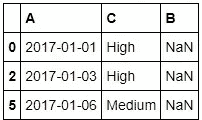
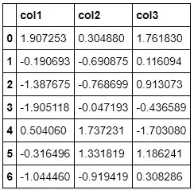
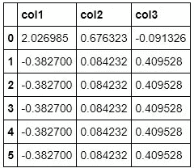
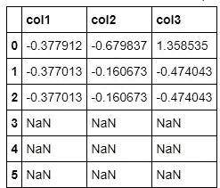
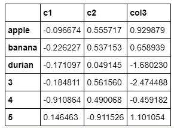

# PYTHON 熊猫重新索引

> 原文：<https://medium.com/analytics-vidhya/python-pandas-re-indexing-1fa209fe07b?source=collection_archive---------17----------------------->

重新索引行标签和列标签会更改数据帧。这意味着 Reindex 使数据与特定轴上的一组特定标签相匹配。通过步进可以执行多种操作，如下所示:

*   重新排序现有数据以匹配新的标签集。
*   向标签不是数据的标签位置添加缺失值(NA)标记。

**注:**我来简单解释一下上面的几个 numpy 特性。

*   **tolist ():** 以 Python 列表的形式返回数组数据(嵌套)的副本。数据项通过 element 函数转换为最接近的兼容内置 Python 类型。
*   **linspace ():** 返回指定范围内等距分布的数字。
*   **choice ():** 从特定的一维序列中创建随机样本。

## 重新索引以与其他对象对齐

您可能希望获取一个对象并重新定义它，以将其轴标记为与另一个对象相同。看看下面的例子来理解同样的现象。

## 重建索引期间填充

**reindex()** 取一个可选的参数方法，是一个填充方法，值如下。

*   **填充/填充:**向前填充数值。
*   **b 填充/回填:**回填数值。
*   **最近:**从最近的索引值填充。

## 重新索引期间的填充限制

limit 参数在重新索引期间提供了对填充的额外控制。该限制指定了连续匹配的最大数量。为了理解这种现象，考虑下面的例子。

## 重新命名

rename()方法允许你基于一些匹配(字典或序列)或一个随机函数重新标记一个轴。为了理解这一点，考虑下面的例子:

