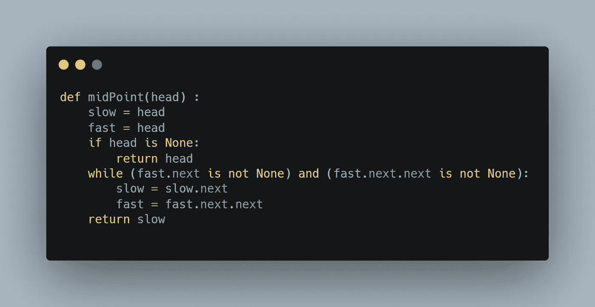
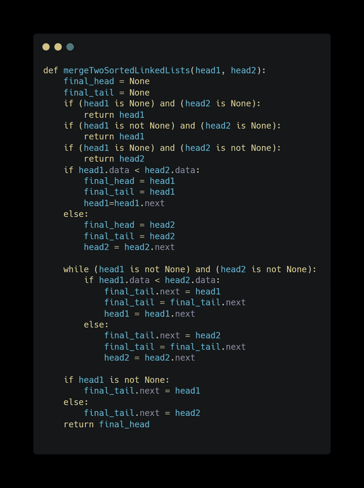
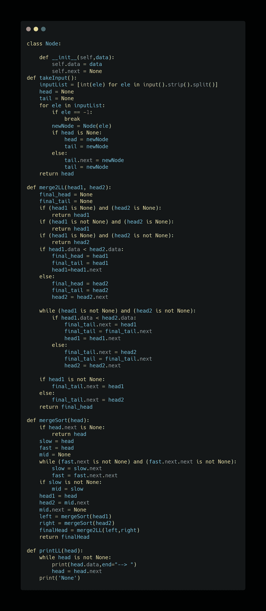
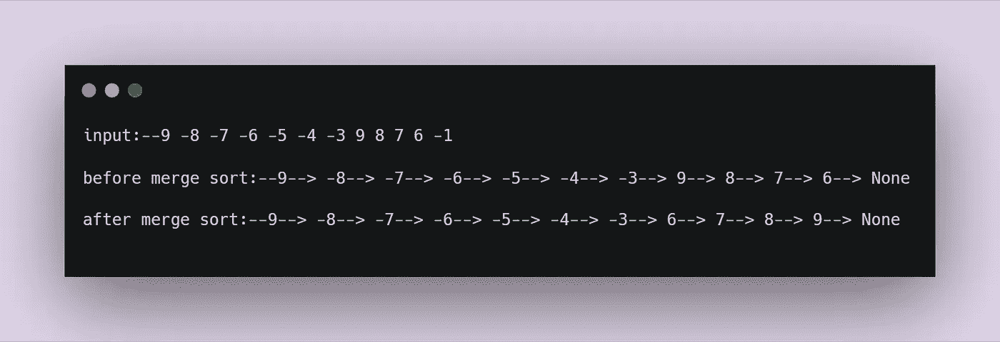

# 用于链表合并排序的 Python 程序

> 原文：<https://medium.com/analytics-vidhya/python-program-for-merge-sort-in-linked-list-30ede4eaf389?source=collection_archive---------2----------------------->

合并排序是一种常用的排序算法。这是对给定列表或数组进行排序的最快算法之一。该算法遵循递归方法来获得期望的结果。

归并排序说让我们做一件事。把给定的列表或数组分成两部分。让我们把这两部分都命名为‘a’和‘b’。现在我们必须分别对两个部分(列表/数组)进行排序，为此我们将对部分“a”调用 sort，对部分“b”调用 sort。一旦这两个部分(列表/数组)被独立排序，那么我们将把这两个部分(列表/数组)合并成一个部分(列表/数组)，这个部分最终将被排序。

> 对两部分(列表/数组)进行排序是递归的工作量，为此我们只需要做三件事…..*递归的基础条件，归纳假设和归纳步骤*要求做已完成的事情。我们将进一步看到它的实施。

**使用类似的方法，我们也可以对给定的链表进行合并排序。**

下面是在链表中实现合并排序所需的步骤

1.  我们会找出链表的中间。
2.  然后我们将在第一步得到的中间值的基础上划分给定的链表
3.  然后我们将调用递归函数对链表的两半进行排序。
4.  然后我们会调用 merge 函数将两个排序后的链表合并成一个链表，并返回新的头。

**找到链表的中间:-**

为了找出链表的中点，我们将有两个指向头部的变量，一个是慢速变量，另一个是快速变量。Slow 将以 x 的速率遍历给定的链表(假设)，fast 将以 2x 的速率遍历给定的链表(假设)。当 fast 将要遍历或者将要遍历整个链表时，slow 将会位于链表的中间，因此，我们将会把中间作为 slow。

查找链表中间的程序

**合并两个排序后的链表:-**

我们将有两个链表的头，我们将不得不在合并两个链表后返回新的头。头部将是两个头部中值较小的一个，此后将进行比较，直到任何链表当前指针不达到 None。

在能够完成这两项要求后，我们现在可以为链表中的合并排序编写完整的代码了。

以下输入的输出是:-

这是我的第一篇文章。希望我能给一些关于这个话题的见解。