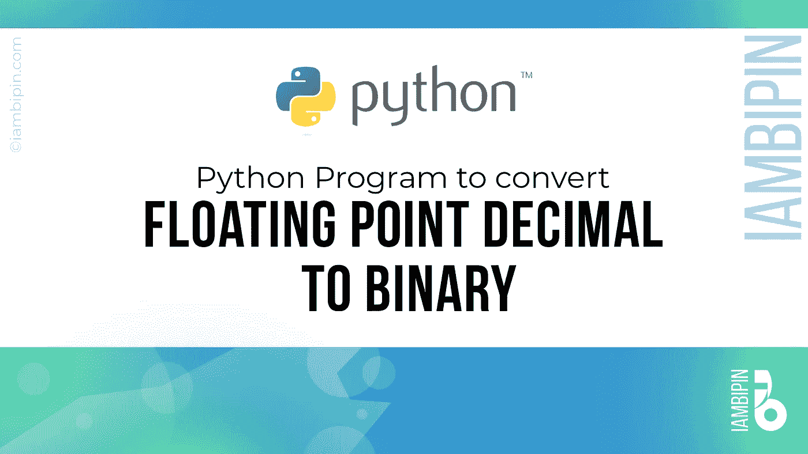

# 将浮点十进制转换为二进制的 Python 程序

> 原文：<https://medium.com/analytics-vidhya/python-program-to-convert-floating-point-decimal-to-binary-485470421743?source=collection_archive---------3----------------------->

## Python 编程/浮点十进制到二进制转换

## 使用 python 程序将浮点十进制转换为二进制。



# 十进制与二进制

十进制是一种用十进制来表示数字的系统。而二进制数字系统涉及用 2 的标度来表示数字。

# 程序

**第一步:**将 59.65625 的整数部分(59)除以 2，直到商变成 1。累加(1 或 0)到给出商 1 的最后一个操作序列的余数(进位)按创建的相反顺序取，从而得到 111011。

59/2 = 29(取 1 为进位)

29/2 = 14(取 1 为进位)

14/2 = 7 (0 为进位)

7/2 = 3(取 1 为进位)

3/2 = 1(取 1 为进位)

所以当我们反转进位时，我们得到 11011。最后，我们将最终商放在 11011 的最开始，得到 111011。

**第二步:**小数部分按最终结果所需的小数位数乘以 2。为了详细说明，我们以上面提到的 59.65625 为例。这里 0.65625 = 65625 * 10^-5.

0.65625 *2 = 1.31250 (1 为进位)*

*0.31250* 2 = 0.62500 (0 为进位)

0.62500 *2 = 1.25000 (1 为进位)*

*0.25000* 2 = 0.50000(取 0 为进位)

0.50000*2 = 1.00000 (1 为进位)
当我们将计算结果汇总在一起时，我们得到 111011.10101

Python 程序:

代码从接收用户输入开始。

```
try:
    num = float(input('Enter a floating point decimal number: '))

except(ValueError):
    print('Please enter a valid floating point decimal')
```

从最终用户接收最终结果要调整到的小数位数。

```
places = int(input('Enter the number of decimal places in the result: '))
```

整数列表(整数列表)和小数列表(小数列表)被声明为全局变量。

```
global whole_list
global dec_list
```

输入的浮点小数被分成整数和小数。

```
whole, dec = str(num).split('.')
whole = int(whole)
dec = int(dec)
```

整数部分除以 2，然后得到的商除以 2。这个过程一直持续到商为 1。while 循环的每次迭代所形成的余数被添加到 whole_list(整数列表)。

```
while (whole / 2 >= 1):
            i = int(whole % 2)
            whole_list.append(i)
            whole /= 2
```

小数部分乘以 2，所得乘积分成整数和小数。这样形成的整数被添加到 dec_list(十进制数列表)。这个过程一直持续到最终结果要调整到的小数位数。

```
while (counter <= places):
        decproduct = decproduct * (10**-(len(str(decproduct))))
        decproduct *= 2
        decwhole, decdec = str(decproduct).split('.')
        decwhole = int(decwhole)
        decdec = int(decdec)
        dec_list.append(decwhole)
        decproduct = decdec
        counter += 1
```

如果 whole_list 的长度大于 1(例如，1.0567 将有一个元素 whole_list)，则列表是相反的。随后，插入 1 作为 whole_list 的第一个元素。

```
if(len(wholeList) > 1):
        wholeList.reverse()
wholeList.insert(0, 1)
```

最后，打印结果。

```
Enter a floating point decimal number: 59.65625
Enter the number of decimal places in the result: 5
************************************************************
The binary number of 59.65625 is:
1 1 1 0 1 1 . 1 0 1 0 1
************************************************************
```

Github 链接:

[](https://github.com/pbipin/floatingpointdecimaltobinary) [## pbi pin/floatingpointdecimaltobbinary

### 将浮点十进制转换为二进制的 Python 程序 59.65625 是浮点十进制，其…

github.com](https://github.com/pbipin/floatingpointdecimaltobinary) 

编码快乐！！！