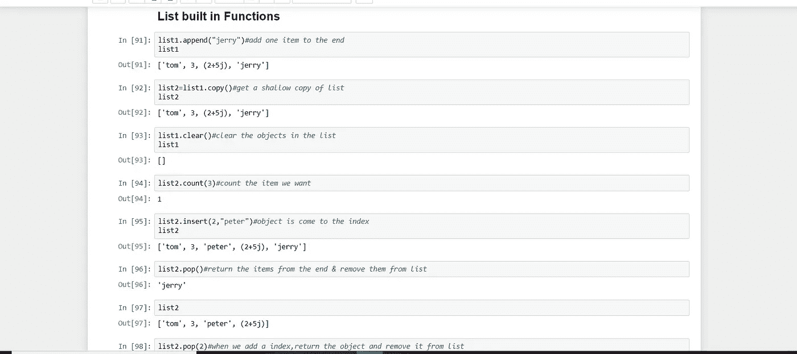
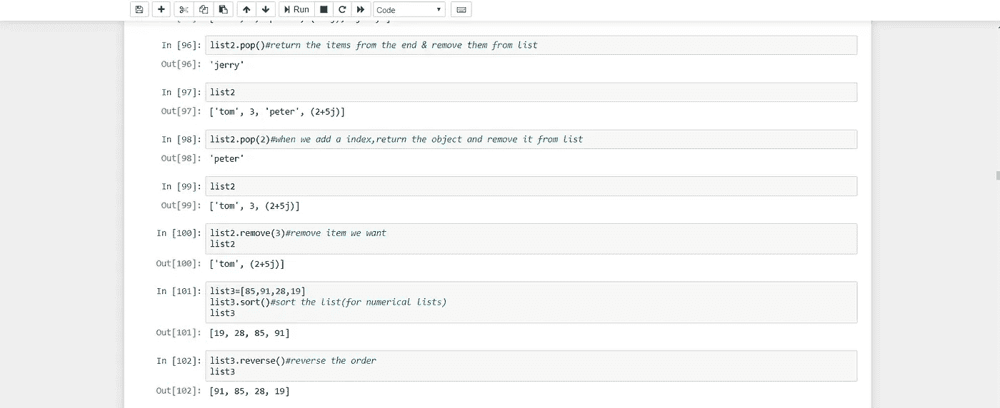
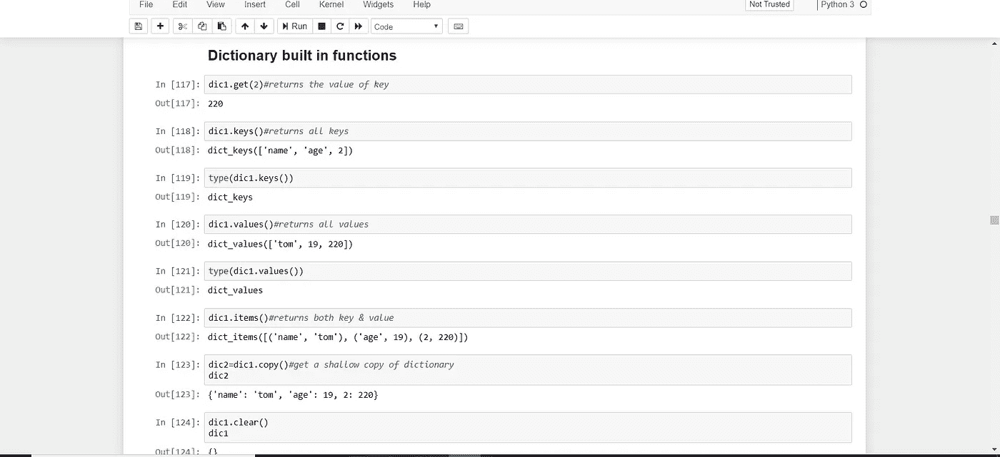
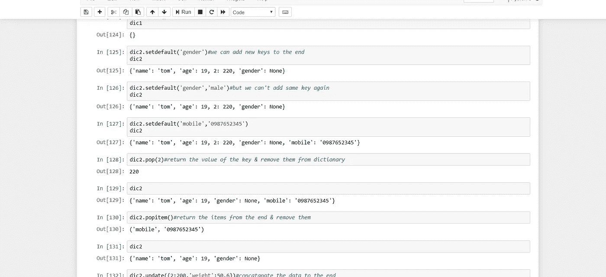
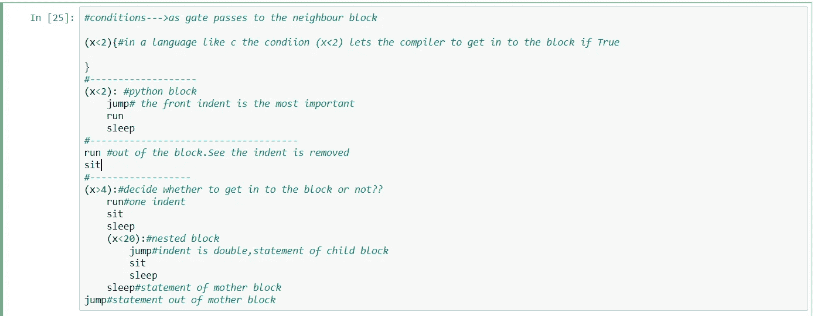
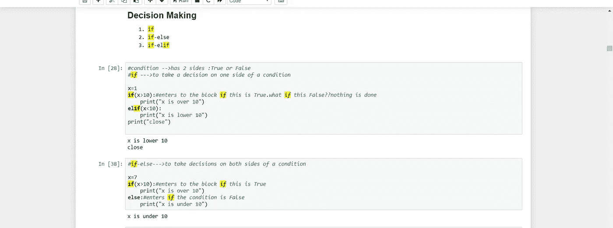

# lPython 编程—第 2 部分:学习机器学习的必备 Python

> 原文：<https://medium.com/analytics-vidhya/python-programming-part-2-essential-python-to-learn-machine-learning-fdca89bf26f2?source=collection_archive---------32----------------------->

欢迎回到我的“Python 编程”系列文章。今天我要谈的是在学习机器学习之前你需要知道的基本事情。希望你能更好地了解**变量、数据类型、类型转换、布尔值、字符串、如何拆分和剥离字符串、列表、字典、元组、if-else、Python 内置函数等。**本文末尾。我们开始吧😊！！


如果你在安装 Anaconda 或 Python 时遇到任何错误或问题，在这里问我。

所以首先要谈的是变量。什么是变量？像其他编程语言一样，变量基本上是存储值的内存位置。在 Python 中，声明变量时不需要告诉数据类型。

x = 5 #赋整数
y = 4.2 #赋浮点值
z = " test " #赋字符串

print(type(x))#测试 x 的类型并打印
print(type(z))

```
<class 'int'>
<class 'str'>
```

Python 有一个被称为多重赋值的简洁特性。

x=y=z=12
打印(x)
打印(y)

```
12
12
```

Python 中可用的数据类型有 bool、int、float、complex、String、time、enum、List、Dictionary、Tuple。我们可以使用“”或“”来键入字符串。我们可以使用''' ''或""" ""在 Python 中创建一个段落。类型转换意味着“一种数据类型转换成另一种数据类型”。

x=2，x 等于 2。在 python 中，x 的类型是整数。x 可以转换成 float → float(x)现在 x = 2.0 的类型是 float。

x=2
式(x)

```
int
```

浮动(x)

```
2.0
```

我们来谈谈字符串连接。让我们创建一个字符串， **name="Nayomi Rashmika"** 如果您想**将这个名称字符串分割成两个单词**

name = " Nayomi Rashmika "
name[:6]

```
'Nayomi'
```

name = " Nayomi Rashmika "
name[7:15]

```
'Rashmika'
```

你能理解这是怎么发生的吗？如果我们写 name[0:6]，python 就得到字符串的字符 0 到 6。就像这样，我们可以从字符串中得到任何子字符串。我们也可以使用 split()来拆分字符串。

data="1，2，3，4，5"
data.split('，')#用，

```
['1', '2', '3', '4', '5']
```

要删除字符串开头和结尾的空格，我们可以在 Python 中使用 strip()

data2=" 1，2，3，4 "
data2.strip()

```
'1,2,3,4'
```

字符串，复数和实数可以包含在一个地方。我们可以在 Python 中使用。列表是可变的(可变意味着可以进行项目分配(更新))。

list1=[1.2，'汤姆'，3，(2+5j)]
list1

```
[1.2, 'tom', 3, (2+5j)]
```

Python 中有一些内置的 List 函数。这意味着 Python 提供了一些功能。我喜欢和你分享我的笔记本。



安全细节被插入到元组中，因为元组是不可变的(不能进行项目分配)。使用()来表示元组。元组中有两个内置函数。它们是 count()和 index()。

tp1=(12，13，14，15，14)
tp1 . count(14)#清点我们想要的物品

```
1
```

tp1 . index(13)#返回索引

```
1
```

那么我们如何改变 tp1 的值呢？为此，您可以使用类型转换。这个 tp1 可以被转换成列表并改变它的值，然后你可以再次把它转换成元组。

list 1 = list(tp1)#我们可以将元组中的项赋值转换为列表
list 1[1]= 3
tp1 =元组(list1)
tp1

```
(12, 3, 14, 15, 14)
```

我们可以通过字典使用方便的索引名称。用{}代表字典。字典的条目是键和值。字典是可变的，不能进行连接和乘法。

dic1={"name":"tom "，" age":19，2:220 }
DIC 1[" name "]#带来 key 的值

```
'tom'
```

len(dic1)

```
3
```

Python 中有一些内置的字典函数



Python 的关系运算符用于检查给定的关系是否存在，并相应地返回真或假。

```
~ x==12 # is x is equal to 12??
~ x<13 # is x is less than 13??if YES so True should be returned
~ x>15 #larger??
~ x>=153 #larger or equal??
~ x!=3 # is x is not equal to 3??
```

因为合同是最重要的东西。



我想分享我的 jupyter 笔记本的决策部分。希望你能从中得到更好的想法。记住缩进是 Python 中最重要的东西。



我希望您对 Python 编程有所了解。所以本文到此结束。下一篇文章再见。快乐编码😊！！！