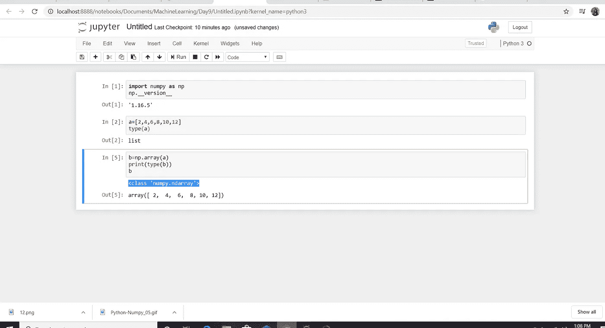

# Python 编程—第 3 部分:Python 中的 Numpy

> 原文：<https://medium.com/analytics-vidhya/python-programming-part-2-numpy-with-python-790d9e10bfff?source=collection_archive---------37----------------------->

欢迎回到我关于“Python 编程”的文章链。今天我将讨论关于 Numpy lib 的每一个基本的东西，你在学习机器学习之前需要知道的。希望你能在这篇文章结束后对 Numpy**T3 有更好的了解。我们开始吧😊！！**


什么是 Numpy(数字 Python)？Numpy 是 Python 中的一个开源库，使用数学、统计运算、科学、工程和数据科学编程。使用 Numpy 可以执行不同的操作。我们可以使用 Numpy 执行任何与 leaner 代数或任何数字生成或随机数生成等相关的操作。让我们来看看 python。默认情况下，Numpy 在 Python 中不可用。因此，我们需要手动安装。为此，我们必须进入命令提示符，并输入其他可用 python 库的路径。接下来，我们必须遵循语法，它被称为“pip install numpy”

好😀！..现在我们要和 Anaconda 一起工作。Anaconda 拥有一些集成开发环境。集成开发环境意味着这些是 Python 编程的图形用户界面。打开 Anaconda navigator，进入 Environments 并搜索 numpy。如果你成功安装了 numpy，你可以看到如下。


首先我们应该导入 numpy 来使用 numpy。要检查您安装的 numpy 版本，请遵循以下步骤。

**import numpy as np
np。__ 版本 __**

ctrl+enter 执行


让我们看看如何创建一个 numpy 数组。这个 numpy 数组有点类似于列表。使用这个“np.array()”函数，我们可以创建数据或将数据转换为 numpy 数组。



通过使用 numpy 数组，您可以对任何其他数学运算进行加减运算。(这是 list 和 numpy 数组的主要区别)

**b = NP . array(a)
print(type(b))
b+100**

```
<class 'numpy.ndarray'>
```

Out[10]:

```
array([102, 104, 106, 108, 110, 112])
```

让我们讨论 numpy 数组的属性。形状是 numpy 数组的属性之一。

**b = NP . array(a)
print(b)
b . shape**

```
[ 2  4  6  8 10 12]
```

Out[11]:

```
(6,)
```

输出为(6，)。逗号前的数字是行数。另一个数字是 b numpy 数组拥有的列数。

**导入 numpy 作为 np
x = np.array([**

**【67，63，87】
【77，69，59】
【85，87，99】
【79，72，71】
【63，89，93】
【68，92，78】**

**)**

**np.shape(x)**

```
(6, 3)
```

行数=6，列数=3。我想你现在能理解了。如果你想检查这个 numpy 数组的内部数据类型，你可以使用“ **dtype** ”。dtype 是 numpy 数组具有的属性之一。它用于检查 numpy 数组的内部数据类型。numpy 有不同的数据类型，如 int16、int32、int64、float、float32 等。那些数据类型属于 numpy 而不是 Python。

**导入 numpy 为 np
x = np.array([ [67，63，87]，[77，69，59]，[85，87，99]，[79，72，71]，[63，89，93]，[68，92，78]])
x.shape
x.dtype**

```
dtype('int32')
```

如何得到这个‘int 32’。它依赖于值的大小，默认情况下会得到。如果你像下面这样取浮点值，

**导入 numpy 为 np
x = np.array([**

**【67.4，63，87】
【77.2，69，59】
【85，87，99.3】
【79，72，71.5】
【63.2，89，93】
【68，92，78】**

**)**

x.dtype

```
dtype('float64')
```

有不同类型阵列，一维、二维和多维等。可以使用 ndim 参数定义数组的维数。

**导入 numpy 为 np
x = np.array([67，63，87]，ndmin=2)
x**

```
array([[67, 63, 87]])
```

我们可以使用 ndim 来检查数组的维数。

**导入 numpy 为 np
x = np.array([67，63，87]，ndmin=2)
x.ndim**

```
2
```

我们也可以定义数组内部值的数据类型。

**导入 numpy 为 np
x = np.array([67，63，87]，dtype=complex)
x**

```
array([67.+0.j, 63.+0.j, 87.+0.j])
```

如果我们在一个列表中取数据，它是一维的，如果我们在两个列表中取数据，它是二维的。

**import numpy as NP
x = NP . array([67，63，87])
print('dimension of x= '，x.ndim)
y = np.array([[67，63，87]])
print('dimension of y= '，y.ndim)**

```
dimension of x=  1
dimension of y=  2
```

如果需要，还可以更改数组的形状。

**import numpy as NP
x = NP . array([67，63，87，54])
print('更改前'，x.shape)
x.shape=(2，2)
print('更改后'，x.shape)**

```
before change  (4,)
after change  (2, 2)
```

您可以使用 jupyter 笔记本来检查和练习上述代码。如果你对 **Numpy** 有任何问题，在这里联系我[。我希望你对使用 Python 编程的 **Numpy 有清楚的了解。所以本文到此结束。下一篇文章再见。快乐编码😊！！！**](https://www.linkedin.com/in/nayomi-rashmika/)