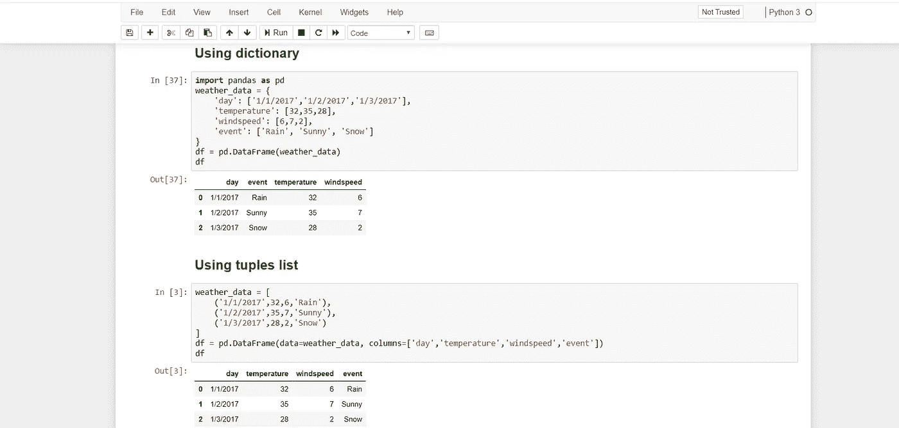

# Python 编程—第 4 部分:熊猫与 Python

> 原文：<https://medium.com/analytics-vidhya/python-programming-part-4-pandas-with-python-947871ceb868?source=collection_archive---------22----------------------->

欢迎回到我关于“Python 编程”的文章链。今天我将讨论关于熊猫图书馆的每一个重要的事情，你在学习机器学习之前需要知道的。希望你能在这篇文章的结尾获得更多关于熊猫**和 T3 的知识。所以在去 T4 看熊猫之前，你也应该了解一下熊猫。**如果你对 numpy 没有更好的想法，请参考我之前的文章《** [**Numpy 与 Python**](/analytics-vidhya/python-programming-part-2-numpy-with-python-790d9e10bfff) **》。**我们开始吧😊！！**


什么是熊猫🤔？pandas 是像 numpy 一样的 python 开源库。我们知道 numpy 用于数值运算。Pandas 用于数据结构。它通过使用强大的数据结构提供了高性能的数据操作和分析工具。系列和数据帧是熊猫拥有的结构。序列是一维结构，数据帧是二维结构。使用熊猫可以轻松处理丢失的数据。熊猫也可以用来分割数据，合并数据，连接数据等。在与熊猫一起工作之前，我们需要安装熊猫。默认情况下，熊猫在 Python 中也不可用。因此，我们需要手动安装。为此，我们必须进入命令提示符，并输入其他可用 python 库的路径。接下来，我们必须遵循语法，它被称为“ **pip 安装熊猫**”。

这里主要谈谈数列和数据帧。那么什么是系列呢🤔？**系列是具有同质数据类型值的一维数据结构**。Dataframe 是系列的集合。例如，如果我们得到一个四行四列的表格。我们可以得到一个系列的专栏。我们可以以数据帧的形式得到表格。所以我们可以说“ **Dataframe 是系列**的集合”。

**进口熊猫当 np
进口熊猫当 pd
pd。**系列(10)

```
0    10
dtype: int64
```

**进口 numpy 当 np
进口熊猫当 pd
pd。系列([10，12，44])**

```
0    10
1    12
2    44
dtype: int64
```

这里 0，1，2 是索引。如果需要，您可以更改索引。

**进口 numpy 当 np
进口熊猫当 pd
pd。Series([10，12，44]，index=[1，2，3])**

```
1    10
2    12
3    44
dtype: int64
```

**进口 numpy 当 np
进口熊猫当 pd
pd。Series([10，12，44]，index=['a '，' b '，' c'])**

```
a    10
b    12
c    44
dtype: int64
```

当您不知道确切的值时，您可以插入一个值(相反，您不能插入零，因为零也是值)。

**进口 numpy 当 np
进口熊猫当 pd
pd。Series([10，12，np.nan]，index=['a '，' b '，' c'])**

```
a    10.0
b    12.0
c     **NaN**
dtype: float64
```

**什么是数据帧🤔？Dataframe 是具有异构数据类型元素的二维对象。**

**import numpy as NP
import pandas as PD
a =[12，24，' nayomi ']
print(a)
print(type(a))**

b=pd。
系列(a)打印(b)
类型(b)

```
[12, 24, **'**nayomi']
<class 'list'>
0        12
1        24
2    nayomi
dtype: object
```

Out[16]:

```
pandas.core.series.Series
```

好的，☺！现在我们要将这些值分配到一个数据帧中。

a=[12，24，54，55]
df=pd。data frame(a)
print(df)
print(type(df))

```
 0
0  12
1  24
2  54
3  55
<class 'pandas.core.frame.DataFrame'>
```

df 是一种数据帧结构。您可以记住 **numpy 数组**中的尺寸、形状、行和列。这里也一样。让我们在“a”(学生姓名和学生标记)中取一些值。

a=['纳约米'，97 年]，['洛恰纳'，99 年]，['拉什米卡'，89 年]]
a

```
[['nayomi', 97], ['lochana', 99], ['rashmika', 89]]
```

现在我们要将“a”转换成数据帧。我喜欢和你分享我的笔记本。


这里 0，1 是列，0，1，2 是行。如果你愿意，你可以改变他们如下。

**进口 numpy 当 np
进口熊猫当 PD
a =[' na yomi '，97]，['lochana '，99]，['rashmika '，89]]
df=pd。DataFrame(a，columns=['name '，' marks'])
df**

```
 name  marks
0    nayomi     97
1   lochana     99
2  rashmika     89
```

如果您想打印特定的列，您可以打印为 **print(df['特定列名'])。**

**进口 numpy 当 np
进口熊猫当 PD
a =[' na yomi '，97]，['lochana '，99]，['rashmika '，89]]
df=pd。DataFrame(a，columns=['name '，' marks '])
print(df[' name '])**

```
0      nayomi
1     lochana
2    rashmika
Name: name, dtype: object
```

b=df['name']那么 b 的类型是什么..你可以记得上面我说过，“Dataframe 是一个系列的集合”。所以 b 的类型应该是级数。让我想想，

**进口 numpy 当 np
进口熊猫当 PD
a =[' na yomi '，97]，['lochana '，99]，['rashmika '，89]]
df=pd。DataFrame(a，columns=['name '，' marks '])
print(df[' name '])
b = df[' name ']
type(b)**

```
0      nayomi
1     lochana
2    rashmika
Name: name, dtype: object
```

Out[19]:

```
**pandas.core.series.Series**
```

让我们看看字典值，

**import numpy as NP
import pandas as PD
a = { ' name ':[' nayomi '，' rashmika']，' age':[24，25]}
b=pd。数据帧(a)
打印(b)**

```
 name  age
0    nayomi   24
1  rashmika   25
```

在字典中，键将接受一个列名。就像这样，你可以把任何值放入一个数据帧。你也可以将数组值放入数据帧中。


所以我们可以这样说。数据帧是熊猫最常用的对象。它是一种类似表格的数据结构，包含行和列，类似于 excel 电子表格。我们可以用不同的方式创建数据框架，如使用列表、使用字典、使用 excel、使用 csv 文件等。我喜欢和你分享我的笔记本。



您可以使用 jupyter 笔记本来检查和练习上述代码。如果你对熊猫有任何问题，请在这里联系我。我希望你对用 Python 编程的**熊猫**有了清晰的认识。所以这就是本文的结尾😎。下一篇文章再见。快乐编码😊！！！