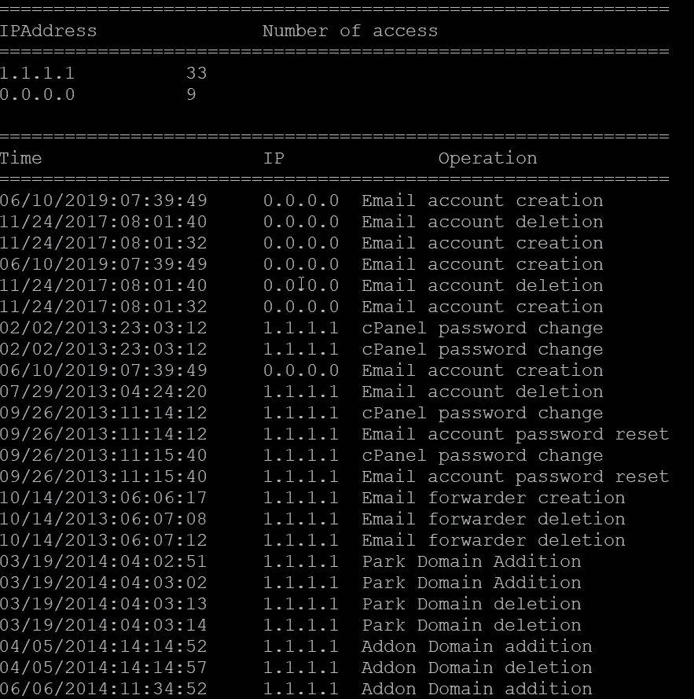

# 生成 cPanel 访问日志摘要的 Python 脚本。

> 原文：<https://medium.com/analytics-vidhya/python-script-to-generate-summary-of-cpanel-access-logs-9916043ff01c?source=collection_archive---------18----------------------->


沙哈达特·拉赫曼在 [Unsplash](https://unsplash.com?utm_source=medium&utm_medium=referral) 上拍摄的照片

过去两年我一直在托管部门工作，老实说，检查 cPanel 访问日志是一项单调乏味的任务。

例如，如果我想检查 cPanel 访问日志以创建电子邮件帐户，我需要创建一个测试电子邮件帐户，然后检查访问日志并确认创建电子邮件帐户时调用了什么关键字。

所以我创建了一个 python 字典，把所有这些关键字都作为“key”，对应的操作在“value”中。

以下是我创建的 python 字典。

```
keywords={
    'addbhtml' : 'Database addition',
    'deldbhtml' : 'Database deletion',
    'simplehtml' : 'Simple DNS Zone editor',
    'advancedhtml' : 'Advanced DNS Zone Editor',
    'The+row+has+been+deleted   ' : 'Database Deletion (phpMyAdmin)',
    'passwd' : 'cPanel password change',
    'add_pop' : 'Email account creation',
    'delpop' : 'Email account deletion',
    'passwdpop' : 'Email account password reset ',
    'doaddfwd' : 'Email forwarder creation ',
    'dodelfwd' : 'Email forwarder deletion ',
    'doaddparked' : 'Park Domain Addition ',
    'dodelparked' : 'Park Domain deletion ',
    'doadddomain' : 'Addon Domain addition ',
    'confirmdodeldomain' : 'Addon Domain deletion ',
    'subdomain/doadddomainhtml' : 'Sub Domain addition',
    'dodeldomainconfirmhtml' : 'Sub Domain deletion',
    'add_ftp' : 'FTP account addition',
    'delete_ftp' : 'FTP account deletion',
    'addredirecthtml' : 'Redirection addition',
    'delredirectconfirmhtml' : 'Redirection deletion',
    'scripts/chrootpass' : 'Root Password Reset ',
    'doadddfwdhtml' : 'Addition of Domain forwarder [email]',
    'dodeldfwdconfirmhtml' : 'Deletion of domain forwarder [email]',
    'mxcheck=local' : 'Change in Email Routing settings (local)',
    'mxcheck=remote' : 'Change in Email Routing settings (remote)',
    'Cron&cpanel_jsonapi_func=add_line' : 'Cron-job addition',
    'Cron&cpanel_jsonapi_func=remove_line' : 'Cron-job deletion',
    'remove_email_id' : 'Email account deletion',
    'add_email_id' : 'Email account creation',

}
```

以下是最终代码:

```
import argparse,re,os,sys
#from collections import Counter
def progressBar(value, endvalue, bar_length=20):
        percent = float(value) / endvalue
        arrow = '-' * int(round(percent * bar_length)-1) + '>'
        spaces = ' ' * (bar_length - len(arrow))
        sys.stdout.write("\rProgress: [{0}] {1}%".format(arrow + spaces, int(round(percent * 100))))
        sys.stdout.flush()

parser=argparse.ArgumentParser(
    description="To print  cPanel access log in more readable format"
)
parser.add_argument('user', help="cPanel user name")
args=parser.parse_args()
print(args)
array2=[]
filesize = os.path.getsize('/usr/local/cpanel/logs/access_log')
progress=0
with open("/usr/local/cpanel/logs/access_log",'r') as file:
    print("Reading from file:")
    for i in file:
         progress=progress+len(i)
         progressP=(float(progress))/filesize
         #print(array2)/filesize
         progressBar(int(progressP*100),100)
         #print(i)
         #print("================================================================")
         if re.search(args.user, i):
          array2.append(i)
keywords={
    'addbhtml' : 'Database addition',
    'deldbhtml' : 'Database deletion',
    'simplehtml' : 'Simple DNS Zone editor',
    'advancedhtml' : 'Advanced DNS Zone Editor',
    'The+row+has+been+deleted   ' : 'Database Deletion (phpMyAdmin)',
    'passwd' : 'cPanel password change',
    'add_pop' : 'Email account creation',
    'delpop' : 'Email account deletion',
    'passwdpop' : 'Email account password reset ',
    'doaddfwd' : 'Email forwarder creation ',
    'dodelfwd' : 'Email forwarder deletion ',
    'doaddparked' : 'Park Domain Addition ',
    'dodelparked' : 'Park Domain deletion ',
    'doadddomain' : 'Addon Domain addition ',
    'confirmdodeldomain' : 'Addon Domain deletion ',
    'subdomain/doadddomainhtml' : 'Sub Domain addition',
    'dodeldomainconfirmhtml' : 'Sub Domain deletion',
    'add_ftp' : 'FTP account addition',
    'delete_ftp' : 'FTP account deletion',
    'addredirecthtml' : 'Redirection addition',
    'delredirectconfirmhtml' : 'Redirection deletion',
    'scripts/chrootpass' : 'Root Password Reset ',
    'doadddfwdhtml' : 'Addition of Domain forwarder [email]',
    'dodeldfwdconfirmhtml' : 'Deletion of domain forwarder [email]',
    'mxcheck=local' : 'Change in Email Routing settings (local)',
    'mxcheck=remote' : 'Change in Email Routing settings (remote)',
    'Cron&cpanel_jsonapi_func=add_line' : 'Cron-job addition',
    'Cron&cpanel_jsonapi_func=remove_line' : 'Cron-job deletion',
    'remove_email_id' : 'Email account deletion',
    'add_email_id' : 'Email account creation',

}
def count_IPs():
 m=[]
 print("\n=============================================================")
 print("IPAddress               "+"Number of access")
 print("=============================================================")
 b = {}
 for i in array2:
         b[i.split()[0]] = b.get(i.split()[0], 0) + 1
         #Counter(m).keys()
         #Counter(m).values()
 for key,value in sorted(b.items(), key=lambda x:x[1],reverse=True):
  print(str(key)+"\t\t"+str(value))
count_IPs()
#a_keywords = {'fileman':['POST','fileman']}
print("\n=============================================================")
print("Time"+"                    "+"IP"+"              "+"Operation")
print("=============================================================")
for i in array2:
        for key,value in keywords.items():
          if key in i:
                print(i.split()[3].replace("[","")+"\t"+i.split()[0]+"\t"+value)

        if "POST" in i and "fileman" in i:
                 print(i.split()[3].replace("[","")+"\t"+i.split()[0]+"\t"+"Filemanager POST")
        elif "POST" in i and "phpMyAdmin" in i:
                 print(i.split()[3].replace("[","")+"\t"+i.split()[0]+"\t"+"phpMyAdmin POST")
```

这个脚本的作用是，它将 cPanel 用户名作为输入，并通过将访问日志转换为“时间”、“IP”和“操作”三列来生成 access_log 的摘要("/usr/local/cPanel/logs/access _ log ")。

```
python generate_accesslog username;
```

样本输出:

