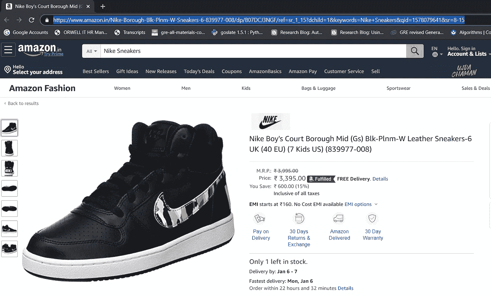
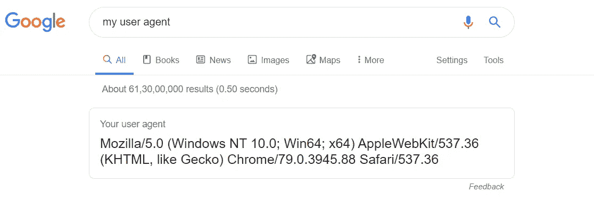
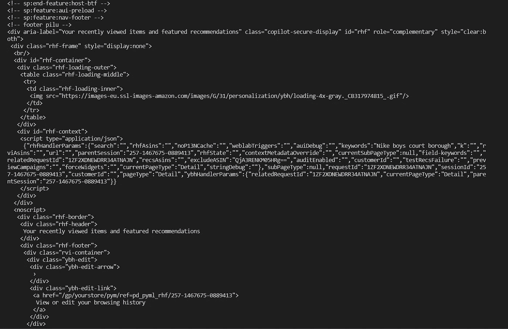
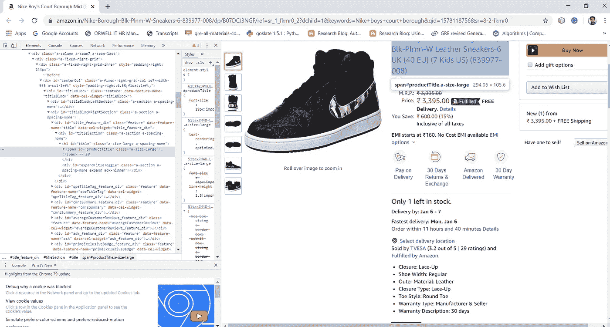
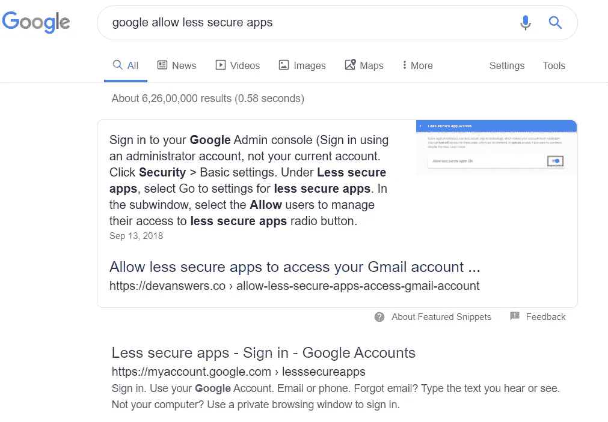
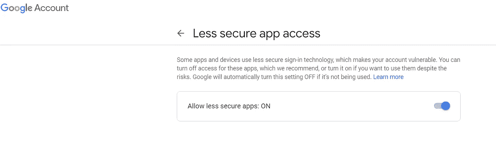
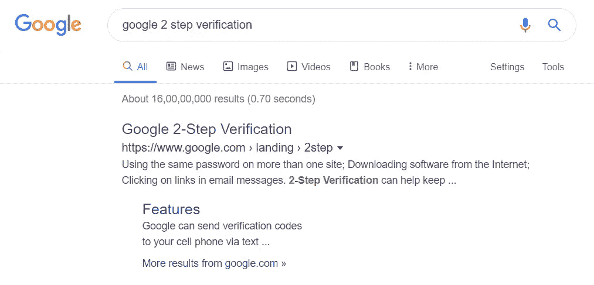
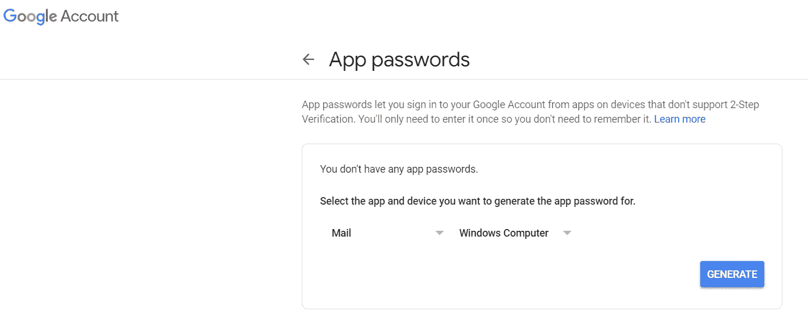
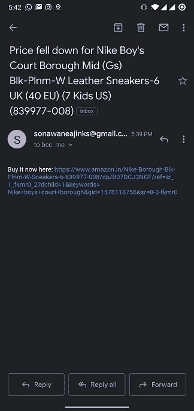

# 跟踪亚马逊价格的 Python 脚本！！|每日 Python #1

> 原文：<https://medium.com/analytics-vidhya/python-script-to-track-amazon-prices-4b2610da5f49?source=collection_archive---------1----------------------->

本文是一篇教程，介绍如何使用一个简单的 Python web scraper 跟踪任何电子商务平台上的产品价格。

# 要求:

1.  Python 3.0
2.  点

# 安装以下软件包:

1.  [请求](https://pypi.org/project/requests/)—Python 的 HTTP 库
2.  [bs4](https://pypi.org/project/beautifulsoup4/) —用于网页抓取的库
3.  smtplib——发送电子邮件的库。

```
pip install requests bs4 smptlib
```

让我们从导入代码中的库开始…

```
import requests
from bs4 import BeautifulSoup
import smtplib
```

接下来，我们将编写一个获取给定产品价格的函数。为此，我们将需要来自亚马逊(或任何其他电子商务平台)的产品的 URL。

例如，我希望从亚马逊购买这些耐克运动鞋，所以我将复制这个特定产品的 URL



亚马逊截图

让我们定义一个检查产品价格的函数。

```
def check_price(URL, threshold_amt):
    headers = {'User-Agent':"Mozilla/5.0 (Windows NT 10.0; Win64; x64) AppleWebKit/537.36 (KHTML, like Gecko) Chrome/79.0.3945.88 Safari/537.36"}page = requests.get(URL,headers=headers)soup = BeautifulSoup(page.content,'html.parser')title = soup.find(id="productTitle").get_text().strip()price = soup.find(id="priceblock_saleprice").get_text()[1:].strip().replace(',','')Fprice = float(price)if Fprice < threshold_amt:
        alert_me()
```

字典“头”包含[用户代理](https://en.wikipedia.org/wiki/User_agent)信息，即浏览器的信息。你可以通过谷歌搜索**我的用户代理**来获得这些信息



谷歌搜索我的用户代理

requests 包中的 get()方法将获得给定 URL 的 HTTP 响应。这个响应被浏览器解析，给我们用户体验的感觉。

这个保存在变量‘page’中的 HTTP 响应是用这个神奇的库**漂亮的汤**解析的。美汤是一个库，可以很容易的从网页上抓取信息。它位于 HTML 或 XML 解析器之上，为迭代、搜索和修改解析树提供了 Pythonic 习惯用法。BeautifulSoup 库最大的优点是它构建在 html5lib、lxml、html.parser 等 HTML 解析库之上。所以 BeautifulSoup 对象和指定解析器库可以同时创建。

```
soup = BeautifulSoup(page.content,'html.parser')
```

这将返回我们请求的网页的 HTML 代码。现在，可以访问网页的每个元素。如果您想要打印此解析的内容，请执行以下操作:

```
print(soup.prettify())
```

输出将类似于以下内容:



soup.prettify()产生的输出片段

访问每个元素的最佳方式是使用它的 ID。几乎所有网页上的重要元素都有一个 ID，即代表该元素的唯一文本。你可以在 Google Chrome 上做一个 inspect 元素来发现这一点。



Amazon.in 的 Snip 和检查元素工具

我们可以看到，包含产品标题的元素的 ID 是' productTitle '。同样，包含价格的元素的 ID 是“priceblock_saleprice”。这些 id 可能因平台而异。

**find()** 用于从解析后的 HTML 代码中查找元素。

**get_text()** 用于获取找到的元素的文本。

**strip()** 用于删除文本前后多余的空格。

我们将价格从字符串格式转换为' [float](https://www.ibm.com/support/knowledgecenter/en/SSGU8G_12.1.0/com.ibm.sqlr.doc/ids_sqr_118.htm) '。首先，我们使用切片来剥离货币图标([1:] —从索引 1 开始直到结束)。然后，我们删除逗号('，')，用空格(')代替它。此外，我们将该字符串类型转换为“float”。

在我们有了可以与某个值进行比较的实际价格之后，我们根据产品价格来设置条件。如果我想在这些耐克运动鞋的价格低于 3000 卢比时收到电子邮件，那么我会相应地设置条件。

如果价格低于给定的阈值金额，向我发送电子邮件的功能应该被触发。

要收到电子邮件提醒，首先，我们需要允许谷歌允许不太安全的应用程序。要做到这一点，搜索“谷歌允许不太安全的应用”。



谷歌搜索允许不太安全的应用程序

转到“不太安全的应用程序-登录-谷歌帐户”页面，并启用谷歌允许不太安全的应用程序。



拦截不太安全的应用程序访问(谷歌)

现在我们可以使用 Gmail 密码进行身份验证，但更安全的方法是启用谷歌两步验证。只需搜索“谷歌两步验证”并打开两步验证。



谷歌搜索 2 步验证截图

启用两步验证后，我们现在可以为不同的应用程序设置密码。搜索“谷歌应用程序密码”并访问应用程序密码页面。Google 会要求您登录以进行身份验证。现在，我们设置应用程序的类型，在这种情况下，邮件和设备的类型，在这种情况下，Windows 计算机。单击 Generate 后，我们会看到一个弹出窗口，显示应用程序的密码。



让我们编写一个函数‘alert _ me’来在它被调用时发送一封电子邮件。

```
def alert_me(URL,title, price):
    server = smtplib.SMTP('smtp.gmail.com',587)

    server.ehlo()
    server.starttls()
    server.ehlo()

    server.login('YOUR_EMAIL','GOOGLE_APP_PASSWORD')

    subject = 'Price fell down for '+title body = 'Buy it now here: '+URL msg = f"Subject:{subject}\n\n{body}"

    server.sendmail('YOUR_EMAIL','TO_EMAIL',msg) print('Email alert sent') server.quit()
```

我们首先通过提供主机“smtp.gmail.com”和端口号 [587](https://serversmtp.com/port-587/) 来实例化 SMTP 的对象。

然后，我们使用`EHLO`向 ESMTP 服务器表明自己身份。您可以从 python 文档中了解更多信息。然后，我们将 SMTP 连接置于 TLS(传输层安全性)模式。接下来的所有 SMTP 命令都将被加密。

我们准备邮件的主题和正文，并将它们连接成一个变量“msg”。该消息随后被传递到' **sendmail** ()'上，后者将电子邮件发送到目标电子邮件地址。



收到的邮件的截图

这封电子邮件被发送，因为我设置的阈值金额超过了测试目的的当前价格。为了保持这个脚本运行，添加一个睡眠一小时的循环，以保持每小时检查一次。

我希望这篇文章是有帮助的，如果你喜欢它或者有任何建议，请留下评论。

[](https://github.com/Ajinkya-Sonawane/Python/tree/master/Python%20Daily) [## Ajinkya-Sonawane/Python

### 此时您不能执行该操作。您已使用另一个标签页或窗口登录。您已在另一个选项卡中注销，或者…

github.com](https://github.com/Ajinkya-Sonawane/Python/tree/master/Python%20Daily)  [## 登录* Instagram

### 欢迎回到 Instagram。登录查看您的朋友、家人和兴趣爱好捕捉和分享了什么…

www.instagram.com](https://www.instagram.com/daily.py/)