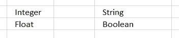
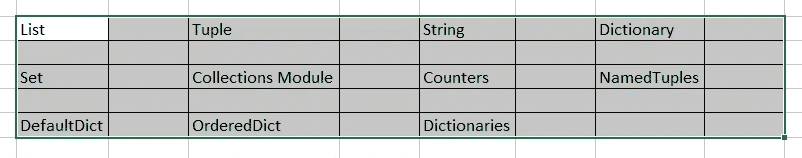

# Python 系列:容器

> 原文：<https://medium.com/analytics-vidhya/python-series-containers-f69deef54e22?source=collection_archive---------20----------------------->


喜马拉雅山的黄金容器

在执行期间以及永久地存储数据是软件程序中的主要活动之一。大体上有两种类型的数据类型。**原始数据类型**是编程语言支持的**数据**的预定义**类型**。Python 有**四种原始数据类型:**



Python 原始数据类型

**非原始数据类型**如下:



Python 非原始数据类型

在本文中，我们将探索非原始数据类型:

**详情:**

**一个>列表:**这是一个类似数组的结构。这可以调整大小。这可以包含其他类型的元素。

**任务:创建一个 Python 列表:**

```
list = [] #empty list
list
[]list = [1,2,3] #number list
list
[1, 2, 3]list = ["I","am"] #string list
list
['I', 'am']list = ["I","am",1] #mixed list
list
['I', 'am', 1]
```

**任务:通过索引访问 Python 列表:**

```
vowel = ['a','e','i','o','u']
vowel[2] #index based access
'i'# Nested List
new_year = ["Happy New Year", [2,0,2,0]]# Nested indexing
print(n_list[0][8]) 
# Output: wprint(n_list[1][3]) 
# Output: 0
```

**任务:切片 Python 列表(注意:Python 索引从 0 开始)**

```
my_list = ['a','b','c','d','e','f','g','h','i']
# elements 4th to 5th
print(my_list[3:5])
['d', 'e']# elements beginning to 2th from back
print(my_list[:-3])
['a', 'b', 'c', 'd', 'e', 'f']# elements 7th to end
print(my_list[6:])
['g', 'h', 'i']# elements beginning to end
print(my_list[:])
['a', 'b', 'c', 'd', 'e', 'f', 'g', 'h', 'i']
```

任务:改变 Python 列表中的元素

```
hundred = [100,200,300,400]
print(hundred)
[100, 200, 300, 400]# change the 1st item
hundred[0] = 500  # Output: [500, 200, 300, 400]
print(hundred)
[500, 200, 300, 400]# change 2nd to 4th items
hundred[1:4] = [30, 50, 70]  
#Note: StartIndex is zero based index and EndIndex is non zero based
# Output: [1, 3, 5, 7]
print(hundred)
[500, 30, 50, 70]
```

**任务:向列表添加项目**

```
thousand = [1000, 2000, 3000]
thousand.append(4000)
# Output: [1000, 2000, 3000, 4000]
print(thousand)
[1000, 2000, 3000, 4000]thousand.extend([9000, 11000, 13000])
# Output: [1000, 2000, 3000, 4000, 9000, 11000, 13000]
print(thousand)[1000, 2000, 3000, 4000, 9000, 11000, 13000]
```

**Python 列表方法:**
append() —将一个元素添加到列表末尾
extend() —将一个列表中的所有元素添加到另一个列表中
insert() —在定义的索引处插入一个项目
remove() —从列表中删除一个项目
pop() —删除并返回给定索引处的一个元素
clear() —从列表中删除所有项目
index() —返回第一个匹配项的索引
count() —返回作为参数传递的项数计数
sort() —对列表中的项进行升序排序
reverse() —颠倒列表中的项的顺序
copy() —返回列表的浅层副本

**任务:循环:**

```
animals = ['cat', 'dog', 'monkey']
for animal in animals:
print(animal)# Prints "cat", "dog", "monkey", each on its own line.cat
dog
monkey
```

**任务:使用 enumerate 获取每个元素的索引:**

```
animals = ['cat', 'dog', 'monkey']
for idx, animal in enumerate(animals):
print('#%d: %s' % (idx + 1, animal))# Prints "#1: cat", "#2: dog", "#3: monkey", each on its own line#1: cat
#2: dog
#3: monkey
```

**任务:列表理解:**

```
nums = [0, 1, 2, 3, 4]
cubes = [x ** 3 for x in nums]
print(cubes)   # Prints [0, 1, 8, 27, 64]
[0, 1, 8, 27, 64]
```

**任务:条件列表理解:**

```
nums = [0, 1, 2, 3, 4]
even_squares = [x ** 2 for x in nums if x % 4== 0]
print(even_squares)  # Prints "[0, 16]"
[0, 16]
```

**B > Tuple:** 继承了所有列表特性，并引入了一个新特性——**不可变(**状态创建后不能修改 **)** 。

**任务:创建元组和访问索引**

```
d = { (x, x + 1):x for x in range(10)}  # Create a dictionary with tuple keyst = (5, 6)        # Create a tuple
print(d)
print(type(t))    # Prints "<class 'tuple'>"
print(d[t])       # Prints "5" For the element (5, 6) value is 5
print(d[(1, 2)])  # Prints "1" For the element (1, 2) value is 1{(0, 1): 0, (1, 2): 1, (2, 3): 2, (3, 4): 3, (4, 5): 4, (5, 6): 5, (6, 7): 6, (7, 8): 7, (8, 9): 8, (9, 10): 9}<class 'tuple'>
5
1
```

**元组优于列表:**

*   元组有不同的数据类型，列表有相似的数据类型。
*   因为元组是不可变的，所以遍历元组比使用列表更快
*   包含不可变元素的元组可以用作字典的键。对于列表，这是不可能的。
*   元组将保证数据保持写保护。

字典:字典存储(键，值)对，并且是项目的无序集合

**任务:创建字典**

```
d = {'Bangalore': 'Karnataka', 'Mumbai': 'Maharashtra'}  
# Create a new dictionary with some dataAccess the key and valuesprint(d['Bangalore'])      
 # Get an entry from a dictionary; prints "Karnataka"print('Mumbai' in d)       
 # Check if a dictionary has a given key; prints "True"
Karnataka
True
```

**任务:添加新元素**

```
d['Dispur'] = 'Assam'     # Set an entry in a dictionary
print(d['Dispur'])         # Prints "Assam"
Assam
```

**任务:访问不存在的元素**

```
# print(d['Andaman'])  # KeyError: 'Andaman' not a key of d
print(d.get('Dispur', 'N/A'))    # Get an element with a default; prints "Assam"
Biharprint(d.get('Andaman', 'N/A'))    # Get an element with a default; prints "N/A"N/A
```

**任务:删除元素**

```
del d['Dispur']         # Remove an element from a dictionary
print(d.get('Dispur', 'N/A')) 
"N/A"
```

**任务:循环:**

```
for city in d:
state = d[city]
print('%s is capital of %s' % (city, state))Bangalore is capital of Karnataka
Mumbai is capital of Maharashtra
```

**任务:迭代字典中的键:**

```
for city in d:
state = d[city]
print('%s is capital of %s' % (city, state))Bangalore is capital of Karnataka
Mumbai is capital of Maharashtra
```

**任务:使用物品方法**

```
for city, state in d.items():
print('%s is capital of %s' % (city, state))Bangalore is capital of Karnataka
Mumbai is capital of Maharashtra
```

**字典理解:**同列表理解。

集合:集合是不同元素的无序集合。所有方法和操作与列表相同。

**任务:设置操作:**

```
city = {'Pune', 'Nashik'}
print('Pune' in city)   # Check if an element is in a set; prints "True"
print('Satara' in city)  # prints "False"city.add('Panjim')       # Add an element to a set
print('Panjim' in city)  # Prints "True"print(len(city))       # Number of elements in a set; prints "3"
city.add('Pune')        # Adding an element that is already in the set does nothingprint(len(city))       # Prints "3"
city.remove('Pune')     # Remove an element from a set
print(len(city))       # Prints "2"True
False
True
3
3
2
```

**参考文献:**

[](https://www.programiz.com/python-programming/first-program) [## Python 如何入门？

### Python 是一种跨平台的编程语言，也就是说，它可以在多种平台上运行，如 Windows、MacOS、Linux 和…

www.programiz.com](https://www.programiz.com/python-programming/first-program) 

对于更多容器:

[](https://data-flair.training/blogs/python-list-examples/) [## 一个完整的 Python 列表教程

### 在今天的教程中，我们将学习 Python list。我们将讨论如何创建、访问、切片和重新分配列表…

数据-天赋.培训](https://data-flair.training/blogs/python-list-examples/) [](https://cs231n.github.io/python-numpy-tutorial/#python-lists) [## Python Numpy 教程

### 斯坦福 CS231n 课程材料和笔记:视觉识别的卷积神经网络。

cs231n.github.io](https://cs231n.github.io/python-numpy-tutorial/#python-lists)