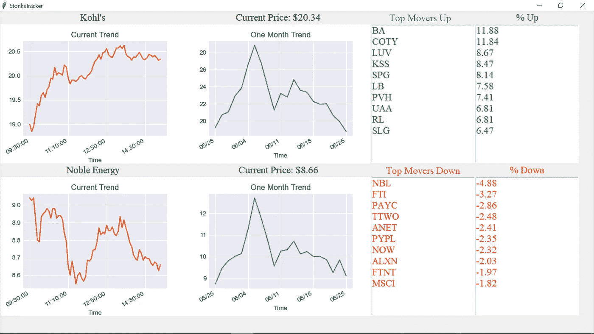
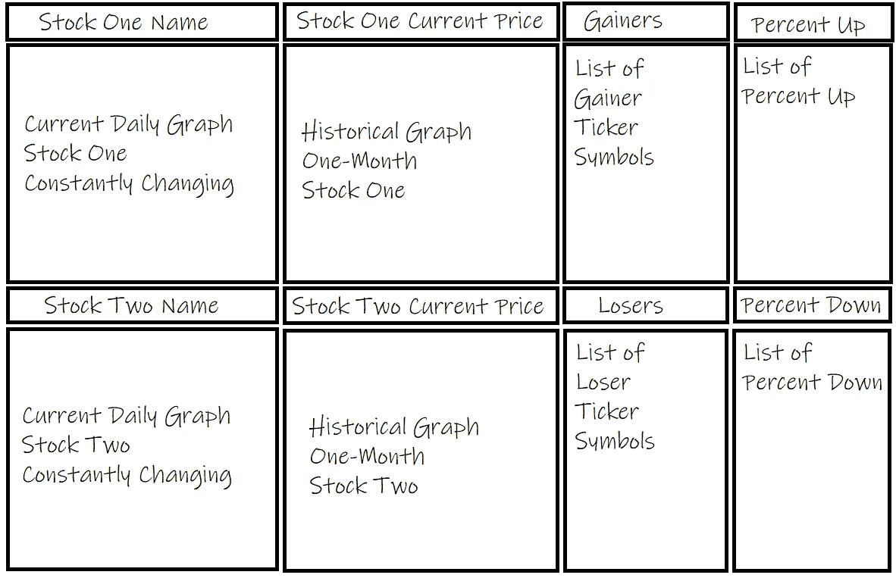

# 带有 Robin_Stock 的 Python 股票可视化工具

> 原文：<https://medium.com/analytics-vidhya/python-stock-visualizer-with-robin-stock-4dc0882eb33d?source=collection_archive---------11----------------------->

我最近对股票数据非常感兴趣；作为一个程序员新手，我想创建一个易于理解的程序，并可以用来观察股票市场。

这个程序/教程将向您展示如何获得实时和历史股票数据，并使用 Python 将其实时可视化，允许您监控您已经投资的股票。



显示当前和历史股票数据的 GUI

本教程将分为两个部分，在这里您可以看到如何获得数据，然后使用 [tkinter](https://docs.python.org/3/library/tkinter.html) 和 [matplotlib](https://matplotlib.org/) 在 GUI 中可视化数据。

# 获取数据

为了获得这个项目的数据，我们将使用[罗宾 _ 斯托克](https://robin-stocks.readthedocs.io/en/latest/functions.html#getting-stock-information)；这个 [API](http://www.robin-stocks.com/en/latest/quickstart.html) 非常适合获取当前和历史数据，它具有从跟踪股票到买卖股票的功能。您将需要一个 [RobinHood](https://robinhood.com/us/en/) 登录名来获取数据。使用 *authentication.login()* 功能，您将使用您的凭证登录，并且您将在首次登录时收到短信确认。

```
r.authentication.login(username="user", password="pass")
```

要获得股票的当前价格，可以使用*stocks . get _ latest _ price()*函数。这将返回一个字符串列表，因此我们可以使用这段代码，通过获取第一个元素，将其转换为浮点型，并对其进行舍入，以更好的格式获取它。

```
round(float(r.stocks.get_latest_price(ticker_symbol)[0]), 2)
```

为了获得历史数据，我们将使用*stocks . get _ stock _ historicals()*函数。这个函数有多个参数，可以用来收集各种数据。我们感兴趣的是股票代码、区间和跨度。下面是一个如何获取数据的示例。

```
r.stocks.get_stock_historicals(symbol, interval="5minute", span="day")
```

这将输出一个包含多个字典的大列表。为了让它变成一个更适合 pandas 的格式，第一步是使用 *pandas 从输出中创建一个 pandas [DataFrame](https://pandas.pydata.org/pandas-docs/stable/reference/api/pandas.DataFrame.html) 。DataFrame()* 函数；从那里，我们可以使用数据转换来获得我们想要的输出。

这个例子将返回一个日期数组，它的格式便于我们绘图。这是通过将数据帧的*‘begins _ at’*列转换为 [datetime](https://pandas.pydata.org/pandas-docs/stable/reference/api/pandas.to_datetime.html) 格式，从转换后的数据帧创建 [DatetimeIndex](https://pandas.pydata.org/pandas-docs/stable/reference/api/pandas.DatetimeIndex.html) pandas 数据帧，最后[转换为正确的时区](https://pandas.pydata.org/pandas-docs/stable/reference/api/pandas.Series.dt.tz_convert.html)来完成的。这就是转变的样子。

```
2020-06-26T13:30:00Z ➡ '2020-06-26 13:30:00+00:00' ➡ '09:30:00'
```

通过使用 *markets.get_top_movers()* 函数，可以获取的其他一些重要数据包括当天的主要移动者。在我看来，生成的数据帧中最有用的两列是符号*和 *price_movement* ，它们给出了股票代码、股票价格和百分比变化。*

```
# get the movers going up
pd.DataFrame(r.markets.get_top_movers("up"))# get the movers going down
pd.DataFrame(r.markets.get_top_movers("down"))
```

使用 robin_stock 还可以做很多事情，比如买卖股票，但是这几个函数涵盖了 robin_stock 的大部分跟踪功能。

# 可视化数据

Tkinter 包是创建你自己的 GUI(图形用户界面)的最简单的方法之一。为了初始化 GUI，您将创建一个名为 root 的变量。每当您想在 GUI 中放置一些东西时，您将调用这个对象中的方法。要启动 GUI，最后一行代码应该调用 *mainloop()* 函数来循环并刷新 GUI。

```
# initialize the GUI
root = Tk()# last line of code to start the loop
root.mainloop()
```

在初始化根之后，您可以开始添加元素来获得您想要的布局。



GUI 布局示例

[标签](https://www.tutorialspoint.com/python/tk_label.htm)是在 Tkinter 中显示文本的最简单方式。还可以使用一个字符串变量来操纵文本，这使得它非常适合显示不断刷新的当前价格。

列表框允许你在你的 GUI 中显示一个列表。当您单击列表中的一个项目时，Listbox 也会返回一个事件，这允许 on 事件功能。

最后一步是用 [Matplotlib](https://matplotlib.org/3.2.2/contents.html) 绘图。当[与 Tkinter](https://matplotlib.org/3.1.0/gallery/user_interfaces/embedding_in_tk_sgskip.html) 集成时，我们不使用像 *plt.show()* 这样的函数，而是使用画布和 *draw()* 函数来绘制图形。

## 将这一切结合在一起

为了将所有代码放在一起，我们需要为所有要运行的东西创建一个循环，并创建一个启动函数来获取运行点之前的每日数据。我们还想定义活动时间，因为股票市场只在特定的日期和特定的时间段开放。

**要查看该项目的代码，点击** [**此处**](https://github.com/PriyaSoneji/StockVisualization) **。***stock visualizer bin . py*将突出显示本教程中教授的所有内容，并将显示本文顶部显示的实时跟踪 GUI。

以下是一些其他有用的文章，可能也会对你有所帮助:

*   [获取罗宾汉数据](https://towardsdatascience.com/using-python-to-get-robinhood-data-2c95c6e4edc8)
*   [用 Python 获取股票数据](https://towardsdatascience.com/how-to-get-stock-data-using-python-c0de1df17e75)
*   [用 Python 下载股票价格](https://towardsdatascience.com/a-comprehensive-guide-to-downloading-stock-prices-in-python-2cd93ff821d4)。

希望这篇文章有所帮助！