# Python 字符串方法

> 原文：<https://medium.com/analytics-vidhya/python-string-methods-ab6a309695be?source=collection_archive---------12----------------------->


在本文中，您将学习如何使用 Python 的一些内置方法。python 中的字符串用单引号或双引号括起来，字符串中的每个字符都有一个索引。

# 部分概述

*   计数()
*   居中()
*   交换情况()
*   查找()
*   拆分()
*   开始于()
*   端点()
*   ljust()和 rjust()
*   字符串大写
*   零填充()
*   条状()

让我们看看字符串方法:

# 第一节。计数()

[**count**](https://docs.python.org/3.7/library/stdtypes.html#str.count) **()** 方法返回一个子字符串在给定字符串中出现的次数。

## 语法:

```
string**.**count(substring, start, end)
```

## 参数:

*   **substring** (必选)是要计算其计数的字符串。
*   **start** (可选)是字符串的起始索引。
*   **end** (可选)是字符串的结束索引。

让我们看看没有可选参数的例子**:**

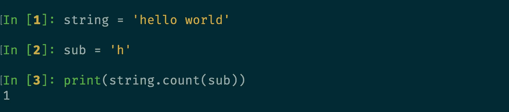

让我们看看使用可选参数的示例

**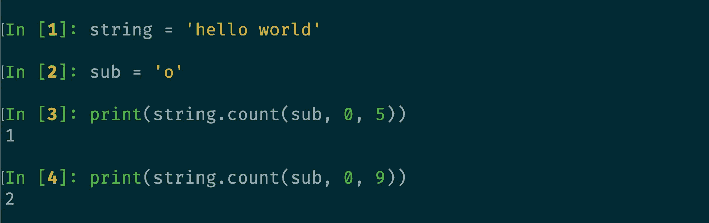**

# **第二节。居中()**

**方法的作用是:创建并返回一个新的字符串。**空白**是默认的。**

## **语法:**

```
string.center(length, fillchar)
```

## **参数:**

*   ****长度**(必需)是字符串的长度。**
*   ****fillchar** (可选)是需要填充的字符。**

**让我们看看没有可选参数的例子**:****

**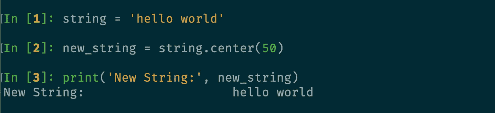**

**默认占用**空间**。**

**让我们看看使用可选参数的示例**

****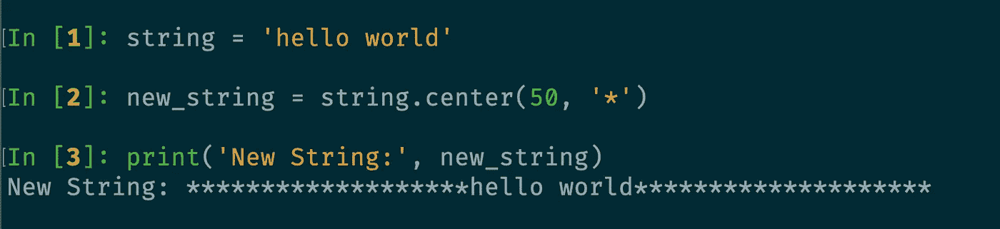****

# ****第三节。交换情况()****

****[**swap case**](https://docs.python.org/3.7/library/stdtypes.html#str.swapcase)**()**方法将所有大写字符转换为小写字符或将所有小写字符转换为大写字符。****

## ****语法:****

```
**string.swapcase()**
```

****让我们看看这个例子:****

****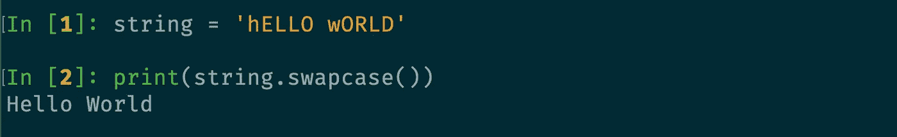****

# ****第四节。查找()****

****[find](https://docs.python.org/3.7/library/stdtypes.html#str.find) ()方法返回子串 *sub* 在片`**s[start:end]**`中找到的字符串中的最低索引。****

## ****语法:****

```
**string.find(substring, start, end)**
```

## ****参数:****

*   ******要在给定字符串中搜索的子字符串**(必需)。****
*   ******start** (可选)是在字符串中检查子串的起始位置。****
*   ******end** (可选)是字符串中要检查的子字符串的结束位置。****

****让我们看一下没有可选参数的例子**:******

****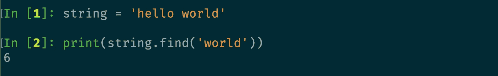****

****让我们看看使用可选参数的例子****

******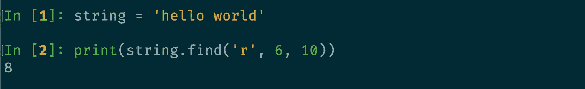******

# ******第五节。拆分()******

******[**split()**](https://docs.python.org/3.7/library/stdtypes.html#str.split) 方法返回一个字符串中的字符串列表，用于按照指定的分隔符来分隔给定的字符串。同样，默认分隔符是任何空白**。********

## ******语法:******

```
****string.split(separator, maxsplit)****
```

## ******参数:******

*   ********分隔符**(可选)是分隔符。字符串在指定的分隔符处拆分。默认分隔符是任何空白。******
*   ******maxsplit** (可选)是拆分次数。如果不使用，则没有限制。****

******注意:**你可以使用[**【rsplit()**](https://docs.python.org/3.7/library/stdtypes.html#str.rsplit)**从右边拆分一个字符串。******

******让我们看看这个例子:******

******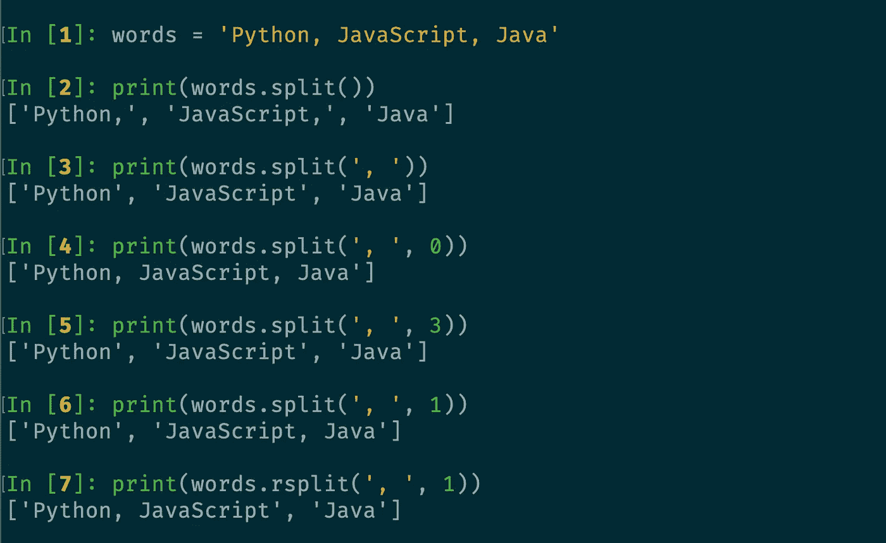******

# ******第六节。开始于()******

******如果从字符串中给定的指定值开始，[**starts with()**](https://docs.python.org/3.7/library/stdtypes.html#str.startswith)**方法返回 **True** 。否则，返回**假**。********

## ****语法:****

```
**string.startswith(search_string, start, end)**
```

## ****参数:****

*   ******search_string** (必选)是要搜索的字符串。****
*   ******start** (可选)是在字符串中检查子串的起始位置。****
*   ******end** (可选)是字符串中要检查的子字符串的结束位置。****

****让我们看看没有可选参数的例子**:******

****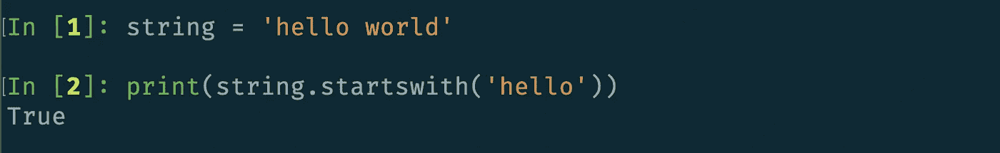****

****让我们看看使用可选参数的例子****

******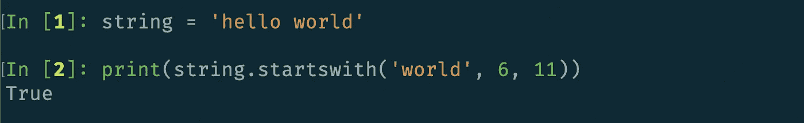******

# ******第七节。端点()******

******[**endswith()**](https://docs.python.org/3.7/library/stdtypes.html#str.endswith)**方法返回 **True** ，如果以字符串中给定的指定值结尾。否则，它返回**假**。********

## ****语法:****

```
**string.endwith(search_string, start, end)**
```

## ****参数:****

*   ******search_string** (必选)是要搜索的字符串。****
*   ******start** (可选)是在字符串中检查子字符串的起始位置。****
*   ******end** (可选)是字符串中要检查的子字符串的结束位置。****

****让我们看看没有可选参数的例子**:******

****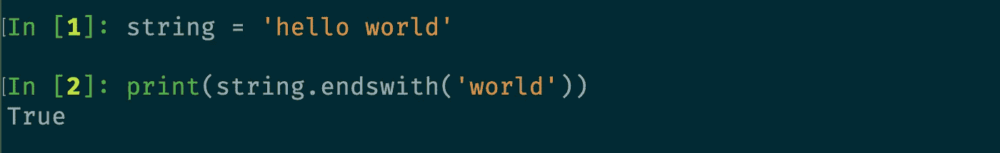****

****让我们看看使用可选参数的示例****

******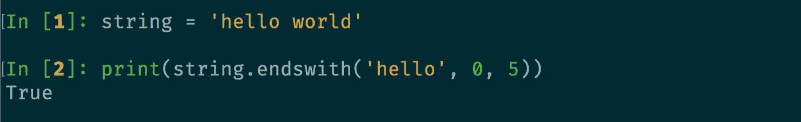******

# ******第八节。ljust()和 rjust()******

******[**ljust**](https://docs.python.org/3.7/library/stdtypes.html#str.ljust) **和**[**rjust**](https://docs.python.org/3.7/library/stdtypes.html#str.rjust)**将字符串左对齐或右对齐，使用指定的字符(默认为空格)作为填充字符。********

## ******语法:******

```
****string.ljust(s, fillchar)
string.rjust(s, fillchar)****
```

## ******参数:******

*   ********length** (必选)是展开字符串的宽度。******
*   ******fillchar** (可选)是填充剩余空间的字符。****

****让我们看看这个例子:****

****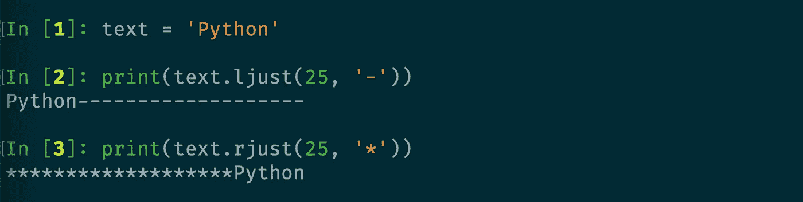****

# ****第九节。字符串大写****

## ****第 9.1 节。大写()****

****[**大写()**](https://docs.python.org/3.7/library/stdtypes.html#str.capitalize) 方法只将字符串的第一个字符转换成大写字母。****

## ****语法:****

```
**string.capitalize()**
```

****让我们看看这个例子:****

****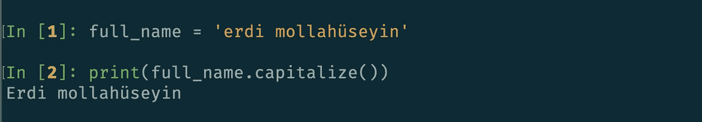****

## ****第 9.2 节。上部()****

****[**upper()**](https://docs.python.org/3.7/library/stdtypes.html#str.upper) 方法将一个字符串中的所有字符转换成大写字母。****

## ****语法:****

```
**string.upper()**
```

****让我们看看这个例子:****

****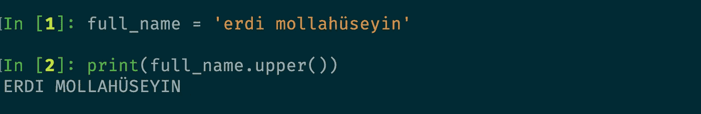****

## ****第 9.3 节。标题()****

****方法的作用是:将一个字符串的第一个字符转换成大写字母。****

## ****语法:****

```
**string.title()**
```

****让我们看看这个例子:****

****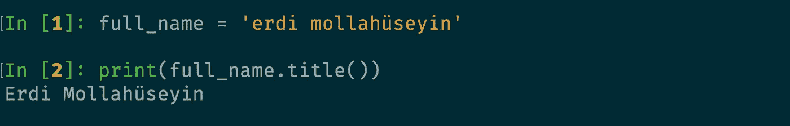****

# ****第 10 节。零填充()****

****[**zfill()**](https://docs.python.org/3.7/library/stdtypes.html#str.zfill) 方法返回字符串的副本，其中给定字符串的左侧填充了 **"0"** 字符。****

## ****语法:****

```
**string.zfill(length)**
```

## ****参数:****

*   ******length** 是从 zfill()返回的字符串的长度，左边填充了**【0】**位。****

****让我们看看这个例子:****

****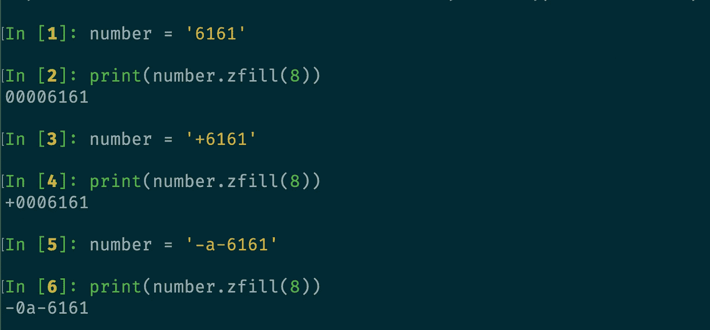****

# ****第 11 节。条状()****

****[**strip()**](https://docs.python.org/3.7/library/stdtypes.html#str.strip) 方法返回移除了前导字符和尾随字符的字符串副本。****

*   ****[rstrip()](https://docs.python.org/3.7/library/stdtypes.html#str.rstrip) :从字符串的右边剥离字符。****
*   ****[lstrip()](https://docs.python.org/3.7/library/stdtypes.html#str.lstrip) :从字符串左侧剥离字符。****

## ****语法:****

```
**string.strip(character)**
```

## ****参数:****

*   ******字符(可选)** →要删除的字符集。****

****让我们看看这个例子:****

****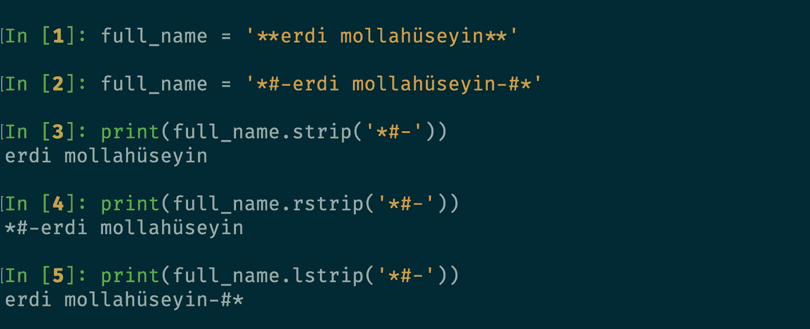****

# ****结论****

****在本文中，您已经学习了如何使用 Python 的一些**内置方法**。可以访问 [**Python 文档**](https://docs.python.org/3.7/library/stdtypes.html#string-methods) 深入了解。****