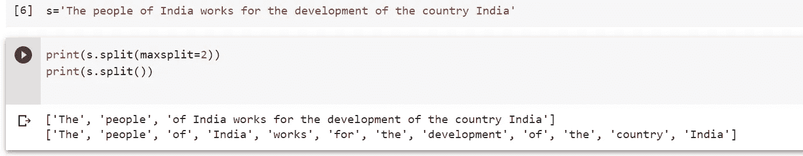

# Python 十大常用字符串方法及实例

> 原文：<https://medium.com/analytics-vidhya/python-ten-frequently-used-string-methods-7a7fded6e5e4?source=collection_archive---------22----------------------->

Python 字符串

在这篇文章中，我们将试着理解字符串的用法以及所有可以用来避免编写复杂代码的选项。String 是 python 中功能强大的类，有很多方法。我们将尝试理解一些有用的方法，如果你想了解更多，你可以访问 python 官方文档

在继续之前，我们需要记住一件事，**所有的字符串方法将总是返回新值，这意味着它不会操作或更改旧值。**我们将逐一查看每一种方法。

## **1。count()**

Count()主要返回任何指定值在给定字符串中出现的次数。例如:假设我们有一个句子“印度人民为印度的发展而工作”。我们要统计“印度”这个词的重复次数，可以利用字符串计数的方法。有 3 个参数与计数方法相关联，如下所列

**值:**这是我们要在给定字符串中搜索的单词。在我们的例子中是“印度”。这是计数方法中需要的**参数**。

Start: 这是我们希望在句子中搜索单词的起始索引。这是计数方法中的**可选**参数。

**End:** 这是结束搜索单词的结束索引。此外，这是 count 方法中的可选参数。

字符串计数()方法

## **2。居中()**

这也是我们可以使用的最有用的方法之一。中心方法将单词与我们作为参数提供的字符中心对齐，如果我们不提供任何参数，它将替换为空格。它的语法是 **str.center(length，fillchar)**

字符串中心()函数

## **3)查找()**

这是一个字符串方法，它将给定单词的最低索引返回到 find 方法中。find()方法的语法是 **str.find(value，start，end)。**在下面的例子中我们可以看到印度的最低指数被返回为 **14。**

字符串查找()函数

## 4)交换酶()

这也是最重要的字符串方法之一，用于将小写的**转换为大写的**或反之。字符串 swapcase 的语法是 **str.swapcase()。**下面是使用交换酶的例子。所有的大写字母都变成了小写字母，反之亦然

字符串交换方法

## **5) startswith()和 endswith()**

**starts with()**:starts with()的返回类型为布尔型。假设如果我们需要检查任何句子是否以某个特定的单词开头，我们可以使用这个字符串方法，如果句子以那个单词开头，它将返回 true。这个 startswith()方法的语法是 **str.startswith(value，start，end)。在第二个例子中，我们指定了需要检查的字符串索引，即 4**

startswith()字符串方法

**endswith():**endswith()的返回类型也是 boolean。假设如果我们需要检查任何句子是否以某个特定的单词结尾，我们可以使用这个字符串方法，如果句子以那个单词结尾，它将返回 true。这个 endswith()方法的语法是 **str.endswith(value，start，end)。这个可以这样用。**

endswith()字符串方法

## **6) split()**

分割是最常用的方法。记住，我们在使用预训练单词嵌入时使用了 split。以空白作为默认分隔符的单词的分割返回列表。split()方法的语法是 **str.split(sep，maxsplit)** 。

**sep:** 将用于字符串拆分的分隔符。如果没有指定任何默认情况下，这将是空白。这是**可选的**参数

**最大拆分:**表示拆分的次数。默认情况下，它将是-1，这意味着所有的话将被分割。如果我们将 maxsplit 指定为 2，将只有 2 个拆分。下面的例子解释了最大分割。

字符串拆分方法

## **7)对于大写字符串，我们有 capital()、upper()、string.title()**

我们将试着逐一理解这三种方法。

大写字母()

这个方法只将字符串的第一个字符大写。其语法是**str . capital()**

**b)上部()**

这个方法将字符串中的所有字符大写。其语法是 **str.upper()**

**c) title()**

该方法将给定字符串的第一个字母全部大写。其语法是 **str.title()。我们将在下面的代码中查看这 3 种方法。**

title()、upper()、capitalize()字符串方法

## 8) ljust()和 rjust():

这两个方法返回左对齐和右对齐。ljust()和 rjust()的语法是 str.ljust(长度，字符)。我们将尝试一个一个地理解这些参数

**长度:**需要返回的字符串的总长度

**character:** 如果我们想在返回的空白处填充任意一个字符，我们可以指定为一个字符。假设我们将 ljust 设为 25，字符串长度为 12，剩下的字段需要用字母“a”填充，我可以将字符指定为“a”。我们将看到 ljust()和 rjust()的示例代码。

ljust()和 rjust()字符串函数

## **9) strip()**

strip()是最常用的字符串方法。它用于删除 strip 方法中作为属性的指定字符。它还有两种口味，分别叫做 **lstrip()** 和 **rstrip()** 。假设我们需要删除“！”或者字符串中的任何字符，我们都可以使用 strip()方法。我们将逐一查看 lstrip 和 rstrip。**有一点我们需要注意，它不会出现在任何 2 个单词中间的指定字符**

**lstrip()** :删除字符串左边的字符

**rstip()** :删除字符串右边的字符

我们将使用 python 代码逐一查看所有的风格

strip()字符串方法

## **10) zfill()**

此方法在给定字符串的开头添加 0。它接受一个参数宽度。如果宽度与原始字符串匹配，它将返回相同的字符串。zfill 的语法是 **str.zfill(width)** 。我们将在下面的代码中看到实现。

zfill()字符串方法

恭喜你，我们已经学会了 python 中最常用的字符串方法。这些都是我们可以在数据预处理或脚本中使用的方法。我想到分享这些有用的方法，因为最近我在开发一个 python 脚本时使用了所有这些方法，我非常感谢这些字符串方法。string 中有许多方法可以理解我将建议的所有方法，以便查看 python 文档。

如果你对这些方法或任何字符串方法的理解有任何疑问，请在下面评论，我很乐意解答。在下一篇文章中，我将解释 python 的其他一些实用工具，它们在日常工作中非常有用。如果你对深度学习感兴趣，我建议你看看我写的一些文章。我已经一步一步地解释了这些概念。下面我会附上文章。

 [## 通过实时用例逐步介绍分层结构的深度神经网络

### 在我们上一系列的深度学习中，我们已经学习了如何为自然语言的神经网络准备输入…

medium.com](/analytics-vidhya/introduction-to-deep-neural-networks-with-layers-architecture-step-by-step-with-real-time-use-cases-ef544580687b) 

# 敬请关注