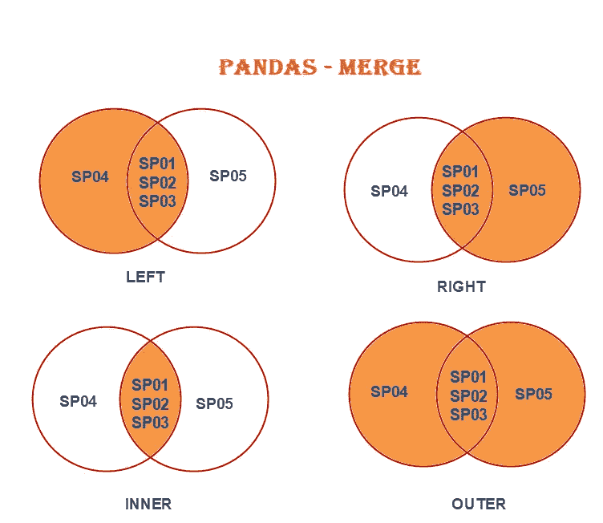

# Python 技巧 6——熊猫合并

> 原文：<https://medium.com/analytics-vidhya/python-tip-6-pandas-merge-dev-skrol-bf0be41f29b7?source=collection_archive---------10----------------------->

Pandas concat & append 的工作方式类似于按列或行的数组连接。

但是 Merge & Join 的工作方式类似于数据库表连接。让我们在本文中看到合并，并在下一篇文章中了解加入！

因此，当我们需要连接两个具有不同列的数据框，并且两个数据框中都有一个关键列时，可以使用 Merge。

例如，如果我们有两个数据框，一个包含商店详细信息，另一个包含所有商店的产品详细信息，我们可以使用商店 Id 合并数据框。

**签名:**
pd.merge(left，
right，
how: str = 'inner '，
on=None，
left_on=None，
right_on=None，
left_index: bool = False，
right_index: bool = False，
sort: bool = False，
suffixes=('_x '，' _y ')，
copy: bool = True，

*   左右参数是数据。
*   how ->提到合并应该如何发生。它接受值'左'，'右'，'内'，'外'。默认值为“内部”。
*   left '-->收集左侧数据帧的所有数据以及左右两侧的公共数据。
*   “右侧”->收集右侧数据帧的所有数据以及左侧和右侧的公共数据。
*   ' inner '-->仅从左侧和右侧数据帧收集公共数据。这更像一个十字路口。
*   ' outer' ->从左右两边收集所有的，包括 common。
*   on ->提到哪个列应该作为同时存在于左右数据帧中的键列。



```
import pandas as pd shop = { 'Shop_id' : ['SP01', 'SP02', 'SP03', 'SP04'], 'City' : ['Chennai', 'Madurai', 'Trichy', 'Coimbatore'], 'ZipCode' : [600001, 625001, 620001, 641001] } shop = pd.DataFrame(shop) shopproduct = { 'Shop_id' : ['SP01', 'SP02', 'SP02', 'SP03', 'SP03', 'SP03', 'SP05'], 'product_id' : ['p01', 'p02', 'p03', 'p01', 'p02', 'p03', 'p02'], 'price' : [220, 500, 145, 225, 510, 150, 505] } product = pd.DataFrame(product) product
```

## left '-->收集左侧数据帧的所有数据以及左右两侧的公共数据。

```
pd.merge(shop, product, how = 'left', on = 'Shop_id')
```

## “右侧”->收集右侧数据帧的所有数据以及左侧和右侧的公共数据。

```
pd.merge(shop, product, how = 'right', on = 'Shop_id')
```

## ' inner '-->仅从左侧和右侧数据帧收集公共数据。这更像一个十字路口。

```
pd.merge(shop, product, how = 'inner', on = 'Shop_id')
```

## ' outer' ->从左右两边收集所有的，包括 common。

```
pd.merge(shop, product, how = 'outer', on = 'Shop_id')
```

想试试这个吗？尽情享受吧！

我们将看到 Python 中的一个新技巧。谢谢大家！👍

喜欢支持？只需点击心形图标❤️.

编程快乐！🎈。

*原载于 2020 年 10 月 25 日*[*https://devskrol.com*](https://devskrol.com/index.php/2020/10/25/a-tip-a-day-python-tip-6-pandas-merge/)T22。