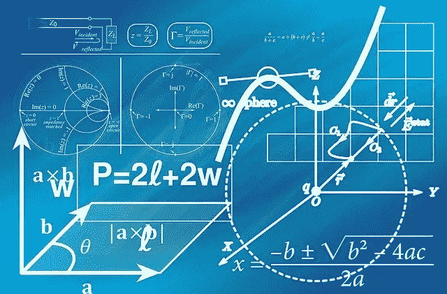

# Python ~基础知识

> 原文：<https://medium.com/analytics-vidhya/python-to-the-basics-e45d8c2586dd?source=collection_archive---------25----------------------->


所以，这将是 Python 的速成班。我们不去探究它的起源或任何其他故事。我们不会争论其他语言是否比 Python 更好。我们将直奔主题。让我们学习如何使用 Python 编写简单的程序。

请注意，我们将重点关注 Python 的数据科学视角。您可能知道也可能不知道，Python 几乎是万能的。他们将它用于数据科学、web 编程、windows 应用程序&许多诸如此类的目的。对于 Python，我们可以使用各种 ide。我个人的学习选择是 Anaconda 附带的 Jupyter 笔记本。如何以及在哪里安装？有无数的视频展示如何开始。请自便！

我们开始吧！

你好世界！！—传统的起点:D

```
print("Hello World! I don't know python")   #I am printing something
```

现在让我们来分解一下，

*   print →这是一个 python 特有的**关键字**，它打印一条消息
*   ()→无论什么进入这个弧形括号，都会被打印出来。
*   “你好世界！我不知道 python”→这只是你想在输出中打印的普通文本。尝试根据您的意愿更改它，以更改打印的内容
*   #我在打印东西→这里有两个部分。“#”。在 python 中，任何以 hash 开头的都不是代码。它只是一个注释块，告诉我们在做什么。注释你的代码块总是一个很好的做法，这样，当我们引用代码或者其他人将来引用代码时，他们可以简单地理解你想做什么！

所以，我们的第一个节目开始了。重申一下。Python 中的关键字是专门为某个目的保留的词。这意味着你不能在你的程序中使用“打印”用于其他目的，“打印”只有一个功能。即打印消息或()中的内容。

# 版本检查

在我们继续之前，让我们检查一下我们的版本。代码如下所示。

```
import sys
sys.version
```

输出→ '3.8.3(默认，2020 年 7 月 2 日 17:30:36) [MSC v.1916 64 位(AMD64)]'

此输出将根据您使用的 Python 版本而有所不同。请注意，在撰写本文时，我们使用的是 Python 的 3.x 版本。所以，我在这里展示的例子可能不适用于 2.x 版本。

来到上面的“导入系统”。正如它所说的，我们正在向 python 中导入一些东西。“sys”只是我们调用 Python 的一个外部程序，它有许多用途。检查版本就是其中之一。

一种选择，

```
import platform
print("Python Version:",platform.python_version())
```

输出→ Python 版本:3.8.3

这与前面的模块“sys”做的是一样的，只是一种变化。请注意这里我是用 print 打印版本。“Python 版本:”只是我想在使用 platform.python_version()打印版本号之前打印的消息

# 变量

让我们了解一下 Python 变量。变量是可以保存任何数据的名称。顾名思义，它是“可变的”。它可以采用多种形式的数据或数据类型。如果你对同一个变量做了多次赋值，那么最新的赋值将会持续。



让我们举一些例子。

```
x = 2
x
```

输出→ 2

这里，值 2 作为一个整数存储在变量 x 中。Python 中的类型是基于我们的输入在内部定义的。我们不需要像大多数编程语言那样专门指定数据类型。现在试试这个，在“x”中输入不同的值，比如 2.0，“abc”，2+3j &检查输出。

我们来谈谈 Python 中变量的命名约定。我们不能使用关键字(如果，真，打印，无等。)作为变量名。变量名只允许以字母([a-z]或[A-Z])或下划线“_”开头。其余可以是字母、数字或下划线。但是，请尽量保留与您正在尝试做的事情相关的名称。

例如，存储两位数总和的变量可以命名为“sum”。这使得它比命名为“x”或“y”更直观。

# 数据类型

让我们研究一下 Python 中可用的基本数据类型，

基本数据类型包括:int(整数值)、float(十进制数)、string(文本类型数据)、complex(复数)

```
x = 2 
y = 3.0
z = 2 + 6j #please use 'j' specifically, 'i' cannot be used in python.type(x)
type(y)
type(z)
type(s)
```

输出→ int float 复杂字符串

type()关键字将输出作为输入的“数据类型”给出。所以我们根据输入变量 x，y & z 的值得到输出

# 经营者

## 算术运算符

```
#Arithmatic Operators: (+,-,*,/,//,%)
print (5+4)    #addition
print (10-2)   #Subtraction
print (4*2)    #Multiplication
print (9/3)    #Division
print (10//3)  #Floor division (quotient is rounded off to nearest integer)
print (15%3)   #Returns the remainder of the division
print(5 ** 2)  # 5 to the power 2 i.e., 5 x 5
```

## 比较运算符

```
#comparison operators:
#comparison operators compare the two values in the variable and return boolean values (True and False)
a = 10
b = 5
print (a > b)  #greater then
print (a < b)  #less then
print (a >= b) #greater then equal to
print (a <= b) #less then equal to
print (a != b) #Not equals to
print (a == b) #equals to#try to substitute the values where a & b are equal or b > a to see the difference in your outputs.
```

## 赋值运算符

```
# Assignment Operators:
# it assigns the value to whatever variable is on the left side
a = 5 #assigning value to variable a
b = 6 #assigning value to variable ba += b # this is shorthand for  a = a + b , Similarly, below examplesa -= b # a = a - b
a *= b   # a = a * b
a /= b   # a = a / b
a //= b  # a = a // b  Floor division
a %= b   # a = a % b
a **= b  # a = a ^ b
```

## 逻辑运算符

```
#Logical Operators:
# This is the usual Logical operations of AND , OR , NOTa = 5
b = 6
c = 2#In AND logic, if any one condition is FALSE the output is FALSE 
print(a==b AND a==c)  # returns FALSE AND FALSE --> FALSE
print(a!=b AND a!=c)  # returns TRUE AND TRUE --> TRUE
print(a!=b AND a==c)  # returns TRUE AND FALSE --> FALSE#In OR logic, if any one condition is TRUE then output is TRUE & If both conditions are FALSE it will give FALSE
print(a!=b OR a==c)  # returns TRUE OR FALSE -> TRUE
print(a==b AND a==c) # returns FALSE OR FALSE -> FALSE#In NOT logic
print(NOT(TRUE))  #returns FALSE
print(NOT(FALSE)) # returns TRUE
```

## 运算符优先级

运算符优先级是 Python 中进行计算的优先级或顺序。它遵循 BODMAS 规则

括号、阶(幂)、除法、乘法、加法、减法

```
Precedence()           #Brackets
**           #Exponent / powers
, /, //, %   #Divide, floor division, modulus*            #multiplication
+, -         #Addition and subtraction 
```

这就是 Python 的基础！很简单，对吧？

在下一篇文章中，我们将看到如何使用字符串进行操作&对字符串的一些基本操作。到那时再见！！