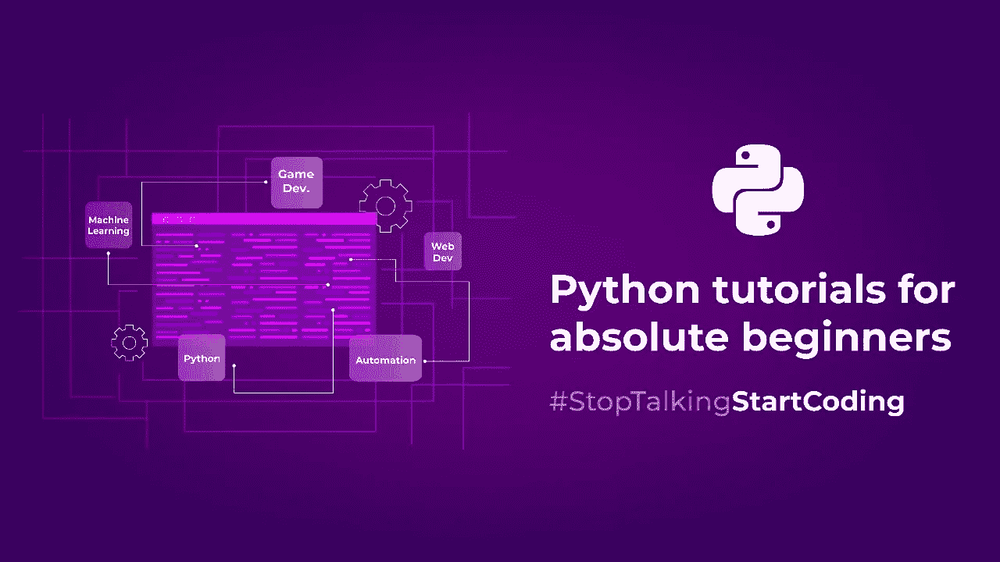

# 面向绝对初学者的 Python 教程:第 1 部分

> 原文：<https://medium.com/analytics-vidhya/python-tutorials-for-absolute-beginners-part-1-fabc7dd0ecc9?source=collection_archive---------13----------------------->

你好世界！！

这是我的第一篇博客，在这篇博客中，我们将探索 python 编程的基础。所以，不再多说，让我们开始吧…

# Python 是什么？

Python 是一种强大的通用高级编程语言，语法简单，易于使用。

因为它有简单的语法，与其他编程语言相比，它允许开发者用更少的代码行编写程序，这使它更有吸引力。

Python 是一种解释型语言。

等等…解释是什么意思？

根据字典…

解释者含义

就 python 而言，机器无法理解人类编写的代码，因此，每次程序运行时，都是解释器将代码翻译成机器可读的字节码。

# 哪里可以用？

*   Web 开发
*   数据科学
*   数据工程
*   创建软件应用程序
*   游戏开发等等。

# 简单的安装步骤

安装 python 非常简单，只需遵循下面给出的步骤

**Linux**

打开终端并键入:*sudo apt-get install python 3*

输入密码，这将在 Linux 系统上安装 python

**窗户**

在 windows 上安装 python 非常简单，只需遵循下面给出的步骤

转到[https://www.python.org/downloads/](https://www.python.org/downloads/)并点击下载按钮。

运行/双击下载的 python 可执行文件，并遵循下面给出的步骤:

到现在为止，您一定已经在您的机器上安装了 python。我们开始学习吧！

# Python 中的注释

注释在编程中起着重要的作用，它们通常被解释器和编译器所避免。注释可以用来描述你的代码，让你的代码更加易读易懂。

对于单行注释，我们可以使用#(散列)符号开始注释，对于多行注释，我们在行首和行尾使用'''符号。

# **变量**

变量基本上是你分配给一个存储位置的名字，在那里你可以存储一些值。如果与 Java、C 或 C++等语言相比，这些语言中的变量将变量与特定的数据类型绑定在一起，例如，如果您有一个整数类型的变量，则该变量中只能有整数类型的数据…但在 python 中，您可以通过更改该变量的值和数据类型来灵活地处理变量。

Python 处理几种数据类型，在这篇博客中，我们将关注字符串、数字、布尔值、列表、元组、字典、日期和时间。

## 字符串:

它是一个字符序列，可以是字母、数字或一些符号的组合。为了定义一个字符串，我们用单引号或双引号将字符串括起来。要从字符串中提取特定的字符，只需输入变量名称及其索引(索引是从零开始的项目的数字表示)。
连接字符串:要连接或组合两个或更多的字符串，我们可以使用“+”操作符。

一些最常用的字符串方法:

*upper()* :这个方法将字符串转换成大写

*lower()* :这个方法将字符串转换成大写

*replace()* :这个方法用一个特定的值替换一个指定的值

*len()* :这个方法返回字符串的长度

*count()* :该方法返回指定值在字符串中出现的次数

## 数字数据类型:

Integer (int):整数是不带小数点的整数。它们可以是积极的，也可以是消极的。

Float:浮点数是实数，它们用一个小数点来分隔整数和小数。

复数:复数是实数和虚数的组合。它的形式是 a + bJ。

## 布尔数据类型:

当您比较任意两个值时，python 会以布尔数据类型返回答案，True 或 False。

## 列表:

列表数据类型用于在单个变量中存储多个项目。列表中的项目被索引并从零开始。为了创建一个列表，我们将元素放在方括号([ ])中。列表是可变的，这意味着你可以改变列表的元素/条目。

## 元组:

元组类似于列表，它用于在单个变量中存储多个项目，但它们是不可变的(元组中的元素是不可变的)。元组中的项被索引并从零开始。为了创建元组，我们将元素放在圆括号(( ))内。

## 词典:

在字典中，数据存储在键值对中。冒号(:)将键与其值分开，所有键都用大括号({ })括起来。字典中的值是可变的，也就是说，值是可变的。

## 日期和时间:

为了在 python 中获取日期和时间，我们需要导入 *datetime* 模块。

# 类型转换

类型转换有助于将一种数据类型转换成另一种数据类型，这在编程中非常有用。

# 条件语句

条件语句用于根据条件是真还是假来执行操作。

*if-else* 的语法如下:

如果条件 1 为真，则执行 If 中给出的语句，但如果条件 1 为假，则执行 else 部分的语句。

让我们看一些例子…

# 环

Python 提供了两种类型的循环，*for 循环*和*while 循环*。这些循环遍历允许代码块重复多次的语句。

## For 循环:

For 循环用于遍历列表、元组或字符串。For 循环对列表、元组或字符串中的每个项目执行一条语句。

## While 循环:

只要条件为真，While 循环就会执行一组语句。

# 功能

函数是执行特定任务的一组语句。它有助于避免代码重复，并使代码可重用。为了创建一个用户定义的函数，我们使用 *def* 关键字，后跟函数名。

语法:def functionName(参数):

让我们看一个使用用户自定义函数在列表中添加/删除项目的好例子…

# 哇哦。

你已经学习了很多关于 python 的基础知识；变量、数据类型、循环、函数等等。

但我们还没有完成这里，很快我会张贴的第 2 部分，这是先进的 python，所以敬请期待！

以下是一些可用于 Python 编程的最佳 IDE:

*   *闲着*
*   *PyCharm【我个人很喜欢*❤️
*   **Visual Studio 代码**
*   **Spyder**

**