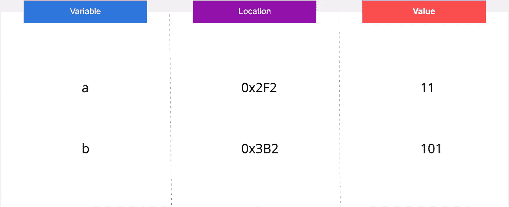
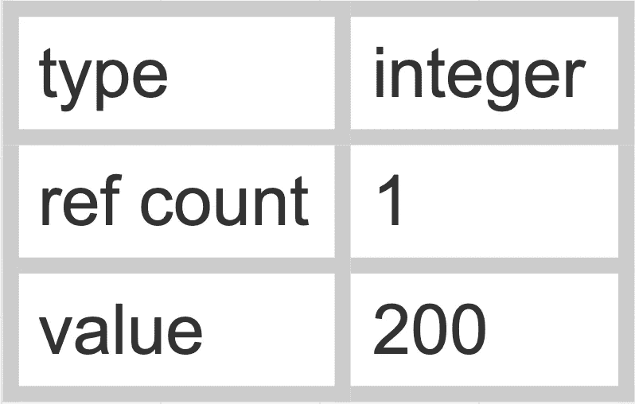
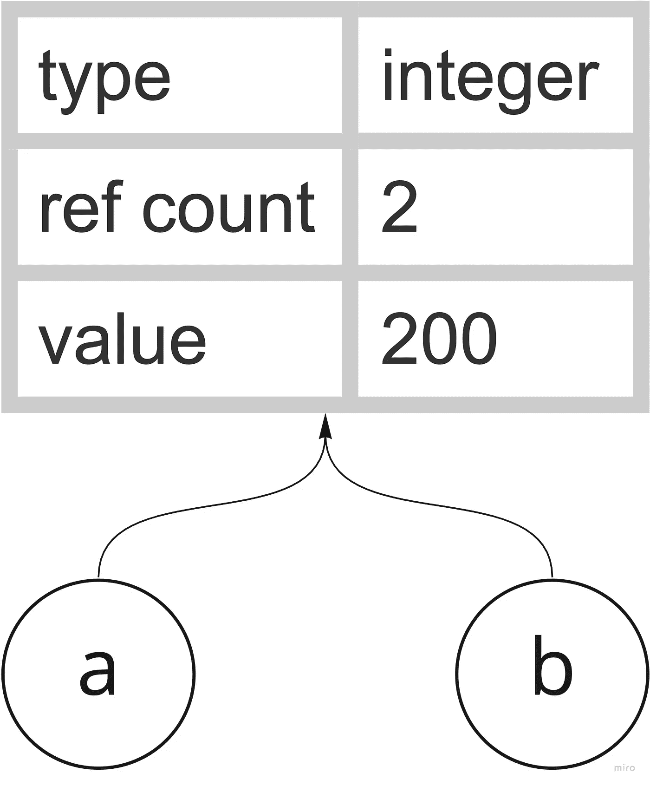
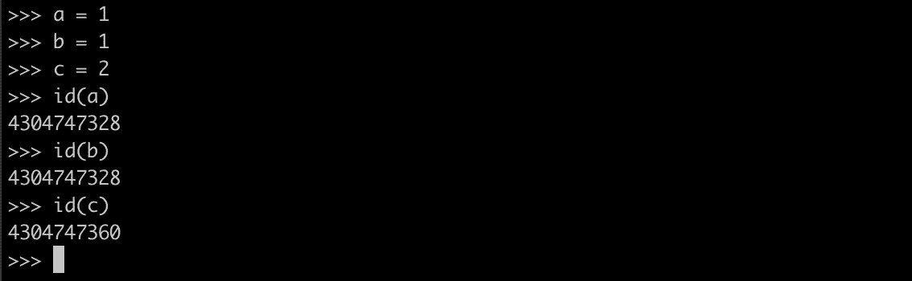
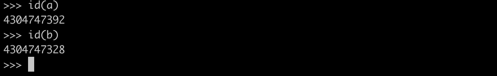
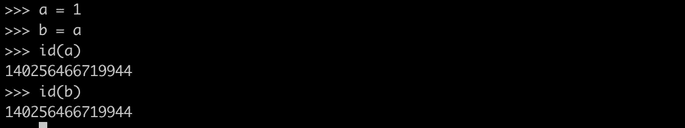
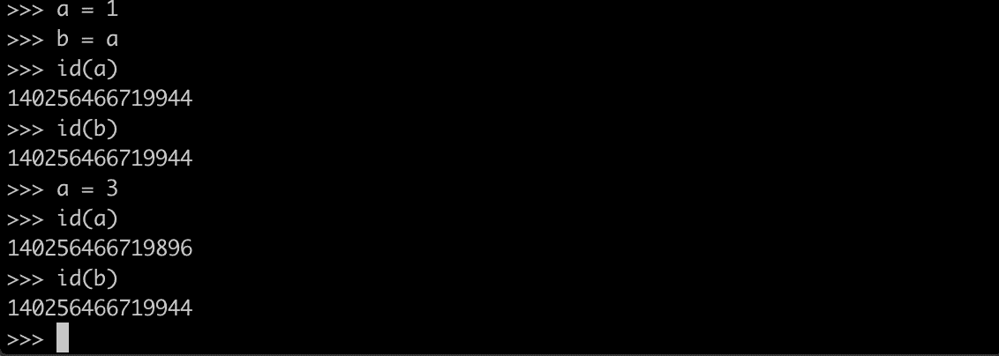
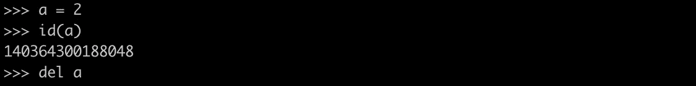
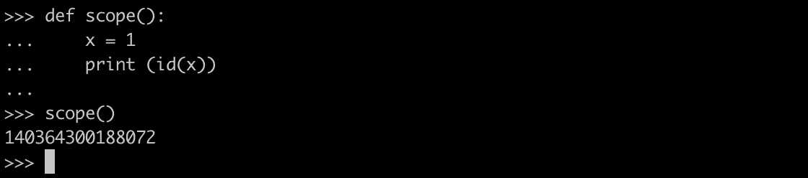
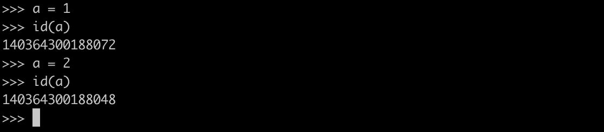

# python:Under the hood[内存分配和管理]

> 原文：<https://medium.com/analytics-vidhya/python-under-the-hood-draft-2-7191d4da48aa?source=collection_archive---------17----------------------->

嗨，在本文中，我们将学习 python 的一些核心概念，但不涉及编码。

首先，你可能会问，为什么我们会关心那些本来应该“藏在引擎盖下”的东西，对吗？嗯，作为一名开发人员，了解编程语言是如何工作的是很有用的。因为它可以揭开发生在你不知道的背景中的神奇事物的秘密。

出于某种原因，如果你的意识告诉你，这将是具有挑战性的。相信我，不是的。这些都是相对简单的概念，就像 Python 语言本身一样。

这是我们将在本系列文章中涉及的主题列表。

1.  Python 中的内存分配和管理
2.  碎片帐集
3.  GIL(全局解释器锁)

## Python 中的内存分配和管理

了解内存管理可能有助于您编写高效的代码。即使您可能无法控制内存分配，但是您可以优化您的程序来更好地分配它。

在我们深入挖掘之前，请记住:

> 在 python 中，一切都是对象。

像 C、C++或 Java 这样的语言将值存储在内存中，有一个变量指向那个内存位置。

C 语言中的内存分配

而在 python 中，整个对象存储在内存中(堆内存)；对象可以是整数、字符串或列表，变量指向一个对象。令人困惑。对吗？

为了有意义，让我们理解 python 对象包含什么！

内存中的对象保存

1.  *类型:整型、字符串型、浮点型等*
2.  *引用计数:绑定到该对象的引用数量*
3.  *价值:价值/数据/信息*

对象(a=200)

所以，每当你创建一个变量，比如说 ***a = 200*** ，在内存中创建一个新的 PyObject，它的 ref count 设置为 1，变量“***a”***指向它。

好吧。**但是什么是 ref count 呢？**

我们举个例子来了解一下。

我们有一个值为 200 的整型变量" ***"一个"*** "假设我需要另一个名为“***b”***的整型变量，其值为 200。

你已经创建了两个这样的变量。

> a=200
> 
> b=200

现在，你可能会猜测；内存中必须有两个对象为变量" ***a"*** 和" ***b"*** 。但事实并非如此。***a***和***b***都指向同一个对象。

变量 a 和 b 引用同一个对象

让我们通过代码验证这一点。

可以看到，变量"***【a】***和"***【b】***具有相同的 id(内存位置)因此，表示相同的对象，而 c 具有不同的 id 值。因此，目前在内存中，有两个 python 对象。

那么，如果我们给"*赋值一个新值，即 ***a = 3*** ，会发生什么呢？*

**

**“a”现在指向一个新的对象，但是“***”b“***仍然指向同一个对象。**

**但是让我们考虑这个例子。**

****

**在这个例子中， ***a =1*** 但是“***b”***的值为“***a”***。当我们改变" ***a"*** 的值时，是否也会影响" ***b"*** ？让我们看看。**

****

*****【a】***现在指向一个新的对象，但是***【b】***仍然指向较老的对象。相当令人惊讶。**但是为什么？****

**因为"***【b】***并不直接指向变量"***【a】***而是变量"*的对象。这就是裁判计数的作用。它跟踪指向它的变量的数量。***

***另一个有趣的问题是，**如果一个对象的引用计数变为零会发生什么？*****

***在此之前，让我们看看如何删除对一个对象的引用。***

1.  *****德尔*****

***Python 内置的 del 关键字帮助我们删除这些指向对象的引用。其实有人认为 del 是把对象从记忆中移除了，事实并非如此。***

***所以，你可以像这样使用 del 来删除一个引用。***

******

***删除对对象的引用***

***2.**超出范围*****

***对对象的引用一旦超出范围就会被自动删除。***

******

***让我们以上面的代码为例，变量“***【x】***的对象在 scope()函数内部会有+1 的 ref count，但是随着解释器离开这个函数作用域，PyObject 的 ref count 减少到-1，因为“***【x】***是一个局部变量，只对它的函数有作用域。***

**这也是 python 不鼓励使用全局变量的原因之一，因为全局范围内的变量会影响整个程序。**

****3。将新对象赋给变量。****

**当把一个新对象赋给一个已经存在的变量时，前一个对象的引用计数减少到-1。**

****

**通过分配新对象来减少对象的引用计数**

**现在回到上一个问题， ***当一个对象的引用计数为 0 时会发生什么？它会留在记忆里吗？*****

**答案是否定的。**

> **一旦对象的引用计数变为 0。它被垃圾收集器从内存中清除。你可以把垃圾收集器想象成一个清洁工，它清理所有的剩菜和将来不会被使用的废物，这种技术被称为“垃圾收集”。**

**我们将在下一篇文章中更详细地讨论 python 中的垃圾收集。**

***注:如果你有任何疑问或建议，我很乐意在评论中回复，我也需要这些可爱的掌声来激励自己写更多的文章，所以请务必这样做。***