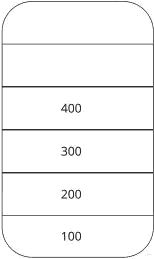
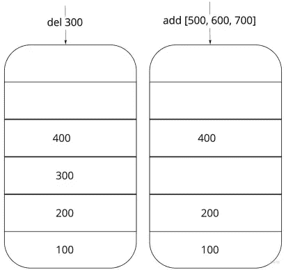
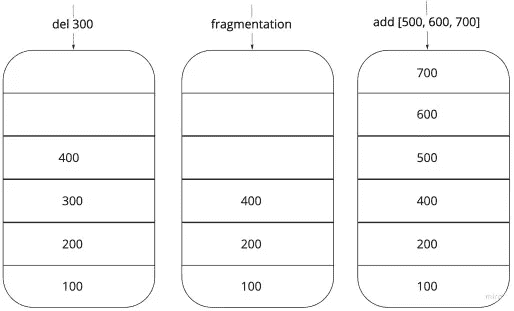
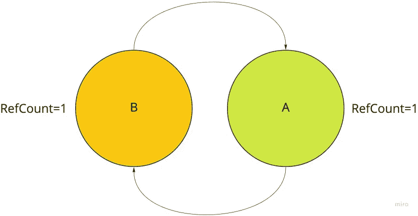

# Python:引擎盖下[垃圾收集]

> 原文：<https://medium.com/analytics-vidhya/python-under-the-hood-garbage-collection-7cc55977c482?source=collection_archive---------19----------------------->


嗨，欢迎来到 Python 的第二部分:引擎盖下系列，在本文中，我们将看看什么是垃圾收集，以及它在 Python 语言的上下文中是如何工作的。

先说一下 ***什么是垃圾回收？*** 和 ***是做什么用的？***

> 垃圾收集是计算机科学中的一项技术，用于通过将程序不再需要的对象从内存中移除来清除它们所占用的内存。

所有 HLL 编程语言都在内部实现了垃圾收集作为语言的核心，这样开发人员就不需要处理显式的内存分配和释放。

现在，来问一下 ***它是做什么的？***

它主要做两件事:

1.  内存清理
2.  堆碎片

好吧，我理解内存清理，但是什么是堆碎片？

python 中的程序需要连续的内存块，当一个对象在执行过程中被删除时，一个特定的内存块就会被释放出来，准备被另一个对象占用。

这里唯一的问题是，python 中并不是每个对象都需要一个内存块。有些可能会占用多个内存块，比如 python 中的 list 就需要连续的内存块。

所以，堆碎片的作用是，

> 它聚合内存中的所有空闲块，形成一个连续的内存块。

让我们用一个例子来理解这一点

比方说，我们的程序在执行过程中有一个这样的内存结构。



堆内存表示

假设我们的垃圾收集器从内存中移除了第三个对象(300 ),然后我们尝试创建一个包含 3 个整数值的列表对象。



由于连续内存不可用，无法添加列表

即使有 3 个块可用于包含 3 个整数对象，但是由于该列表需要连续的存储块，并且只有 2 个块可用，因此该操作不能在该特定存储块上执行。

显然，这不是管理内存的最有效方式。因此，堆碎片来拯救我们了。



碎片化后添加列表操作

GC 在删除对象后执行碎片化并连续释放内存块。从而允许执行“添加”列表操作。

酷！现在来说说***python 是如何实现垃圾回收的？*** 。

尽管有多种垃圾收集技术或垃圾收集器 GC。你可以在这里看看这些类型。

有趣的是，Python 使用了两个垃圾收集器，名为引用垃圾收集器和分代垃圾收集器。

## 引用垃圾收集器

python 中的每个 PyObject 都维护一个 RefCount，它计算它拥有的引用数，即有多少变量指向该对象。

在我的第一篇文章中，我讨论了 RefCount 在程序执行状态期间如何变化。

引用 GC 是 python 中主要的垃圾收集机制，没有办法禁用或替换实现。但是，我们可以使用 sys 模块中的 getrefcount( <variable>)来计算一个对象拥有的引用数。</variable>

```
import sys
a = "xyz"
sys.getrefcount(a)
>>2
```

*注意这里有两个引用。一个是在第 2 行创建变量，第二个是在第 3 行将变量"***传递给****sys . getrefcount()****函数。**

*尽管有如此健壮的实现，它也有一些缺点。*

*   ***它不检测循环引用。***

*当两个对象相互引用时，就会出现循环引用。因此，这些对象的 RefCount 永远不会达到零。*

**

*对象之间的循环引用*

*   *这不是线程安全的。*

*在多线程环境中，两个线程可能同时访问/修改同一个对象。而引用 GC 却没有处理它的机制。*

## *分代垃圾收集器*

*分代 GC 背后的关键概念是大多数新对象很快变得不可访问。因此，我们可以根据对象的寿命将它们分开，并分配到不同的代中。*

> *Python 有三代对象。一个对象一次只能驻留在一代中。*

*在执行过程中，每当解释器遇到一个新对象，它就把这个对象放入第 0 代。*

*对于每一代，垃圾收集器保存有限数量的对象，即阈值。当对象数量超过该阈值时，将执行垃圾收集过程。如果一个对象在这个过程中幸存下来，那么该对象将向上移动到下一代(或者在第三代对象的情况下停留在同一代)。*

*与引用垃圾收集不同，您可以修改分代垃圾收集行为，例如修改阈值、手动触发垃圾收集过程或完全禁用垃圾收集。点击[此处](https://docs.python.org/3/library/gc.html)查看 GC 文档了解更多信息。*

*好吧！但是**是否解决了** **循环引用的问题？***

> *是的，分代 GC 通过观察引用的创建和覆盖来跟踪跨代的对象引用，并且能够检测不可到达的对象，而不必遍历整个引用树。*

*那么线程问题呢？*

*Python 通过一种非常有趣的方式处理多线程来解决这个问题。Python 实现了一种称为全局解释器锁或 GIL 的机制。*

*从最基本的意义上来说，*

> *GIL 只允许一个线程在任何时间点都处于执行状态。*

*因此，不需要线程安全的环境。*

*我的下一篇文章是我们将更多地了解 GIL。*