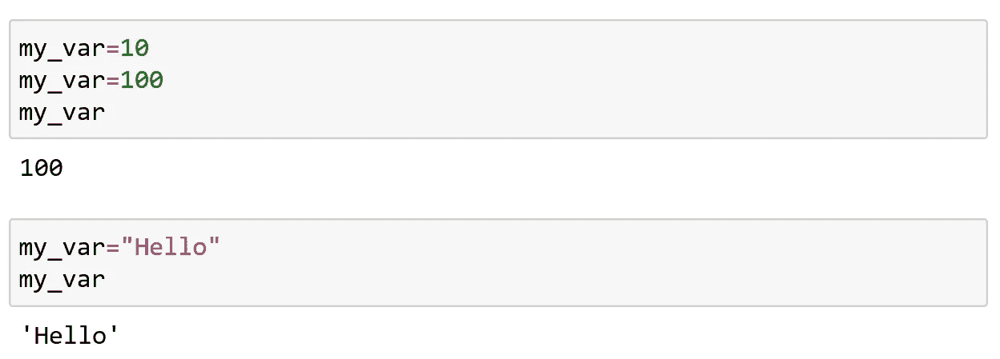
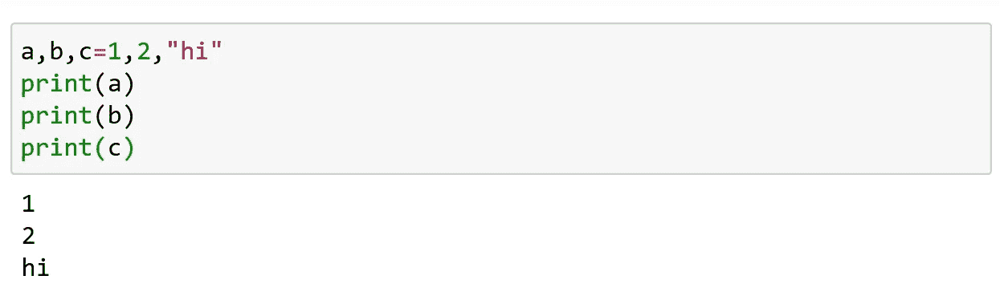
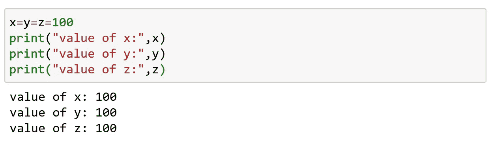

# Python 变量

> 原文：<https://medium.com/analytics-vidhya/python-variables-51451f372882?source=collection_archive---------18----------------------->

在这篇文章中我们将看到什么是变量？python 中变量是如何赋值的？

**什么是变量？**

变量是我们赋值的命名数据。这些用于在存储器中存储数据。变量的值可以改变。Python 的另一个显著特点是，在程序执行过程中，不仅变量值会改变，数据类型也会改变。你可以把一个整数值赋给一个变量，暂时把它作为一个整数使用，然后把一个字符串赋给这个变量。

如果你把变量想象成一个储存水果的篮子，这些水果可以在任何时候被替换，那就简单多了。

考虑到蔬菜和水果是不同的数据类型，水果可以替换为相同的水果(苹果到苹果)或不同的水果(苹果到橘子)或蔬菜(苹果到胡萝卜)。

**给变量赋值:**

在 Python 中，我们实际上并没有给变量赋值。相反，Python 变量只是指向对象(值)对变量的引用。

可以使用赋值运算符(=)为变量赋值。

最初，我们将 my_var 的值指定为 10，然后将其更改为 100，之后将其更改为不同的数据类型“Hello”。

应该使用单引号(“”)或双引号(“”)来声明字符串变量。

**分配多个值:**

将多个值赋给多个变量

Python 中不需要声明变量，甚至不需要变量总是指向相同的数据类型。

如果你想一次给多个变量赋予相同的值，也可以这样做。

**变量与标识符:**

变量和标识符经常被误认为同义词。

简单来说:变量的名字是一个标识符，但变量“不仅仅是一个名字”。变量有一个名字，大多数情况下是一个类型，尤其是一个值。除此之外，标识符不仅用于变量。标识符可以表示各种实体，如变量、类型、标签、函数、包等等。

因此，变量只是一个用来在内存中存储数据的命名位置。请始终将变量想象成一个容器，它保存着程序中以后可以更改的数据。

快乐编码…😊😊😊