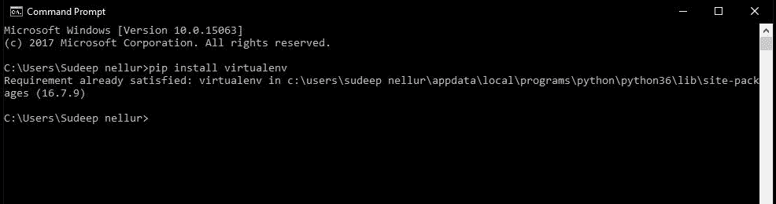

# 简而言之就是“Python 虚拟环境”。

> 原文：<https://medium.com/analytics-vidhya/python-virtual-environment-in-nutshell-abc74482fbd1?source=collection_archive---------17----------------------->

在本文中，我将带你了解 Python 中关于虚拟环境的一切，比如“什么是虚拟环境？”到“如何使用？”。


通过**虚拟环境**这个词，你会知道它基本上和环境是一样的。是的，的确如此，但这里是主环境中的环境。在 IT 行业中，我们构建的任何东西，首先都会为其创建一个虚拟环境。**为什么？因为如果你要构建一个项目，你需要很多包/库来构建一个单独的项目。**

现在，让我们举一个例子(根据我自己的经验)，我正在构建一个项目，我使用 tensorflow 2.2 来完成这个项目，项目成功执行，后来我又使用相同的框架完成了另一个项目，但这次我应该使用 tensorflow 1.4，因为它与其他库兼容。现在我的项目永远不会被执行，因为我的机器得到了 2.2 版本，而我需要的是 1.4。所以，我能做到的唯一方法是卸载 2.2 版本并安装 1.4 版本，但这里有一个 twist tensorflow 库，大小为 350+ mb。现在你知道卸载和重新安装它的痛苦，也知道它的时间。也不要忘记，现在我已经安装了 1.4 版本的珍贵项目将不会运行，因为与该项目中的其他库的兼容性问题。

所以你现在有问题了，我们解决这个问题的唯一方法是把这两个项目完全分开。我们通过为每一个创建两个独立的环境并分别安装库来做到这一点。现在，我们使用**虚拟环境**方法来做到这一点。

假设您正在构建一个需要 1.17.x 版 numpy 的项目，而您的计算机安装了 1.18.x 版的 numpy。因此，现在您要为该项目创建虚拟环境，并在其中安装 numpy 1.17.x。对于图片中的整个过程，它看起来像这样:


**青色【numpy 为 1.18.x 版本的主环境。**

**红色**:需要用 1.17.x 版本的 numpy 创建的虚拟环境。

现在打开命令提示符，输入:

```
pip install virtualenv
```



它需要几秒钟来安装我的已经在里面了。

现在您已经有了 virtualenv，为您想要安装虚拟环境的环境创建一个文件夹，这是一个很好的开发实践。在这里，我制作了一个名为“Envs”的文件夹。

```
mkdir #folder_name
```

接下来，导航到该文件夹

```
cd #folder_name
```


在创建虚拟环境之前，让我给你看看我的主机的 numpy 版本。


所以你可以看到我已经得到了 python 3.6.7 版本和 numpy 1.18.1 版本的主环境。接下来，我们使用下面的命令创建一个虚拟环境:

```
python -m venv #virtualenv_name
```

该命令将创建创建虚拟环境所需的所有内容，执行该命令可能需要几秒钟时间。在这里，我创建了名为“demo_env”的虚拟环境。


现在你已经创建了一个虚拟环境并潜入到该环境的文件夹中，你会发现所有那些你在 python 主文件夹中找到的文件，比如 Include、Lib 和 Scripts 文件夹。


现在返回到命令提示符，因为我们刚刚创建了一个环境，我们仍然需要在使用它之前激活它。使用以下命令。

```
#virtualenv_name\Scripts\activate
```

这将激活环境，并带你进入其中。您可以通过检查目录命令前是否有“(#virtualenv_name)”文本来确保这一点，如下所示。


这意味着你在虚拟环境中，你已经准备好了。现在我将展示除了 python 之外，这个环境与主环境没有任何联系。


在这里，你可以看到它从主机共享 python，而内部是空的。因此，我们得到错误消息说没有名为“numpy”的模块。让我们在其中安装所需的数字。步骤和我们通常做的一样，但是在这里你应该提到你想要的版本，否则它将安装最新的版本，在这种情况下我们不想要。

```
 pip install numpy==1.17.0
```


如果你检查它的版本。你会看到你想要的版本。


现在您的机器中有了两个 numpy 库。因此，如果你想使用最新的 numpy，只需直接创建项目并运行它，或者如果你想要一个 1.17.x 的特定 numpy 版本，那么到这个环境中来。在这里，你可以创建不同版本相同库的多个项目，而不会干扰整个系统。当你以非常专业的方式(自由职业者)在公司或任何项目中工作时，这是非常有用的。养成这个习惯会节省很多时间和痛苦。

最后，在您完成项目后，您可以通过使用命令“停用”来停用环境，它将关闭环境并将您重定向到主环境。

```
deactivate
```


谢谢你读到这里，如果你喜欢这篇文章，请为它鼓掌。