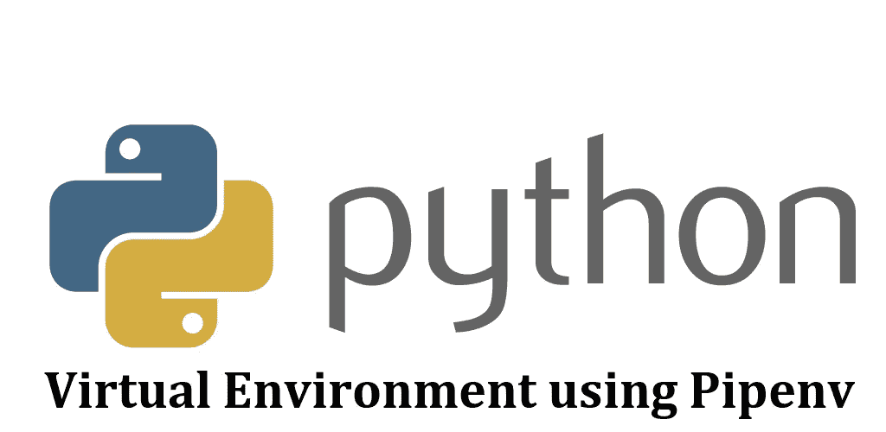
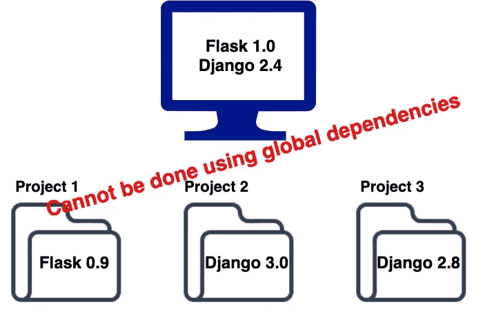
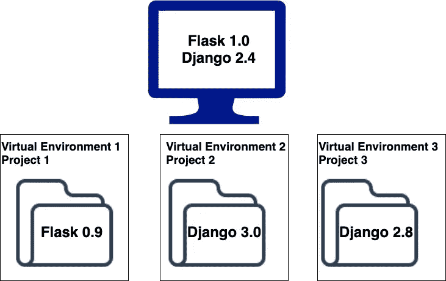
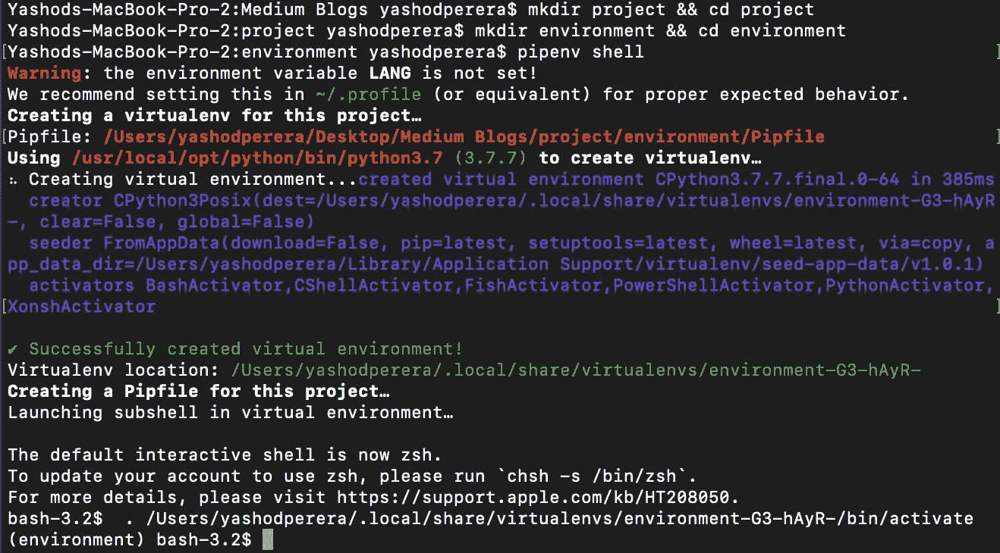
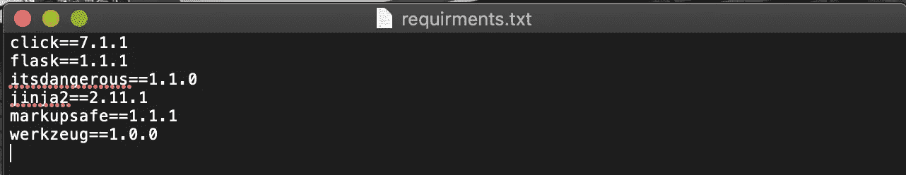
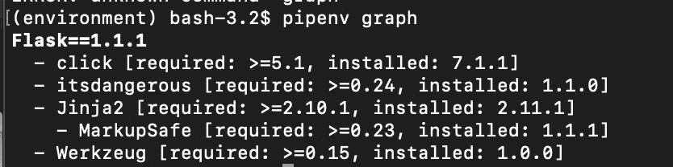
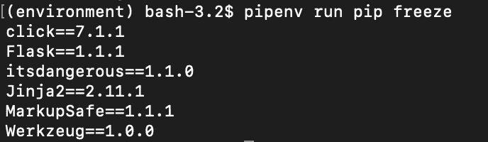

# 使用 pipenv 的 Python 虚拟环境

> 原文：<https://medium.com/analytics-vidhya/python-virtual-environment-using-pipenv-22010a8bb1c2?source=collection_archive---------3----------------------->



什么是虚拟环境？

大多数开发人员面临的共同问题是依赖问题，开发人员开发几个需要不同依赖版本的项目。

作为下面的例子，让我们假设 Flask 1.0 和 Django2.4 是全局安装在机器上的，下面的项目需要 Flask 和 Django 的不同版本。那么我们如何跨项目管理版本呢？这就是虚拟环境出现的地方。



解决方案是跨不同的项目创建单独的虚拟环境，并在这些特定的虚拟环境上安装所需的依赖项和版本。那么这些已安装的依赖项不会与全局依赖项和版本混合，如下所示。



**什么是 pip 和 pipenv？**

pip 是 python 的包管理器，它简单地安装 python 所需版本的包。python 3.5 以后默认包含 Pip，您可以简单地检查是否安装了 pip，输入

pip–版本

**如何安装 pip？**

步骤 1:下载源文件

```
curl [https://bootstrap.pypa.io/get-pip.py](https://bootstrap.pypa.io/get-pip.py) -o get-pip.py
```

步骤 2:然后使用 python 运行文件

```
python get-pip.py
```

注意:在 linux 和 mac 上有特定的安装方法，但上述方法是所有操作系统的通用方法。

让我们深入了解如何创建虚拟环境并使用它们。

**1。创建虚拟环境**

a.制作项目目录

```
mkdir project && cd project
```

b.创建一个目录来管理虚拟环境文件

```
mkdir environment && cd environment
```

c.启动虚拟环境

*对于 python 3*

```
pipenv –-three
```

*对于 python 2*

```
pipenv –-two
```

d.启动虚拟环境

```
pipenv shell
```

注意:-如果没有 Pipfile 文件，则创建新文件，虚拟环境启动并运行。Pipfile 包含所有的需求和软件包，如果您安装了任何软件包，那么 Pipfile.lock 将被创建，其中包含依赖项。



*你可以使用*简单地安装任何 python 包

```
pipenv install <package_name> 
```

*具体版本*

```
pipenv install “package_name=version_number”
```

**2。使用外部文本文件安装依赖关系**

当我们在一个项目中工作，并且我们必须安装其他人使用的依赖项时，这是很重要的。对于 pip env，使用文本文件简化了生成依赖关系方式，如下所示。



文本文件格式

首先，您必须使用 pipenv shell 启动虚拟环境，因为您必须转到存放 pipfile 的目录。然后简单地键入如下内容，

```
pipenv install -r <txt_file.txt>
```

然后，具有各自版本的所有依赖项将被安装在虚拟环境中。

**3。查看已安装的依赖项**

您可以使用两个命令查看已安装的依赖项。

```
pipenv graph
```



pipenv 图形命令输出

```
pipenv run pip freeze
```



pipenv 运行 pip 冻结命令输出

注意:- pip freeze 将显示机器上的所有依赖项，为了查看虚拟环境中的依赖项，我们使用 pipenv run 命令在环境中运行该命令。

**4。在虚拟环境中卸载已安装的软件包**

这可以使用以下命令简单地完成

```
pipenv uninstall <package_name>
```

**5。退出虚拟环境**

这可以使用 exit 命令来完成。

参考资料:【https://pipenv-fork.readthedocs.io/en/latest/】T4