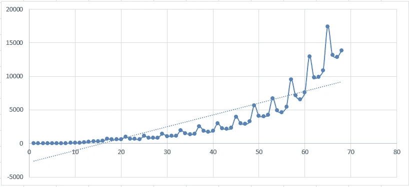

# Python 与 Excel:创建线性回归

> 原文：<https://medium.com/analytics-vidhya/python-vs-excel-create-a-linear-regression-647e7bc1cfb8?source=collection_archive---------3----------------------->

线性回归是一种简单且常用的预测分析类型，它是我们在数据科学中学习的第一件事。线性回归是一种发现变量、因变量和自变量之间线性关系的模型。

Excel 和 Python 是最常用的数据分析工具，使用这两种工具可以完成多项数据分析任务