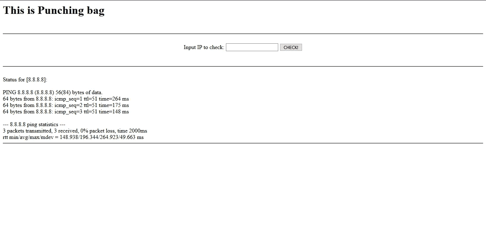

# 第 1 部分:让 Python Web 应用变得简单——Python-CGI

> 原文：<https://medium.com/analytics-vidhya/python-web-apps-made-easy-python-cgi-5dd013964f2d?source=collection_archive---------14----------------------->

# Python 是什么？

根据维基百科，

> " Python 是一种解释型高级通用编程语言."

**解释性语言..？**

那些在执行前**没有**转换成机器(或计算机可读)代码，但*在运行时*被转换的语言。因此转换只在运行时逐行进行。

**高水平..？**

对计算机细节进行高度抽象的语言。如需进一步阅读，请点击此处->([https://en . Wikipedia . org/wiki/High-level _ programming _ language](https://en.wikipedia.org/wiki/High-level_programming_language))。

**一般用途..？**

通用语言是一种计算机语言，可广泛应用于各种应用领域，但缺乏特定领域的专门功能。

**什么是 Python-CGI？**

就去这里->([https://docs.python.org/3.6/library/cgi.html](https://docs.python.org/3.6/library/cgi.html?highlight=cgi#module-cgi))

而这里-> [为什么是 python？](https://www.thoughtco.com/what-is-python-2813564)

让我们现在跳到有趣的东西..弄脏我们的手！

第一步…设置好所有需要的东西。

1.  Python3(我用的是 python 3.6.3)
2.  RHEL7/ CentOS7(或任何其他操作系统，如果你知道你在做什么的话)
3.  web 服务器(我使用的是 httpd 2.4)

一旦你设置好所有需要的东西……在你的终端上输入这个启动你的网络服务器。

```
$ sudo systemctl start httpd
```

现在你的 web 服务器已经启动并运行了…不信？你自己检查一下。

```
$ sudo systemctl status httpd
```

*现在让我们跳到编码部分……*

首先让我们试着构建一个简单的静态 HTML 站点。

1.  请转到/var/www/html/
2.  创建一个 HTML 文件。
3.  把下面的代码粘贴进去。

```
<html>
<head> 
<title> punchingbag </title> 
</head> 
<body> 
This is My Web Page.  <!-- this is comment -->
</body> 
</html>
```

4.在浏览器上查看网页。→ (http:// <ip_of_linux_machine>/index.html)</ip_of_linux_machine>

5.(*可选)如果您没有看到任何页面，请尝试为您的工作环境停止防火墙和 SELinux 策略(在 RHEL7/CentOS7 上)。这两个为我们的系统提供了额外的安全性，通过禁用它们，我们的系统变得容易受到攻击。

要停止防火墙，请键入->

```
$ sudo systemctl stop firewalld
```

要停止 selinux，请键入->

```
$ sudo setenforce 0
```

现在我们已经托管了你的第一个静态网站。现在是 CGI 脚本的时候了。

1.  请访问/var/www/cgi-bin/
2.  创建一个 python 文件。
3.  复制代码。

```
#!/bin/python36
print(“hello”)
```

如果你不知道这里的第一行，读读这个。

4.现在改变文件的模式，给你的文件添加可执行位权限。(简单来说就是给文件可执行权限)。

```
$ sudo chmod +x filename.py
```

5.在终端中运行代码。

```
$ ./filename.py
```

6.现在，为了让这段代码在浏览器上运行，你需要像转换一个 HTTP 响应一样转换这个输出。(否则，您会得到一个内部服务器错误)

```
 <status-line>
 <general-headers>
 <response-headers>
 <entity-headers>
 <empty-line>
 [<message-body>]
 [<message-trailers>]
```

7.至少我们需要在代码中添加实体头，其余的将由 web 服务器和客户端浏览器处理。

为此，请更改代码。

```
#!/bin/python36print(“content-type: text/html”) #This is a entity header
print() # This is empty line
print(“hello”) # This is message body
```

8.按照步骤 5 在终端中运行代码。您应该得到如下所示的输出。

```
content-type: text/htmlhello
```

现在，这看起来像是一个 HTTP 响应，可以被 web 浏览器正确理解。

9.该浏览这个了→( http://<ip_of_linux_machine>/CGI-bin/filename . py)</ip_of_linux_machine>

10.现在，通过对字符串应用一些 html 标签来处理消息正文。

现在，让我们来做一个 Web 应用程序，它可以输入一个 IP 地址，并从我们的系统中显示该 IP 的 ping 状态。

我的看起来像这样…



[代码]

```
#!/bin/python36## HEADERS
print(“content-type: text/html”)
print()## HTML
html = '''<html><head><title> punchingBag </title></head><body> {body} </body></html>'''
body = '''<h1> This is Punching bag </h1><br><hr><br><center> {form} </center><div> {output} </div>'''form = '''
 <form>
 Input IP to check: <input type=”text” name=”target_ip” > </input>
 <input type=”submit” value=”CHECK!” > </input>
 </form>
 <br>
 '''output = '''
 <hr><br>
 Status for [{target_ip}]: <br><br>
 {cmd_status}
 <hr><br>
 '''## LOGIC CODE
import subprocess as sb
import cgidata = cgi.FieldStorage() # read the field Storage or mini field storage for the cgi scriptif data.getvalue("target_ip"):
 data_target_ip = data.getvalue("target_ip")
else:
 data_target_ip = "8.8.8.8" # default set to google DNS 8.8.8.8cmd_status = sb.getoutput("sudo ping -c 3 "+data_target_ip)
cmd_status = cmd_status.replace("\n","<br>")## PRINT HTML
print(html.format(
         body=body.format(
             form=form,
             output = output.format(
                 target_ip=data_target_ip, cmd_status=cmd_status) ))
```

如果你不知道 python 中的子进程库，那么阅读[这个](https://docs.python.org/3/library/subprocess.html)。(*如果看起来要读很多，只需搜索 subprocess.getoutput()* )。

您需要在/etc/sudoers 文件中添加一行，因为您正在使用*sudo*ping 目标 ip。

```
apache ALL=(ALL) NOPASSWD: ALL
```

[(默认 sudo 安全策略模块](https://linux.die.net/man/5/sudoers))

这个 web 应用程序仍然存在很多问题，不适合在现实世界中部署。

你可以从[这里](https://www.hacksplaining.com/)继续了解不同的 web 应用漏洞。