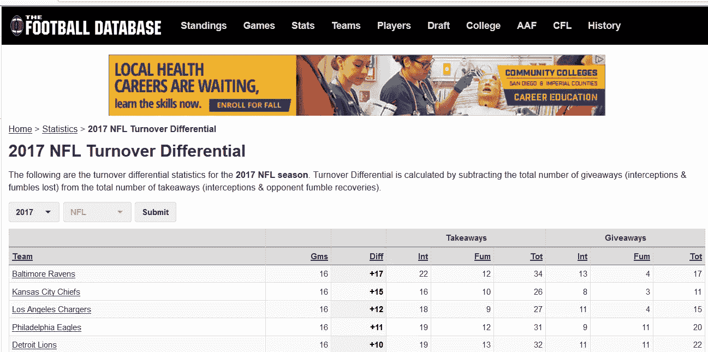
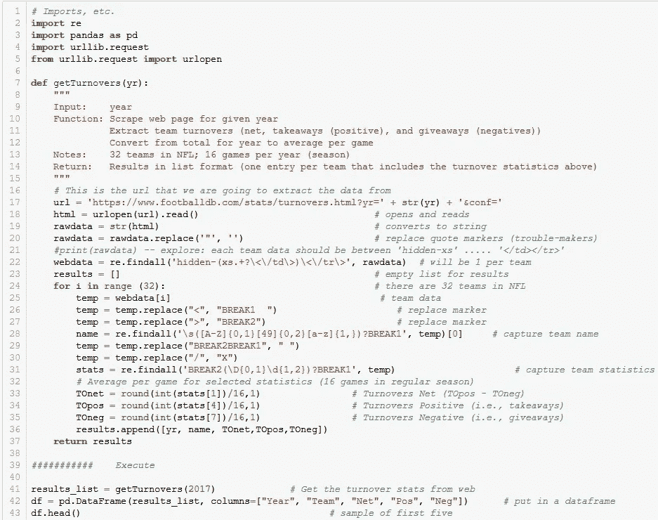

# Python 网络抓取

> 原文：<https://medium.com/analytics-vidhya/python-web-scraping-5045f2a1c673?source=collection_archive---------19----------------------->

**一个入门【完整】的可执行示例**

你想要一个 Python web 抓取的快速可执行示例吗？在这里。只需剪切、粘贴和执行。

以下是本示例中使用的网站的快照:

示例网站数据

该程序(如下)废弃网站并打印 NFL 橄榄球失误数据。希望代码中的注释足以理解这个过程。

Github 上的代码:[https://Github . com/dsfai 2020/NFL _ machine _ learning/blob/master/Scrape-Teams-overlap-article . ipynb](https://github.com/dsfai2020/nfl_machine_learning/blob/master/Scrape-Teams-turnover-article.ipynb)

这种复杂性涉及到 HTML 数据，一个混杂着 HTML 标签和特殊字符的上下文数据的混乱组合(代码中的 xx 行)。还有一些其他的包，比如 Beautiful Soup(链接)可以帮助提取数据。【大卫，附上一两句关于美汤的话】。Beautiful Soup 是一个广泛使用的 python 包，具有优秀的文档，可以简化您的 web 抓取过程。在我们的简单示例中，我们使用相对表达式来查找和提取数据。

一个人可以使用这个程序访问几乎每个网站(只需改变网址和数据提取)。市场营销、金融、医疗、经济和研究是一些应用的例子。

在我们的示例中，提取的数据被加载到 Pandas 数据帧中。在实际应用中，人们可能会将数据加载到 Pandas dataframe 或 SQL 数据库中进行进一步分析，与其他数据集成，或输入到机器学习中。我们使用这个 NFL 数据，结合其他类似的数据，使用各种机器学习算法来预测足球比赛( [NFL 机器学习文章](/@raymond.ernst/nfl-predictions-from-machine-learning-model-to-predictions-c789d18cf800))。

希望这个例子能给你一个开始。我和我的合作伙伴 David Fai 正在开发这些入门示例，作为我们人工智能游戏项目 ai_affinity(游戏到行业解决方案)的一部分。感谢您的评论和建议([ai_affinity@gmx.com](mailto:ai_affinity@gmx.com))。

*鸣谢:*

*感谢 ai_affinity 的助理大卫·辉(*[*)https://github.com/dsfai2020*](https://github.com/dsfai2020)*)，他对文章内容和编程都做出了贡献。*