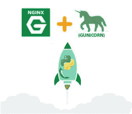
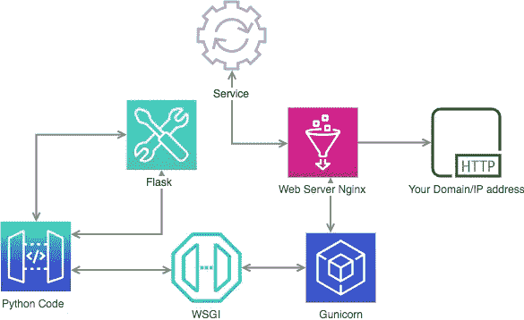
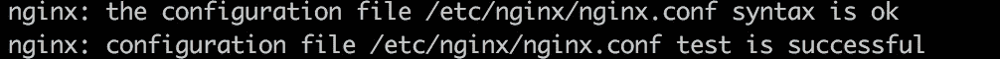
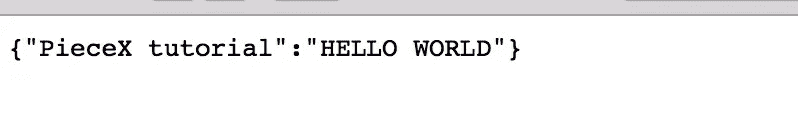

# 使用 Ubuntu 部署 Python Webservice API 服务器

> 原文：<https://medium.com/analytics-vidhya/python-webservice-api-server-deployment-using-ubuntu-201d48f477d9?source=collection_archive---------0----------------------->

## 使用 Nginx 和 Gunicorn 在 Ubuntu 中实现 Python Flask Restful API



*更新:本教程使用的文件可以在这里免费下载:[https://www . piecex . com/source-code/Tutorial-Resources-Python-web service-API-Server-deployment-using-Ubuntu-1998](https://www.piecex.com/source-code/Tutorial-Resources-Python-Webservice-API-Server-deployment-using-Ubuntu-1998)

在这里，我将一步步介绍如何使用 Nginx 和 Gunicorn Python 将 Flask REST API 部署到 Ubuntu 服务器中。

因此，让我们从基础开始，对于那些可能不熟悉 Flask 的人来说，Flask 是一个 Python web 框架，可以替代 Django 项目的整体结构和依赖关系。它采用小型核心和易于扩展的理念构建。使用 flask，您可以立即创建 web 服务或 Restful APIs。

如果我们想在我们的服务器中实现 Flask API，我们需要完成一些任务和安装。

*对于本教程，我们假设您具备连接服务器和 Python 编程方面的知识…

请注意，您还可以使用 Supervisor 作为客户机/服务器系统来监视和控制 UNIX 上的许多进程。

此外，我们将在 HTTP 协议中实现它。在服务器上安装 SSL 证书超出了本教程的范围。

这里我们将使用下面的架构，因为(在我看来)对于初学者来说更容易理解。



服务器将通过服务执行命令，使用带有 Gunicorn 的 WSGI 调用 Nginx。Flask 将作为 web 服务框架，用 Python 代码实现。

# 步骤 1 —安装

通过命令连接到服务器后，我们将首先更新然后安装 python 和 nginx 的包。

```
$ sudo apt-get update
```

`$ sudo apt-get install python3-pip python3-dev nginx`

安装 python 和 nginx 之后，我们将继续安装 virtualenv 来创建虚拟环境。

`$ sudo pip3 install virtualenv`

# 步骤 2 —创建虚拟环境

创建一个新文件夹，并将文件夹刻录成光盘。在本教程中，我们的文件夹将被命名为“myflaskproject”。

例如:

```
mkdir myflaskprojectcd myflaskproject
```

创建一个名为“myfirstflask”类型的新虚拟环境

`$ virtualenv myfirstflask`

现在，要使用虚拟环境，我们需要激活它。我们将通过使用源虚拟化名称/bin/activate 来实现

`$ source myfirstflask/bin/activate`

# 步骤 3 —安装烧瓶和 Gunicorn

Gunicorn 是一个用于 UNIX 的 Python WSGI HTTP 服务器，它广泛兼容许多 web 框架，占用服务器资源少，速度快。

所以首先我们需要在服务器上安装 Gunicorn:

`$ sudo apt install gunicorn`

激活虚拟环境时，使用 pip(即使我们在虚拟环境中使用 python3，我们也使用 pip)来安装 flask 和 gunicorn

`$ pip install gunicorn flask`

# 步骤 4 —托管演示文件

对于本教程，我们将创建一个 hello word API 来测试服务器配置和托管。

在我们的项目 myflaskproject 的文件夹中创建一个新的模拟文件(helloworld.py)。这个文件做得非常简单，只是一个带有 hello world 消息的 JSON。

**helloworld.py:**

```
from flask import Flask, jsonify, requestapp = Flask(__name__)@app.route('/', methods=['GET'])def helloWorld():
   if request.method == 'GET':
      return jsonify({"PieceX tutorial": "HELLO WORLD"})if __name__ == "__main__":
   app.run(host='0.0.0.0')
```

默认端口是 5000，因此我们需要在服务器中打开该端口。如果您有防火墙或安全组(AWS ),您需要添加入站规则以允许端口 5000

在服务器端:

`(myfirstflask) $ sudo ufw allow 5000`

现在让我们测试配置

`(myfirstflask) $ python helloworld.py`

打开浏览器，键入服务器的域名或端口后面的 IP:5000

举个例子，

[http://domainOrIP:5000](http://domainorip:5000/)

您必须能够看到您的“hello world”应用程序。

**WSGI**

为了告诉 Gunicorn 如何与应用程序交互，我们需要一个入口点或 wsgi。

在项目文件夹中创建一个名为 wsgi.py 的新文件

`(myfirstflask) $ sudo nano wsgi.py`

文件的代码:

wsgi.py:

```
from helloworld import appif __name__ == "__main__": app.run()
```

在这里，我们将通过导入并运行应用程序来调用我们的应用程序 helloworld.py。

现在让我们用 Gunicorn 绑定 wsgi 文件

`(myfirstflask) $ gunicorn --bind 0.0.0.0:5000 wsgi:app`

在端口 5000 浏览您的域/服务器 IP:

[http://domainOrIP:5000](http://domainorip:5000/)

您应该能够看到和以前一样的输入。

现在我们需要中断托管。输入 CTRL-C 结束托管。中断托管后，我们还将停用虚拟环境，以继续 Nginx 配置和服务。

`(myfirstflask) $ deactivate`

**Docker 示例***

*(*本节假设你已经安装了 docker，并且具备一些 Docker 的基础知识。了解更多 docker:*[*https://www.docker.com/*](https://www.docker.com/)*)*

为了使事情更简单，这里是前面步骤的 docker 文件。可以在这里下载:[https://www . piecex . com/source-code/Tutorial-Resources-Python-web service-API-Server-deployment-using-Ubuntu-1998](https://www.piecex.com/source-code/Tutorial-Resources-Python-Webservice-API-Server-deployment-using-Ubuntu-1998)

或者可以将其添加到保存 Python 文件的文件夹中。

关于 docker 文件的简要说明:

> 我们将使用来自 docker hub([*【https://hub.docker.com/_/nginx?tab=tags*](https://hub.docker.com/_/nginx?tab=tags)*)和 Debian frontend 的最新版本作为基础 nginx。*
> 
> *如果你用“ubuntu”做基础，这个 dockerfile 也可以。例如:*
> 
> 来自 ubuntu:最新
> 
> *首先，我们更新，然后安装 python3 pip，nginx(不需要，因为它来自基础映像，但我只是保留它，以防你想使用另一个基础映像)和 gunicorn。*
> 
> *然后将文件夹中的文件作为名为“myflaskproject”的文件夹添加到容器中，并将其作为工作目录(当前路径)。*
> 
> *使用 pip3 将 flask 和 gunicorn 安装到 python 中。*
> 
> *最后，使用 gunicorn* 将应用程序绑定到端口 80

现在是 docker 文件的代码。添加一个名为“Dockerfile”的文件，并插入以下内容:

```
#We will use nginx latest as base, you can also use FROM ubuntu:latest instead#FROM ubuntu:latest
FROM nginx:latest
ENV DEBIAN_FRONTEND noninteractiveRUN apt-get update -q && apt-get install -qqy \
nano python3-pip python3-dev nginx gunicorn systemdADD . /myflaskproject
WORKDIR /myflaskprojectRUN pip3 install gunicorn flaskCMD gunicorn — bind 0.0.0.0:80 wsgi:app
```

如果您下载了资源，那么您只需要进入终端，将文件夹“教程资源”光盘化

构建 Dockerfile 文件:

```
docker build — tag flask_tutorial:1.0 .
```

然后运行容器，例如:

```
docker run --publish 81:80 --detach --name flask_container flask_tutorial:1.0
```

这将把服务发布到您的本地主机端口 81(确保您的端口 81 可用，或者在上面的 docker 命令中更改它)。

进入你的浏览器，进入 [http://localhost:81/](http://localhost:81/)

它应该显示:{"PieceX 教程":" HELLO WORLD"}

# 步骤 5 —创建服务

为了运行应用程序，我们需要一个服务。请注意，最好使用 supervisor 来完成这项任务。对于本教程，我们将使用一个普通的服务来保持应用程序的活动。

当服务器重新启动时，它会自动启动 Gunicorn 和我们的应用程序/网站。

在 ubuntu 中，服务位于文件夹:/etc/systemd/system/

首先，我们将测试服务中的逻辑，以验证一切正常:

类型:

`$ /home/ubuntu/myflaskproject/myfirstflask/bin/gunicorn --workers 3 --bind unix:flaskproject.sock -m 007 wsgi:app`

它应该在端口 80 中托管您的应用程序，所以如果您进入浏览器并键入您的 IP 或域，它应该会返回我们的 Hello World 消息。

所以我们将创建一个新的。

`$ sudo nano /etc/systemd/system/flaskproject.service`

我们的文件将如下所示:

```
[Unit]Description= This is a Gunicorn instance from PieceX tutorial for our hello world applicationAfter=network.target[Service]User=ubuntuGroup=www-dataWorkingDirectory=/home/ubuntu/myflaskprojectEnvironment="PATH=/home/ubuntu/myflaskproject/myfirstflask/bin"ExecStart=/home/ubuntu/myflaskproject/myfirstflask/bin/gunicorn -workers 3 - bind unix:flaskproject.sock -m 007 wsgi:app[Install]WantedBy=multi-user.target
```

[Unit]部分是元数据和依赖项，可以添加描述来轻松识别我们服务的功能。=network.target 之后的命令将告诉我们的服务在到达网络目标之后启动它。

在[Service]部分，我们指定将执行我们的服务的用户(它应该有足够的权限来执行)。我们将使用默认的托管组 www-data，因为默认情况下它已经拥有所需的权限。

WorkingDirectory 是我们的应用程序所在的路径(比如 apache /var/www/html)

Environment="PATH=我们将使用虚拟环境的路径。

最后，我们分配服务的执行

[Install]部分将告诉您在引导时何时启动服务。

WantedBy =多用户.目标

保存文件后，我们可以启动并启用服务。

如果文件中出现错误，您需要重新加载服务:sudo systemctl daemon-reload

`$ sudo systemctl start flaskproject`

`$ sudo systemctl enable flaskproject`

# 第 6 步— Nginx

Nginx 是一个 web 服务器，就像 apache 一样，它也作为一个反向代理来处理 Python WSGI 的请求和响应。建议您使用 Nginx for Python，而不是 Apache。

首先，我们需要为服务器创建配置文件，以使用我们刚刚在服务中创建的套接字。

`$ sudo nano /etc/nginx/sites-available/flaskproject`

添加以下内容:

> 服务器{
> 
> 听 80；
> 
> server_name 本地主机；
> 位置/ {
> 
> 包含 proxy _ params
> 
> proxy _ pass[http://UNIX:/home/Ubuntu/myflaskproject/flask project . sock；](http://unix/home/ubuntu/myflaskproject/flaskproject.sock;)
> 
> }
> 
> }

这将使服务器通过使用我们项目的 socket 的 proxy_pass 监听端口 80。

然后，我们需要将我们的文件添加到启用站点列表中。

`$ sudo ln -s /etc/nginx/sites-available/flaskproject /etc/nginx/sites-enabled`

用欢迎页面删除默认的 Nginx 站点

`$ rm /etc/nginx/sites-enabled/default`

检查错误

`$ sudo nginx -t`

您应该会收到如下消息:



重启服务器

`$ sudo systemctl restart nginx`

因为我们不需要打开端口 5000，所以我们将删除对端口 5000 的访问

`$ sudo ufw delete allow 5000`

`$ sudo ufw allow 'Nginx Full'`

就是这样！通过浏览您的域/服务器 IP，您应该能够看到您的 rest API:

[http://domainOrIP](http://domainorip/)



以下是一些可能对您有帮助的链接:

*   https://www.nginx.com/
*   烧瓶:[http://flask.palletsprojects.com/en/1.1.x/](http://flask.palletsprojects.com/en/1.1.x/)
*   https://gunicorn.org/
*   https://virtualenv.pypa.io/en/latest/

现在你已经有了关于部署 Restful API 的重要信息，我将推荐一个出售或购买你的源代码的网站:[www.piecex.com，](https://piecex.page.link/mdm)这是一个人工智能驱动的源代码市场，非常酷，来看看吧。

> 最初发布于:[https://www . piecex . com/articles/Python-web service-API-Server-deployment-using-Ubuntu-282](https://www.piecex.com/articles/Python-Webservice-API-Server-deployment-using-Ubuntu-282)